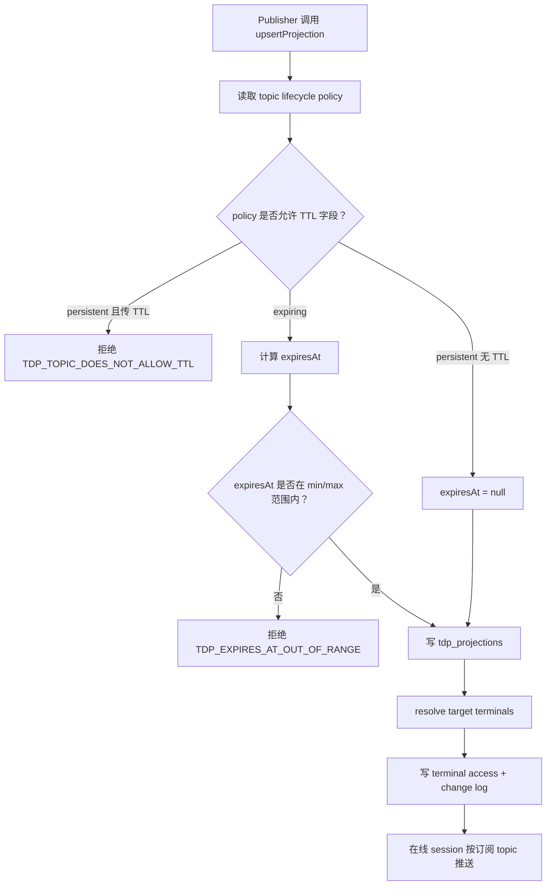
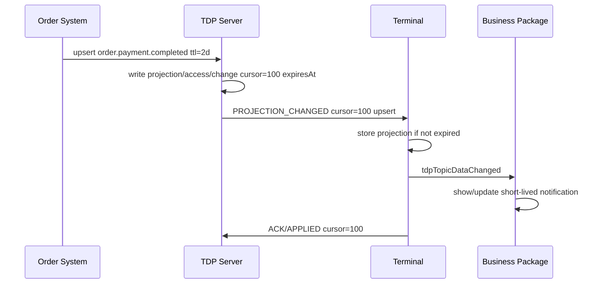
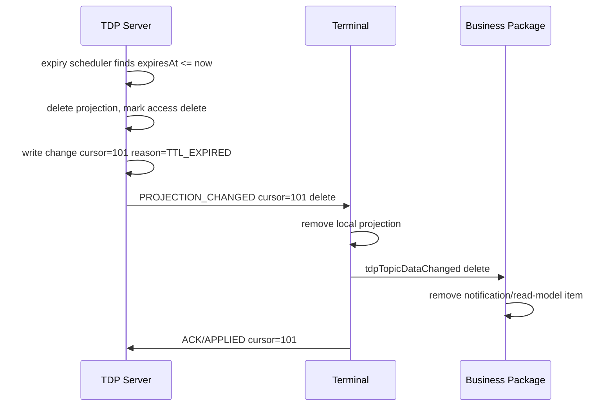
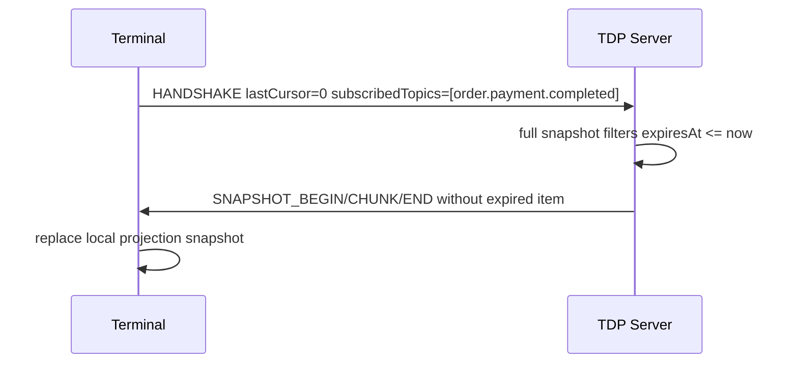
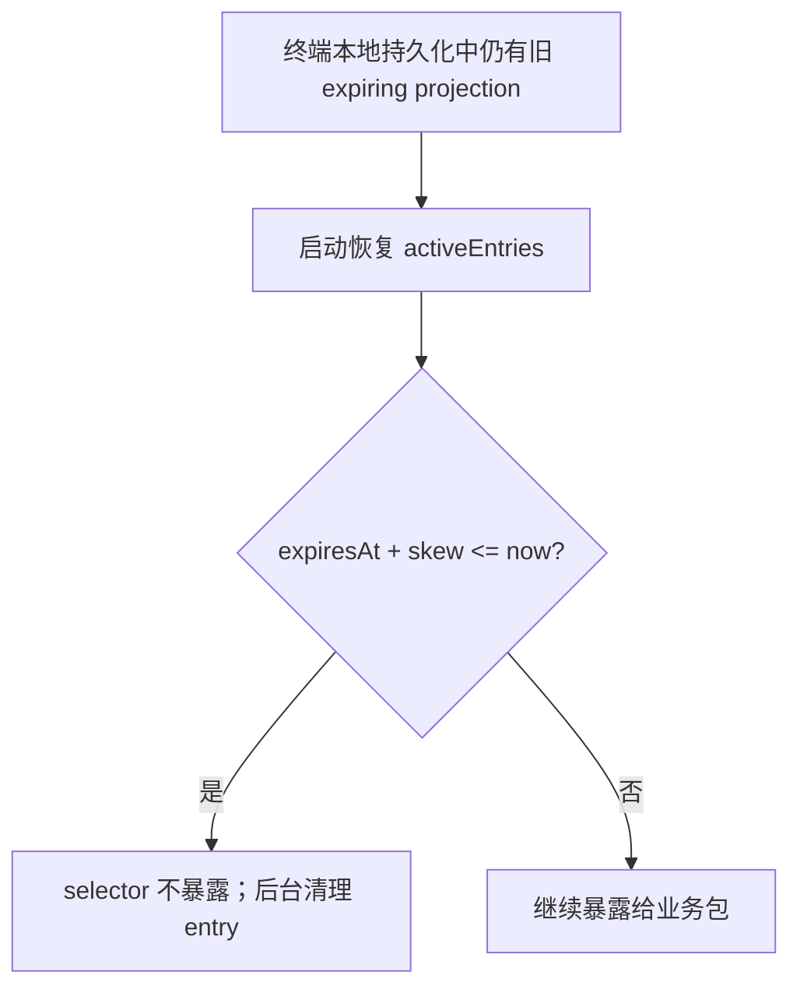

# TDP Projection 生命周期与 TTL 机制需求分析和设计

> 日期：2026-04-29  
> 范围：TDP 服务端、终端 `tdp-sync-runtime-v2`、后续业务包 topic 消费约定  
> 状态：设计稿，待 review 后再实现  
> 背景：当前 TDP 已具备 topic 按需订阅、cursor、chunked snapshot、changes 分页和 change-log retention。本文只设计“数据生命周期 / TTL / 自动过期”能力，不修改代码。

---

## 0. 本轮 review 后采纳的关键修正

本轮结合 `ai-result/2026-04-29-tdp-projection-lifecycle-ttl-review.md` 后，采纳以下对落地正确性有直接价值的建议：

1. **expiry scheduler 必须有并发安全设计**：不能只靠“重新读取当前 projection”，需要数据库级 claim、幂等 tombstone key 或事务保护。
2. **tombstone 写入必须原子化**：删除 projection、写 access delete、写 change log、更新水位必须在同一事务内完成；在线推送只能在事务提交后执行。
3. **`expiresAt` 计算基准必须唯一**：`ttlMs` 的基准固定为 `occurredAt`；只有未提供 `occurredAt` 时才使用 `serverNow`，不再使用含糊的“或”。
4. **批量过期需要背压**：scheduler 要有批量上限、运行间隔、claim 过期、在线推送限流和指标。
5. **终端时钟偏差要定义默认策略**：默认宁可晚丢弃，不提前丢弃；本地防御使用服务端时间偏移或 5 分钟宽限。
6. **`volatile-command` 不再作为 projection lifecycle 枚举值**：命令类走 command outbox，是旁路投递类型，不是 projection 生命周期。
7. **delete access 记录需要清理策略**：否则 access 表会无限增长；清理前需要有独立 watermarks 或保守保留窗口。
8. **审计历史要在阶段 1 做决策**：如果业务需要过期后仍可查历史，需要 lifecycle audit/event 表；不能等数据删除后再补。

---

## 1. 一句话结论

这个需求非常有意义，而且应该作为 TDP 的一等能力来设计。

但它不应该被理解为“业务实体自动删除”，而应该被定义为：

**TDP 投影的可见生命周期到期后，由 TDP 服务端自动生成一条带 cursor 的 tombstone/delete，把该投影从服务端当前态和终端本地当前态中清理掉。上游业务系统的真实订单、支付、商品等业务事实不受影响。**

也就是说，TDP 只管理“终端是否还需要看到这条投影”，不管理“业务事实是否存在”。

---

## 2. 当前架构事实

### 2.1 已经存在的能力

当前实现里已经有几块能力可以复用：

| 能力 | 当前状态 | 对 TTL 设计的意义 |
|---|---|---|
| topic 元数据 | `tdp_topics.retention_hours` 已存在 | 可以升级为 lifecycle 默认策略的一部分 |
| projection 当前态 | `tdp_projections` | 保存当前仍有效的 retained projection |
| terminal access 当前态 | `tdp_terminal_projection_access` | 保存某个 terminal 当前可见的 topic/item |
| change log | `tdp_change_logs` | cursor 投递流水，可承载 TTL 到期 tombstone |
| topic 订阅过滤 | 服务端和终端已支持 explicit topics | TTL delete 也能按订阅范围投递 |
| chunked snapshot | 已支持 `SNAPSHOT_BEGIN/CHUNK/END` | 大量 TTL 数据进入 full snapshot 时可避免巨型消息 |
| changes 分页 | HTTP `changes` 已支持 limit/hasMore | TTL 到期集中删除时可分页追赶 |
| command outbox | `COMMAND_DELIVERED.expiresAt` 已存在 | 说明命令类短生命周期已经有雏形，但它不是 projection TTL |
| change-log retention | 已有定时清理 | 需要和 projection lifecycle 明确区分 |

### 2.2 当前缺失的闭环

当前 `retention_hours` 更像 topic 元数据占位，没有形成“投影自动过期”的完整闭环：

1. projection 没有 `expires_at`。
2. projection access 没有 `expires_at`。
3. change log 没有表达“这是过期产生的 tombstone”。
4. 服务端 snapshot/changes 没有过滤过期当前态。
5. 服务端没有 expiry scheduler。
6. 终端 projection envelope 没有 `expiresAt`。
7. 终端没有防御性忽略过期 upsert / 本地清理过期投影。

因此，仅靠现有 `retention_hours` 无法满足“订单支付完成通知 2 天后自动消失”的业务诉求。

---

## 3. 需求分析

### 3.1 业务问题

当前 TDP 既承载长期主数据，也可能承载短期通知类数据。

长期主数据的特点是：

- 项目信息、店铺信息、菜品信息、菜单、价格规则、参数、权限等。
- 终端重启后仍然需要。
- 离线终端重新上线后仍然需要补齐。
- 删除必须由业务真相源明确发出。

短期通知类数据的特点是：

- 订单已支付、订单已取消、取餐提醒、临时弹屏、短期状态提示等。
- 只在一个时间窗口内有意义。
- 上游系统不希望为了清理 TDP 投影再发一条 delete。
- TTL 到期后，终端如果还想知道真相，应主动查询订单系统、履约系统、支付系统等真相源。

如果 TDP 没有生命周期能力，会出现几个问题：

1. **上游复杂度上升**：订单系统既要发布通知，又要记得清理 TDP 数据。
2. **TDP 当前态膨胀**：通知类 projection 会无限留在 `tdp_projections` 和 terminal access 中。
3. **终端本地状态污染**：终端持久化 projection 后，过期通知可能重启后仍被业务包看到。
4. **快照越来越大**：full snapshot 会包含大量历史通知。
5. **语义混乱**：业务 delete、TDP expiry、change-log retention 被混在一起。

### 3.2 目标

TTL/lifecycle 机制需要达到这些目标：

| 目标 | 说明 |
|---|---|
| 减轻上游清理责任 | 上游发布短期投影时可以声明 TTL，之后不必主动 delete |
| 保持 cursor 单调 | 到期清理必须生成 cursor，不能静默删除导致终端漏清理 |
| 不误删主数据 | 持久 topic 默认禁止 TTL，防止项目/店铺/菜品等被自动过期 |
| snapshot 干净 | TTL 到期后，新上线或重连 full snapshot 不应再看到过期投影 |
| changes 可追赶 | 在线/离线终端在 change-log retention 窗口内能收到 expiry tombstone |
| 终端防御 | 即使 tombstone 漏掉或终端长期离线，终端也不能把过期投影当成有效数据 |
| 运维可观测 | 能看到哪些 topic 是 expiring、何时过期、过期删除了多少数据 |
| 和订阅兼容 | 只对订阅该 topic 的 terminal/session 投递 expiry delete |

### 3.3 非目标

以下内容不应由 TDP projection TTL 承担：

| 非目标 | 原因 |
|---|---|
| 删除上游业务实体 | TDP expiry 只删除投影，不删除订单、支付、商品等业务事实 |
| Exactly-once 业务处理 | TTL 投影适合 best-effort 通知，不适合必须执行一次的任务 |
| 终端处理确认闭环 | 必须确认的动作应使用 command/task/outbox/ACK，而不是 TTL projection |
| 无限历史审计 | projection TTL 不是审计日志。审计应由业务系统或专门 audit log 承担 |
| 每条通知永久可补偿 | TTL 到期后，终端应从真相源查询，不应依赖 TDP 补偿 |

---

## 4. 核心概念

### 4.1 三类生命周期

建议把 topic lifecycle 分成三类：

| 类型 | 建议名称 | 典型数据 | 是否进入 projection 当前态 | 是否有 TTL | 终端离线后是否补发 |
|---|---|---|---|---|---|
| 持久投影 | `persistent` | 项目、店铺、菜品、菜单、价格、权限、参数 | 是 | 否 | 是，直到业务 delete |
| 有效期投影 | `expiring` | 订单支付完成通知、取餐提醒、短期状态提示 | 是 | 是 | TTL 内补发，TTL 后不补 |
| 即时命令 | command/outbox 类型 | 远程控制、上传日志、打印命令 | 否，不走 projection 当前态 | 是 | 依赖 command outbox 策略 |

本文主要设计第二类：`expiring projection`。

注意：即时命令不是 projection lifecycle。后文的 `TdpTopicLifecyclePolicyV1.lifecycle` 只允许 `persistent | expiring`。命令类 topic 可以在 topic 元数据或投递策略中标记为 `deliveryType='command-outbox'`，但不能通过 `upsertProjection` 写入为 `volatile-command` projection。这样可以避免“命令到底是 projection 还是 outbox”的双写语义。

### 4.2 lifecycle 和 retention 的区别

这两个词必须分开：

| 概念 | 管什么 | 影响当前 projection 可见性 | 是否产生 cursor | 示例 |
|---|---|---:|---:|---|
| lifecycle / TTL | 投影本身什么时候不再有效 | 是 | 是，生成 delete/tombstone | 订单支付通知 2 天后消失 |
| change-log retention | 投递流水保留多久 | 否 | 否，只清日志 | 最近每终端保留 10000 个 cursor |
| audit retention | 审计记录保留多久 | 否 | 否 | 操作日志保存 180 天 |

**关键原则**：TTL 到期是一次状态变化，所以必须写 change log；change-log retention 只是日志清理，不能改变状态。

### 4.3 “过期删除”的正确语义

TTL 到期后生成的是 TDP projection tombstone：

```ts
{
  topic: 'order.payment.completed',
  itemKey: 'order-123-paid',
  operation: 'delete',
  revision: 2,
  occurredAt: '2026-05-01T10:00:00.000Z',
  metadata: {
    reason: 'TTL_EXPIRED'
  }
}
```

它只表达：

> 这条 TDP 投影已经不应再出现在终端当前态里。

它不表达：

> 订单被删除了，支付被撤销了，业务事实不存在了。

---

## 5. 场景举例

### 5.1 场景 A：订单支付完成通知，TTL 2 天

**业务诉求**：订单系统想告诉 KDS、POS 或取餐屏某个订单已支付完成。2 天内终端能收到并处理即可；2 天后如果终端还关心，可以查订单系统。

建议 topic：

```ts
topicKey = 'order.payment.completed'
lifecycle = 'expiring'
defaultTtlMs = 2 * 24 * 60 * 60 * 1000
deliveryGuarantee = 'best-effort-within-ttl'
```

发布数据：

```ts
{
  topicKey: 'order.payment.completed',
  scopeType: 'STORE',
  scopeKey: 'store-001',
  itemKey: 'order-20260429-0001:paid',
  payload: {
    orderId: 'order-20260429-0001',
    paidAt: '2026-04-29T10:00:00.000Z',
    amount: 12800,
    currency: 'CNY'
  },
  occurredAt: '2026-04-29T10:00:00.000Z',
  ttlMs: 172800000
}
```

处理过程：

1. 服务端写入 projection，计算 `expiresAt = occurredAt + ttlMs`。
2. 服务端按 scope 和 terminal access fanout，为目标终端写 change log。
3. 在线终端收到 upsert，业务包处理通知。
4. 两天后 expiry scheduler 发现过期，删除服务端当前态，写 delete change log。
5. 在线终端收到 delete，删除本地 projection/read model。
6. 过期后才上线的终端 full snapshot 不再收到该通知。

### 5.2 场景 B：取餐提醒，TTL 30 分钟

**业务诉求**：订单制作完成后，通知取餐屏展示取餐号。30 分钟后即使没人取餐，也不应继续占用终端本地状态。

建议：

```ts
topicKey = 'fulfillment.pickup.ready'
lifecycle = 'expiring'
defaultTtlMs = 30 * 60 * 1000
```

边界：

- 如果这是“屏幕展示提醒”，TTL projection 合适。
- 如果必须确认顾客已取餐，需要业务系统自己维护取餐状态，TDP 只同步状态或使用任务/ACK，不应只靠 TTL。

### 5.3 场景 C：临时活动弹屏，TTL 到活动结束

**业务诉求**：品牌后台配置一个临时弹屏，活动结束后自动消失。

建议：

```ts
topicKey = 'marketing.popup.notice'
lifecycle = 'expiring'
expiresAt = campaign.endAt
```

这里不一定使用固定 `ttlMs`，而是使用业务给出的绝对 `expiresAt`。

约束：

- `expiresAt` 不能超过 topic 允许的 `maxTtlMs` 和系统级 `TDP_PROJECTION_MAX_TTL_MS`。
- 如果活动延期，上游必须重新 upsert 并提高 revision，不能让终端自己延长。
- 如果 TTL 超过 change-log retention 能力，必须接受“过期 tombstone 可能无法被长期离线终端增量追赶，只能通过 full snapshot 收敛”的语义；否则应降低 max TTL 或提高 retention。

### 5.4 场景 D：菜品信息，不能 TTL

**业务诉求**：菜品资料长期有效，直到商品系统明确更新或下架。

建议：

```ts
topicKey = 'catering.product.profile'
lifecycle = 'persistent'
```

如果发布时携带 `ttlMs` 或 `expiresAt`：

- 默认应拒绝，返回 `TDP_TOPIC_DOES_NOT_ALLOW_TTL`。
- 不应 silently ignore，否则上游以为 TTL 生效了。

### 5.5 场景 E：远程控制命令，继续使用 command outbox

**业务诉求**：后台要求终端上传日志、重启、清缓存。

这不是 projection TTL 的主场。当前已有 `COMMAND_DELIVERED` 和 `tdp_command_outbox.expires_at`，更适合这类场景。

判断标准：

| 问题 | 如果答案是“是” | 推荐机制 |
|---|---|---|
| 终端必须执行吗？ | 是 | command/task/outbox |
| 需要 ACK/结果回执吗？ | 是 | command/task/outbox |
| 只是让终端在一段时间内知道一个事实吗？ | 是 | expiring projection |
| TTL 后还能从真相源查吗？ | 是 | expiring projection |

### 5.6 场景 F：可售库存/沽清状态，需谨慎

库存状态看起来有时效性，但很多情况下它是营业决策关键数据。

建议：

- 如果它是“当前库存真相投影”，应按 persistent 或短周期刷新状态处理，由库存系统明确更新。
- 如果它只是“短期库存预警通知”，可以用 expiring projection。
- 不建议用 TTL 自动删除当前库存真相，否则终端可能误以为“没有库存限制”。

---

## 6. 需求分层

### 6.1 Topic 级策略

每个 topic 应声明生命周期策略：

```ts
interface TdpTopicLifecyclePolicyV1 {
  topicKey: string
  lifecycle: 'persistent' | 'expiring'
  deliveryType?: 'projection' | 'command-outbox'
  defaultTtlMs?: number
  minTtlMs?: number
  maxTtlMs?: number
  expiryAction: 'tombstone'
  deliveryGuarantee: 'retained-until-deleted' | 'best-effort-within-ttl' | 'online-or-outbox'
  allowPublisherExpiresAt?: boolean
  allowPublisherTtlMs?: boolean
}
```

第一阶段建议：

| 配置 | 默认行为 |
|---|---|
| `lifecycle='persistent', deliveryType='projection'` | 不允许 `ttlMs/expiresAt`，必须业务 delete |
| `lifecycle='expiring', deliveryType='projection'` | 必须能得到 `expiresAt`，来自 publisher 或 topic default |
| `deliveryType='command-outbox'` | 不允许通过 projection upsert 写入；应走 command outbox API |

如果 topic 被配置为 `deliveryType='command-outbox'`，`upsertProjection` 应直接拒绝并返回 `TDP_TOPIC_REQUIRES_COMMAND_OUTBOX`。不要在 projection 发布接口里“自动路由到 command outbox”，否则调用方会误以为它发布的是 retained projection，实际却变成命令投递。

### 6.2 Projection 级字段

projection envelope 建议扩展：

```ts
interface TdpProjectionEnvelope {
  topic: string
  itemKey: string
  operation: 'upsert' | 'delete'
  scopeType: string
  scopeId: string
  revision: number
  payload: Record<string, unknown>
  occurredAt: string
  expiresAt?: string | null
  lifecycle?: 'persistent' | 'expiring'
  expiryReason?: 'TTL_EXPIRED' | 'PUBLISHER_DELETE' | null
  sourceReleaseId?: string | null
  scopeMetadata?: Record<string, unknown>
}
```

说明：

- `expiresAt` 是服务端权威时间，不由终端自行推导为准。
- `lifecycle` 便于终端和日志观察，但终端不应用它覆盖服务端过滤。
- `expiryReason` 主要用于 delete/tombstone 的调试和业务区分。

### 6.3 发布接口输入

`upsertProjection` / `upsertProjectionBatch` 建议支持：

```ts
{
  topicKey: 'order.payment.completed',
  itemKey: 'order-123-paid',
  payload: {...},
  occurredAt: '2026-04-29T10:00:00.000Z',
  ttlMs?: number,
  expiresAt?: string | number
}
```

解析优先级：

1. 如果 publisher 显式传 `expiresAt`，使用它，但必须受 topic policy 约束。
2. 否则如果传 `ttlMs`，固定使用 `ttlBase + ttlMs`，其中 `ttlBase = occurredAt ?? serverNow`。
3. 否则如果 topic 有 `defaultTtlMs`，固定使用 `ttlBase + defaultTtlMs`，其中 `ttlBase = occurredAt ?? serverNow`。
4. 如果 lifecycle 是 `expiring` 但无法得到 `expiresAt`，拒绝发布。
5. 如果 lifecycle 是 `persistent` 但传了 TTL 字段，拒绝发布。

这里的核心约束是：**只要 publisher 提供了 `occurredAt`，TTL 基准就必须是 `occurredAt`，不能有时按 `serverNow`、有时按 `occurredAt`。** 这能保证同一业务事实的过期时间可解释、可复现。

建议用 `occurredAt` 作为业务发生时间，但需要防止 publisher 传很久以前或未来太远：

- `expiresAt <= serverNow`：默认拒绝，除非显式允许发布即过期 tombstone。
- `occurredAt` 早于 serverNow 很多：可以接受，但 `expiresAt` 可能很快到期；如果 `occurredAt + ttlMs <= serverNow`，按“已过期发布”处理，默认拒绝。
- `occurredAt` 晚于 serverNow 太多：默认拒绝，例如超过 `TDP_PUBLISHER_CLOCK_FUTURE_TOLERANCE_MS=5 * 60_000`。
- `expiresAt > serverNow + maxTtlMs`：拒绝或截断。推荐拒绝，避免 silent surprise。

系统还应有全局上限，例如：

```text
TDP_PROJECTION_MAX_TTL_MS = 30 * 24 * 60 * 60 * 1000
TDP_PUBLISHER_CLOCK_FUTURE_TOLERANCE_MS = 5 * 60 * 1000
```

topic 的 `maxTtlMs` 不能超过系统级 `TDP_PROJECTION_MAX_TTL_MS`。如果业务确实需要超过 30 天的“当前态”，它更像 persistent projection 或业务事件/audit，不应使用 expiring projection。

---

## 7. 服务端设计

### 7.1 数据库字段

建议新增或迁移字段：

#### `tdp_topics`

| 字段 | 类型 | 说明 |
|---|---|---|
| `lifecycle` | text | `persistent/expiring`，只描述 projection 生命周期 |
| `delivery_type` | text | `projection/command-outbox`，命令类 topic 用这里表达旁路投递 |
| `default_ttl_ms` | integer nullable | expiring topic 默认 TTL |
| `min_ttl_ms` | integer nullable | 最小 TTL |
| `max_ttl_ms` | integer nullable | 最大 TTL |
| `expiry_action` | text | 第一阶段固定 `tombstone` |
| `delivery_guarantee` | text | 调试/契约说明 |

兼容策略：

- 现有 `retention_hours` 不直接删除。
- 迁移时可将 `retention_hours` 映射为 expiring topic 的默认 TTL，但 persistent topic 不应因为已有 `retention_hours` 被误设 TTL。
- 第一阶段更安全的做法是：默认所有现有 topic 都是 `persistent`，只有明确列入 expiring registry 的 topic 才启用 TTL。

#### `tdp_projections`

| 字段 | 类型 | 说明 |
|---|---|---|
| `lifecycle` | text | 冗余记录发布时使用的生命周期 |
| `expires_at` | integer nullable | 服务端权威过期时间 |
| `expired_at` | integer nullable | 实际被 scheduler 处理的时间 |
| `expiry_reason` | text nullable | `TTL_EXPIRED/PUBLISHER_DELETE` |
| `expiry_status` | text nullable | `null/pending/processing/done`，用于并发 claim |
| `expiry_claimed_by` | text nullable | scheduler 实例 ID |
| `expiry_claimed_at` | integer nullable | claim 时间，超时后可重试 |

#### `tdp_terminal_projection_access`

| 字段 | 类型 | 说明 |
|---|---|---|
| `lifecycle` | text | 同 projection |
| `expires_at` | integer nullable | 用于 snapshot 过滤和索引 |
| `expired_at` | integer nullable | 可观测 |
| `expiry_reason` | text nullable | delete 原因 |

#### `tdp_change_logs`

| 字段 | 类型 | 说明 |
|---|---|---|
| `expires_at` | integer nullable | upsert 的过期时间，delete 可为空或保留原值 |
| `change_reason` | text nullable | `PUBLISHER_UPSERT/PUBLISHER_DELETE/TTL_EXPIRED` |
| `source_projection_id` | text nullable | TTL tombstone 来源 projection |
| `tombstone_key` | text nullable | 幂等 key，建议唯一约束 |

#### 可选：`tdp_projection_lifecycle_events`

如果业务要求“过期后 admin 仍可查历史通知”，阶段 1 必须先决定是否新增 lifecycle event/audit 表。建议表结构至少包含：

| 字段 | 说明 |
|---|---|
| `event_id` | 生命周期事件 ID |
| `sandbox_id/topic_key/scope_type/scope_key/item_key` | 定位投影 |
| `event_type` | `PUBLISHED/EXPIRED/PUBLISHER_DELETED/REJECTED` |
| `revision` | TDP revision |
| `payload_json` | 可选，需遵守敏感数据策略 |
| `expires_at/expired_at` | 生命周期时间 |
| `source_event_id/source_revision` | 上游幂等与版本 |

如果阶段 1 不建 audit/event 表，则必须把产品语义写清楚：**过期后 TDP 不承诺可查询历史 payload，只保留 change log/audit log 在 retention 窗口内的运维信息。**

### 7.2 索引建议

需要新增索引，否则 expiring 数据量大时会拖垮查询：

```sql
CREATE INDEX idx_tdp_projection_expiry
ON tdp_projections (sandbox_id, expires_at)
WHERE expires_at IS NOT NULL;

CREATE INDEX idx_tdp_terminal_access_expiry
ON tdp_terminal_projection_access (sandbox_id, expires_at, target_terminal_id)
WHERE expires_at IS NOT NULL;

CREATE INDEX idx_tdp_terminal_access_snapshot_visible
ON tdp_terminal_projection_access (sandbox_id, target_terminal_id, topic_key, operation, expires_at);

CREATE INDEX idx_tdp_change_logs_terminal_topic_cursor
ON tdp_change_logs (sandbox_id, target_terminal_id, topic_key, cursor);

CREATE UNIQUE INDEX idx_tdp_change_logs_tombstone_key
ON tdp_change_logs (sandbox_id, target_terminal_id, tombstone_key)
WHERE tombstone_key IS NOT NULL;
```

如果 SQLite 版本或 Drizzle 迁移不方便 partial index，可以先使用普通复合索引。

`tombstone_key` 建议格式：

```text
ttl-expire:{projectionId}:{terminalId}:{revision}:{expiresAt}
```

它的作用是保证 scheduler 重试、进程崩溃恢复或多实例并发时，不会为同一个 terminal 重复生成相同 TTL delete change。

### 7.3 发布写入流程



### 7.4 Expiry scheduler

新增 `tdpProjectionExpiryScheduler`：

1. 定时扫描 `tdp_projections` 中 `expires_at <= now` 且未处理的记录。
2. 每批限制数量，例如 `TDP_PROJECTION_EXPIRY_BATCH_SIZE=500`。
3. 先 claim，再处理。claim 和写 tombstone 需要具备并发安全。
4. 对每条过期 projection：
   - 在事务内重新读取当前 projection，校验 `projection_id/revision/expires_at` 仍等于 claim 时的值。
   - 如果当前 projection 的 `expires_at` 已被延长、revision 已变化或 projection 已被 publisher delete，则放弃本次 claim。
   - 找到受影响 terminal access。
   - 为每个 terminal 预分配 cursor。
   - 写 `tdp_change_logs operation='delete', change_reason='TTL_EXPIRED'`。
   - 更新 `tdp_terminal_projection_access` 当前态为 delete。
   - 删除或标记 `tdp_projections` 当前态。
   - 提交事务后，对在线且订阅该 topic 的 session 推送 delete。

推荐第一阶段采用“删除 projection 当前态 + access 记录置 delete”的方式：

- `tdp_projections` 删除当前记录，保证 snapshot 不再扫到。
- `tdp_terminal_projection_access` 保留一条 `operation='delete'` 当前态，保留 `last_cursor` 供 highWatermark 和诊断使用。

#### 7.4.1 并发 claim 策略

单实例 mock server 可以先用数据库事务加状态字段；多实例真实部署必须有等价的原子 claim。

推荐策略：

```sql
UPDATE tdp_projections
SET expiry_status = 'processing',
    expiry_claimed_by = :schedulerId,
    expiry_claimed_at = :now
WHERE projection_id IN (
  SELECT projection_id
  FROM tdp_projections
  WHERE expires_at IS NOT NULL
    AND expires_at <= :now
    AND (expiry_status IS NULL OR expiry_status = 'pending'
      OR (expiry_status = 'processing' AND expiry_claimed_at < :claimTimeoutAt))
  ORDER BY expires_at ASC
  LIMIT :batchSize
)
RETURNING projection_id, revision, expires_at;
```

如果数据库支持 `SELECT ... FOR UPDATE SKIP LOCKED`，可以用行级锁；SQLite 环境下更适合用 `expiry_status + expiry_claimed_at` 的状态机。

claim 超时建议：

```text
TDP_PROJECTION_EXPIRY_CLAIM_TIMEOUT_MS = 5 * 60 * 1000
```

#### 7.4.2 原子事务边界

每个 projection 的核心状态变化必须在同一数据库事务内完成：

```text
BEGIN
  verify claimed projection still current
  read affected terminal access rows
  preallocate terminal cursors / update terminal high_watermark
  insert tombstone change logs with unique tombstone_key
  update terminal access operation='delete'
  delete tdp_projections row or mark expired done
  optional insert lifecycle audit event
COMMIT

after COMMIT:
  push delete messages to online sessions
```

不能先删 projection 再写 change log。否则中途失败时，终端永远收不到 tombstone，本地状态会残留。

在线推送必须在事务提交后执行。推送失败不回滚数据库状态；终端后续通过 changes 或 full snapshot 收敛。

#### 7.4.3 Tombstone 幂等

即使 scheduler 重试，也只能为同一 projection/revision/expiresAt/terminal 生成一条 TTL tombstone。

建议：

- 每条 delete change 带 `tombstone_key`。
- `tdp_change_logs` 对 `(sandbox_id, target_terminal_id, tombstone_key)` 建唯一约束。
- 重复插入时按幂等成功处理，继续更新 access 当前态。

这比只依赖 `expiry_status` 更稳，因为它能覆盖进程在状态更新一半时崩溃的恢复场景。

#### 7.4.4 批量过期背压

大批量通知可能在同一时间过期。scheduler 必须限速：

```text
TDP_PROJECTION_EXPIRY_INTERVAL_MS = 30_000
TDP_PROJECTION_EXPIRY_BATCH_SIZE = 500
TDP_PROJECTION_EXPIRY_MAX_TOMBSTONES_PER_RUN = 5_000
TDP_PROJECTION_EXPIRY_PUSH_MAX_BATCH_SIZE = 100
```

运行策略：

- 单次 run 最多 claim `BATCH_SIZE` 个 projection。
- 如果一个 projection fanout 到大量 terminal，单次 run 最多生成 `MAX_TOMBSTONES_PER_RUN` 个 tombstone，剩余继续保留为 pending/processing 可重试状态。
- 在线推送沿用现有 `PROJECTION_BATCH`，但 batch queue 需要容量上限；超过上限时只保留数据库 change log，不继续堆内存，等待终端 HTTP changes 补偿。
- 记录 `expiredProjectionCount`、`generatedTombstoneCount`、`skippedChangedRevisionCount`、`duplicateTombstoneCount`、`durationMs`、`oldestExpiredLagMs`。

### 7.5 Tombstone cursor 语义

TTL 到期必须产生 cursor，不能静默清理。

原因：

1. 在线终端需要收到 delete 以清理本地。
2. 离线终端在 retention 窗口内重连时需要通过 incremental changes 清理。
3. ACK/APPLIED、highWatermark、hasMore 都依赖 cursor 单调推进。
4. 订阅过滤后，delete 也必须只投递给关心该 topic 的 session。

示例：

```text
cursor=100 upsert order.payment.completed/order-1 expiresAt=2026-05-01
cursor=101 upsert order.payment.completed/order-2 expiresAt=2026-05-01
cursor=102 delete order.payment.completed/order-1 reason=TTL_EXPIRED
```

终端如果 lastCursor=101，重连后会收到 cursor=102 并删除本地 order-1。

### 7.6 Snapshot 过滤规则

full snapshot 查询必须只返回“当前有效”的 access：

```sql
WHERE operation != 'delete'
  AND (expires_at IS NULL OR expires_at > :serverNow)
```

如果某条 expiring projection 已经过期但 scheduler 还没跑到，snapshot 查询也必须过滤掉它。scheduler 是清理机制，不应是唯一的正确性机制。

这会带来一个可接受的短窗口：如果 scheduler 还没生成 tombstone，某个终端通过 incremental changes 可能先收到 TTL upsert，却暂时收不到 delete。该窗口长度约等于 scheduler interval 加积压处理时间。终端侧 `expiresAt` 防御必须覆盖这个窗口，收到已经过期的 upsert 时不写入当前态，但 cursor 仍推进。

### 7.7 Changes 查询规则

changes 查询不应过滤掉历史上的 TTL upsert，因为终端可能需要在 TTL 内收到它。

但它需要表达 delete：

- cursor 在 TTL 内的 upsert 正常返回。
- TTL 到期后 scheduler 写入 delete change。
- 如果终端离线时间超过 TTL 且 cursor 太旧，可能因为 change-log retention 只能 full snapshot；full snapshot 不包含过期投影，这是可接受语义。

边界：

如果终端在 TTL 后才拉取 `cursor=0` 的 changes，理论上 change log 中可能同时有 upsert 和 delete。终端顺序应用后最终状态为空。为了减少无意义数据，服务端可以在未来优化为“如果请求 cursor=0 且 projection 已过期，只返回 tombstone 或直接 full snapshot”，第一阶段不必做这个优化。

### 7.8 重复发布与 revision 不变性

当前代码存在 `source_event_id` 幂等重放路径。TTL 设计需要补充约束：

- 同一个 `source_event_id` 的幂等重放必须返回原始 accepted payload、revision、expiresAt，不得用相同 revision 改写 payload 或 expiresAt。
- 如果上游需要延长 TTL 或修改 payload，应使用新的 `source_event_id` 或更高 `sourceRevision`，产生新的 TDP revision。
- `revision` 不变则 payload/expiresAt/lifecycle 必须不变，这也是终端 fingerprint 优化的前提。

API 文档需要明确警告：**消息队列重试使用相同 `source_event_id` 时，不会刷新 TTL。** 如果上游希望“延长通知有效期”，不能重放同一个 source event；应发布新的业务事件，例如 `order-123-paid-ttl-extended-v2`，或使用同一 itemKey + 更高 `sourceRevision` 触发新的 TDP revision。服务端必须在响应中返回 `status='IDEMPOTENT_REPLAY'` 和原始 `expiresAt`，避免调用方误判延期成功。

### 7.9 与 change-log retention 的关系

TTL 会增加 delete change log 的数量，因此 retention 更重要。

建议：

- 保留当前“每终端最近 N 个 cursor”的策略。
- 增加按时间的保护下限，例如最近 7 天内的 change log 不清，或按 topic lifecycle 单独配置。
- 对 expiring topic，可接受更短 retention，但必须大于该 topic 的最大 TTL 加一个离线宽限窗口。

推荐规则：

```text
changeLogRetention(topic) >= max(topic.maxTtlMs, terminalOfflineCatchupWindow)
```

如果 change log 已被清理，终端 cursor stale 时走 full snapshot。full snapshot 会过滤过期 projection，所以最终状态仍然正确。

### 7.10 Delete access 记录清理

`tdp_terminal_projection_access` 保留 `operation='delete'` 有利于 highWatermark 和诊断，但不能无限增长。

建议新增 access tombstone 清理策略：

```text
deleteAccessRetainMs = max(changeLogRetentionWindowMs, terminalOfflineCatchupWindowMs) + safetyMarginMs
```

只有满足以下条件才允许清理 delete access：

1. `operation='delete'`。
2. `updated_at < now - deleteAccessRetainMs`。
3. 对应 tombstone change log 已超过 retention 窗口，或系统已经接受该 cursor 只能通过 full snapshot 收敛。
4. 不再需要该 access row 计算当前 visible highWatermark；如果 highWatermark 依赖 terminal cursor 表，则更容易清理。

推荐长期设计：highWatermark 不依赖 access delete 记录，而由 `tdp_terminal_cursors` 或独立 terminal cursor 表承载。这样 delete access 可以按 retention 安全清理，避免 access 表成为第二个无限增长的日志表。

### 7.11 时间格式转换规则

统一规则：

| 层 | 格式 | 说明 |
|---|---|---|
| 数据库存储 | integer milliseconds since epoch | `expires_at`、`expired_at`、`occurred_at` 均用毫秒时间戳 |
| 服务端内部 | number milliseconds | 便于比较、索引、计算 TTL |
| WebSocket/HTTP 协议 | ISO 8601 string | 与现有 `occurredAt` 风格一致 |
| 终端 Redux 持久化 | 保留协议 ISO string | 避免状态迁移复杂化；selector 内 parse 并缓存可优化 |

服务端序列化必须使用 `new Date(timestampMs).toISOString()`。反序列化必须拒绝非法日期、NaN、秒级时间戳误传等问题；number 输入统一视为毫秒，不做自动秒/毫秒猜测。

---

## 8. 终端设计

### 8.1 协议类型扩展

终端 `TdpProjectionEnvelope` 增加：

```ts
expiresAt?: string | null
lifecycle?: 'persistent' | 'expiring'
expiryReason?: 'TTL_EXPIRED' | 'PUBLISHER_DELETE' | null
```

兼容：

- 老服务端不发这些字段时，终端按 persistent 处理。
- 新服务端对 persistent topic 也可以不发 `expiresAt`。

### 8.2 接收侧防御过滤

终端收到 upsert 时：

```ts
if (item.operation === 'upsert' && isExpiredForLocalDefense(item.expiresAt)) {
  // 不写入 projection 仓库，但 cursor 仍然要推进
  ignoreProjectionAsExpired(item)
}
```

注意：

- cursor 必须仍然推进。否则终端会重复拉取同一条过期 upsert。
- 终端本地时间可能不准，所以应使用宽限，例如 `expiresAt + clockSkewToleranceMs <= estimatedServerNow` 才丢弃。
- 服务端是权威时间；终端过滤只是防御层。

推荐默认值：

```text
TDP_EXPIRES_AT_LOCAL_DROP_GRACE_MS = 5 * 60 * 1000
```

策略：

1. **宁可晚丢弃，不提前丢弃**：终端只在 `expiresAt + grace <= estimatedServerNow` 时丢弃，避免本地时钟偏快导致有效通知被提前丢。
2. **优先使用服务端时间估计**：TDP 消息已有服务端 `timestamp` 的，终端可维护 `serverClockOffsetMs = serverTimestamp - Date.now()`；没有 timestamp 时退化为本地时间。
3. **服务端过滤仍是权威**：终端宽限只影响本地展示/写入，不改变 cursor，不向服务端声明 projection 是否过期。
4. **长期本地慢时钟**：如果终端时间比服务端慢，过期数据最多晚于服务端清理一个 grace 窗口暴露；后续 tombstone、full snapshot 或本地清理会收敛。

### 8.3 本地清理

终端本地 projection 是 owner-only 持久化。即使服务端 tombstone 因长时间离线而错过，终端也应避免展示过期投影。

建议两层处理：

1. selector 层过滤：`selectTdpActiveProjectionEntriesByTopic` 不返回已过期 entry。
2. 定时/启动清理：启动时和每隔一段时间扫描 activeEntries，删除已过期 entry，并触发 topic changed。

第一阶段可优先做 selector 过滤，减少实现风险；后续再做本地物理清理以节省存储。

本地清理也应遵守“晚清理”原则：

```text
expiresAt + TDP_EXPIRES_AT_LOCAL_DROP_GRACE_MS <= estimatedServerNow
```

如果本地物理清理删除了 projection，应触发与 delete tombstone 等价的 topic changed/rebuild，让业务 read model 一起收敛。

### 8.4 业务包消费约定

业务包要按 topic 语义处理：

| Topic 类型 | 业务包处理 |
|---|---|
| persistent | 当作当前主数据 read model |
| expiring notification | 当作通知/短期事实；不要把它当永久订单状态 |
| command | 走 command inbox/task，不走普通 projection read model |

对于订单支付完成通知，业务包应把它理解为：

> “我在 TTL 窗口内收到了一个支付完成事实，可以据此触发 UI 刷新/提示/短期状态更新。”

而不是：

> “订单支付状态只能由这个 projection 决定。”

---

## 9. Topic 生命周期建议表

初始建议如下，供业务 review：

| Topic | 生命周期 | TTL 建议 | 说明 |
|---|---|---:|---|
| `org.project.profile` | persistent | 无 | 项目主数据 |
| `org.store.profile` | persistent | 无 | 店铺主数据 |
| `catering.product.profile` | persistent | 无 | 菜品主数据 |
| `catering.brand-menu.profile` | persistent | 无 | 菜单主数据 |
| `system.parameter` | persistent | 无 | 系统参数 |
| `terminal.group.membership` | persistent | 无 | 分组当前态 |
| `order.payment.completed` | expiring | 2 天 | 支付完成通知 |
| `order.cancelled.notice` | expiring | 2 天 | 取消通知 |
| `fulfillment.pickup.ready` | expiring | 30 分钟 | 取餐提醒 |
| `marketing.popup.notice` | expiring | 到活动结束，最长 30 天 | 临时弹屏 |
| `inventory.low-stock.notice` | expiring | 1-6 小时 | 低库存提醒，不代表库存真相 |
| `remote.control` | command/outbox | 10 分钟 | 继续走 command outbox，不作为 projection lifecycle |
| `print.command` | command/outbox | 10 分钟 | 继续走 command outbox，不作为 projection lifecycle |

---

## 10. 设计方案对比

### 10.1 方案一：上游系统主动 delete

优点：

- TDP 简单。
- 删除时间完全由业务系统控制。

缺点：

- 上游复杂度高。
- 每个业务系统都要做延迟任务或补偿清理。
- 很容易忘记 delete，导致 TDP 膨胀。

适用：

- 持久主数据。
- 删除本身就是业务语义的一部分。

不推荐用于订单完成通知这类短期事实。

### 10.2 方案二：TDP projection TTL + tombstone

优点：

- 上游只负责发布事实和 TTL。
- 服务端统一清理。
- cursor 语义完整。
- snapshot 和终端本地状态最终干净。

缺点：

- 需要新增字段、scheduler、终端防御。
- 需要严格区分 persistent 和 expiring，防止误配置。

推荐作为本文主方案。

### 10.3 方案三：只在终端本地忽略过期数据

优点：

- 服务端改动小。

缺点：

- 服务端 projection/access 无限膨胀。
- full snapshot 仍然越来越大。
- 不同终端清理行为不一致。
- 服务端不可观测。

不推荐作为主方案，只能作为防御层。

### 10.4 方案四：独立事件流，不进入 TDP projection

优点：

- 事件语义更纯粹。
- 不污染 projection 当前态。

缺点：

- 需要新通道、新订阅、新恢复机制。
- 与现有 TDP topic/cursor/snapshot 体系割裂。

适用：

- 未来高吞吐事件流、埋点流、实时消息流。

第一阶段不推荐。当前需求可以用 expiring projection 更自然地落在已有 TDP 架构里。

---

## 11. 端到端流程

### 11.1 TTL 内在线终端



### 11.2 TTL 到期在线清理



### 11.3 TTL 后离线终端上线



终端不会看到过期通知。

### 11.4 终端错过 tombstone，但本地仍有旧数据



这就是终端防御层的价值。

---

## 12. 安全和健壮性约束

### 12.1 防误删

必须有 topic policy：

- persistent topic 默认拒绝 TTL。
- expiring topic 必须有 TTL。
- 只有白名单 topic 能启用 expiring。
- 管理后台修改 lifecycle 需要审计。

### 12.2 时间来源

服务端时间是权威。

publisher 可以提供 `occurredAt`，但 `expiresAt` 最终由服务端校验并记录。终端只能把 `expiresAt` 当防御过滤依据，不能反向影响服务端 cursor。

### 12.3 批量过期风暴

如果大量通知同一时间过期，scheduler 可能产生大量 delete。

建议：

- 分批处理。
- 每批事务大小有限制。
- 在线推送沿用已有 batch queue。
- changes 已支持分页，终端追赶不要一次拉完。
- 指标记录 `expiredCount`, `generatedTombstoneCount`, `durationMs`, `lagMs`。

进一步约束：

- scheduler 不应在单次 tick 内无限追赶积压；每次 tick 达到 `MAX_TOMBSTONES_PER_RUN` 后停止，把剩余积压留给下一轮。
- 在线 session 的内存队列必须有容量上限。超过上限时，服务端可以跳过实时推送，只依赖 change log + HTTP changes 补偿，避免服务端内存被过期风暴打满。
- 如果 `oldestExpiredLagMs` 持续升高，需要运维告警，说明 scheduler 处理能力不足或 TTL topic 设计不合理。

### 12.4 订阅变更

如果终端不订阅某个 expiring topic：

- upsert 不推。
- delete 也不推。
- full snapshot 不包含。

如果后续新增订阅：

- subscriptionHash 变化触发 full snapshot。
- full snapshot 只包含仍未过期的该 topic 当前态。
- 已过期历史通知不补发。

这是符合 expiring topic 语义的。

### 12.5 长时间离线

长时间离线终端可能错过 upsert 和 delete。恢复策略：

- cursor 仍在 retention 内：按 changes 顺序追赶，最终状态正确。
- cursor 已 stale：full snapshot，过期数据不会出现。
- 本地旧数据：终端防御过滤清掉。

---

## 13. 管理后台和可观测性

建议增加以下可观测能力：

### 13.1 Topic 列表展示

显示：

- lifecycle
- default TTL
- max TTL
- 当前 active projection 数
- 即将过期数量
- 最近 24h expiry tombstone 数

### 13.2 Projection 列表展示

显示：

- expiresAt
- remaining TTL
- lifecycle
- expiryReason
- 是否已过期但尚未 scheduler 清理

### 13.3 运维接口

第一阶段可以提供：

```text
POST /api/v1/admin/tdp/projections/expire/run-once
GET  /api/v1/admin/tdp/projections/expiry-stats
```

注意：手动 run-once 也必须走正式 tombstone 逻辑，不能直接删表。

---

## 14. 测试和验收标准

### 14.1 服务端单元/集成测试

必须覆盖：

1. persistent topic 携带 TTL 被拒绝。
2. expiring topic 未携带 TTL 但有 defaultTtlMs 时成功。
3. expiring topic 显式 `expiresAt` 超过 maxTtlMs 被拒绝。
4. `ttlMs` 固定以 `occurredAt ?? serverNow` 为基准计算，publisher 未来时间超过 5 分钟被拒绝。
5. command-outbox topic 通过 projection upsert 被拒绝。
6. TTL 内 snapshot 包含 projection。
7. TTL 后 snapshot 不包含 projection，即使 scheduler 尚未执行。
8. scheduler 到期后生成 delete change log。
9. scheduler 核心写操作失败时事务回滚，不出现 projection 已删但 change log 缺失。
10. 多 scheduler 或重复 run 不会重复生成同一 tombstone。
11. scheduler delete 推送只发给订阅该 topic 的在线 session。
12. changes 分页能返回 TTL delete，`hasMore` 正确。
13. delete access 记录按保留策略可清理，且不破坏 highWatermark。
14. cursor stale 后 full snapshot 最终状态正确。
15. source_event_id 幂等重放保持相同 payload/revision/expiresAt，并返回原始 `expiresAt`。

### 14.2 终端测试

必须覆盖：

1. upsert 带未来 `expiresAt` 写入本地 projection。
2. upsert 带 `expiresAt + grace <= estimatedServerNow` 不写入本地 projection，但 cursor 推进。
3. delete tombstone 删除本地 projection。
4. snapshot replace 后旧过期 projection 不再暴露。
5. selector 不返回已过期 projection。
6. subscription filtering 对 upsert/delete 都生效。
7. 本地时钟比服务端快时不会提前丢弃 grace 窗口内的数据。
8. 本地物理清理过期 projection 后触发 topic changed/rebuild。

### 14.3 端到端验证

验收场景：

1. 发布 `order.payment.completed` TTL=5 秒。
2. 在线终端收到 upsert。
3. 5 秒后服务端 scheduler 生成 delete。
4. 在线终端收到 delete 并清理。
5. 另一个离线终端在 TTL 后上线，full snapshot 不包含该通知。
6. changes API 用 explicit subscribedTopics 拉取时，能看到 upsert/delete 顺序或最终 full snapshot 正确。
7. 并发触发两次 scheduler run，只产生一条 tombstone cursor。
8. 批量发布 1000 条 TTL=1 秒通知，scheduler 分批处理且服务端不产生无界内存队列。

---

## 15. 实施切片建议

### 阶段 1：契约和存储

- 增加 lifecycle policy 类型。
- 明确 command/outbox topic 不属于 projection lifecycle，projection upsert 必须拒绝 command-only topic。
- 扩展 topic 元数据。
- 扩展 projection/access/change log 字段。
- 发布接口计算并校验 `expiresAt`。
- envelope 携带 `expiresAt`。
- 决策是否需要 `tdp_projection_lifecycle_events`，以及过期后 admin 是否可查历史 payload。

验收：TTL 字段可以被正确写入和查询，但不自动清理。

### 阶段 2：服务端过滤和 scheduler

- snapshot 过滤已过期投影。
- 新增 expiry scheduler，包含 claim、事务、幂等 tombstone、背压和指标。
- 到期生成 tombstone cursor。
- 在线 session 推送 delete。
- delete access 记录清理策略。
- admin run-once/stats。

验收：服务端当前态、change log、在线推送全部正确。

### 阶段 3：终端防御

- 协议类型扩展。
- reduceServerMessage / projection reducer 处理 `expiresAt`。
- selector 按 `expiresAt + grace <= estimatedServerNow` 过滤过期投影。
- 启动/定时清理本地过期 projection。
- 使用服务端消息 timestamp 估算 clock offset；没有服务端时间时使用本地时间加 5 分钟宽限。

验收：终端不会暴露过期 projection，即使 tombstone 漏掉。

### 阶段 4：业务 topic 接入

- 定义第一批 expiring topics。
- 订单支付完成通知接入。
- 取餐提醒或活动弹屏择一接入。
- 管理后台展示 lifecycle。

验收：真实业务场景跑通。

---

## 16. 关键设计决策

1. **使用 projection TTL，而不是让上游主动 delete**  
   对通知类短期事实，上游只声明生命周期，TDP 负责投影清理。

2. **TTL 到期必须生成 tombstone cursor**  
   不能静默删除，否则在线终端和离线追赶终端无法清理本地状态。

3. **Tombstone 必须事务化、幂等化**  
   删除 projection/access 当前态、写 change log、推进 cursor 必须同事务完成；重复 scheduler run 不能重复生成 tombstone。

4. **服务端是权威，终端是防御**  
   服务端决定 `expiresAt` 和 tombstone；终端只防止展示过期脏数据。

5. **persistent 默认安全**  
   所有现有主数据 topic 默认 persistent，显式白名单启用 expiring。

6. **command 仍走 command outbox**  
   需要执行、ACK、结果回执的场景，不使用 projection TTL 替代。

7. **TTL 与 retention 分离**  
   TTL 改变 projection 当前态；retention 只清 change log。

8. **`ttlMs` 时间基准固定**  
   `expiresAt = (occurredAt ?? serverNow) + ttlMs`，不允许实现里根据不同路径随意切换基准。

---

## 17. Open Questions

这些问题建议业务 review 时确认：

1. 第一批 expiring topic 是否只从 `order.payment.completed` 开始？
2. 订单支付完成通知 TTL 是固定 2 天，还是按品牌/门店/业务类型配置？
3. 过期通知是否需要保留 admin 可查历史？这个决策必须在阶段 1 前完成。如果需要，应进入 lifecycle audit/event 表，而不是 projection 当前态。
4. 终端业务包收到 TTL delete 后，是否需要额外通知 UI 展示“通知已过期”，还是静默移除？
5. 活动弹屏、取餐提醒、低库存提醒是否纳入第一期，还是等订单支付通知跑通后再扩展？

---

## 18. 推荐 review 结论

建议接受以下方向：

1. 把这个能力命名为 **TDP Projection Lifecycle / Expiring Projection**。
2. 第一阶段只允许白名单 expiring topic，所有现有主数据 topic 继续 persistent。
3. TTL 到期由服务端生成 delete/tombstone，并写 cursor。
4. 终端增加 `expiresAt` 防御过滤，避免本地持久化旧数据污染业务 read model。
5. 命令类场景继续使用 command outbox，不和 projection TTL 混用。

这套设计能解决“订单系统不想主动删除 TDP 数据”的诉求，同时不破坏现有 TDP 的 cursor、topic 订阅、snapshot、changes 和终端本地持久化语义。
