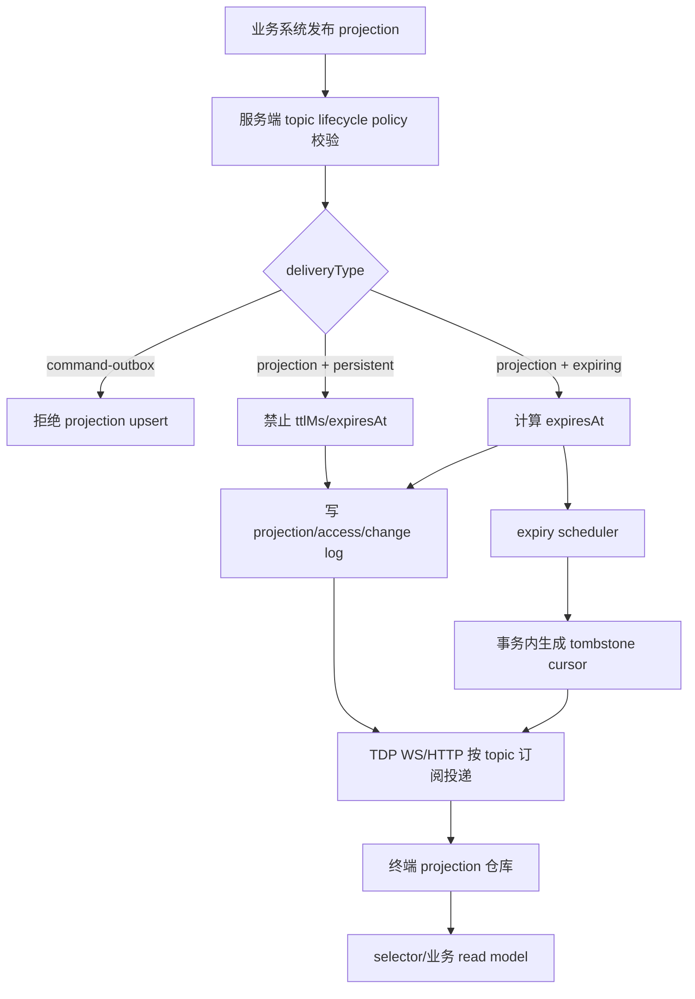

# TDP Projection Lifecycle / TTL 实现计划

> 日期：2026-04-29  
> 关联设计：`as-result/2026-04-29-tdp-projection-lifecycle-ttl-design.md`  
> 状态：实施前计划，待 review 后执行  
> 目标：把 TDP 的 expiring projection 从设计落到服务端、终端、测试和 VM 验收闭环中。

---

## 1. 目标和完成定义

### 1.1 目标

实现 TDP projection 生命周期能力，使通知类 topic 可以声明 TTL。TTL 到期后，TDP 服务端自动生成带 cursor 的 tombstone/delete，在线终端实时清理，离线终端通过 changes 或 full snapshot 收敛，终端本地也能防御性过滤过期投影。

### 1.2 完成定义

只有同时满足以下条件，才算完成：

1. 服务端支持 topic lifecycle policy，`persistent` topic 默认拒绝 TTL，`expiring` topic 能计算、校验并保存 `expiresAt`。
2. 服务端 snapshot 过滤过期投影，不依赖 scheduler 才正确。
3. expiry scheduler 具备 claim、事务、幂等 tombstone、背压和指标，重复执行不会重复生成 tombstone。
4. TTL tombstone 写入 `tdp_change_logs`，保持 terminal cursor 单调递增。
5. 在线 session 只收到自己订阅 topic 的 TTL delete。
6. 终端协议、projection 仓库、selector、topic changed 广播都正确处理 `expiresAt` 和 TTL delete。
7. 终端本地持久化恢复后，不会向业务 read model 暴露已经过期的 projection。
8. `command-outbox` topic 不能通过 projection upsert 写入。
9. 服务端测试、终端测试、live/e2e、VM 验证全部通过。
10. 文档和项目长期记忆更新，能说明实现边界、已验证证据和剩余风险。

---

## 2. 总体架构

### 2.1 数据流



### 2.2 模块边界

| 模块 | 职责 |
|---|---|
| 服务端 DB/schema | 保存 lifecycle、expiresAt、claim、tombstone key、audit/event 可选记录 |
| 服务端 lifecycle policy | 解析 topic 策略，校验 TTL 字段，统一计算 `expiresAt` |
| 服务端 publisher | 写 projection、access、change log 时携带 lifecycle 字段 |
| 服务端 snapshot/changes | snapshot 过滤过期当前态，changes 保留历史 upsert/delete 顺序 |
| 服务端 scheduler | 到期 claim、事务生成 tombstone、背压、指标、在线推送 |
| 终端 protocol/types | `TdpProjectionEnvelope` 增加 `expiresAt/lifecycle/expiryReason` |
| 终端 reducer/selector | 过期 upsert 防御、delete 清理、selector 隐藏过期数据 |
| 终端 local cleanup | 启动/定时清理过期持久化 projection，并触发 topic changed |
| 测试/VM | 验证单元、集成、live、真实运行链路 |

---

## 3. 文件变更地图

### 3.1 服务端

| 文件 | 变更 |
|---|---|
| `0-mock-server/mock-terminal-platform/server/src/database/schema.ts` | 扩展 Drizzle schema：topic lifecycle、projection expiresAt/claim、access expiresAt、change log tombstone 字段、可选 lifecycle events |
| `0-mock-server/mock-terminal-platform/server/src/database/index.ts` | SQLite 迁移/建表/索引/默认字段补齐 |
| `0-mock-server/mock-terminal-platform/server/src/modules/tdp/lifecyclePolicy.ts` | 新增：topic lifecycle policy 解析、TTL 计算、校验、错误码 |
| `0-mock-server/mock-terminal-platform/server/src/modules/tdp/service.ts` | upsertProjectionBatch 写入 TTL 字段；snapshot/changes/highWatermark 过滤；tombstone 事务函数；access cleanup |
| `0-mock-server/mock-terminal-platform/server/src/modules/tdp/expiryScheduler.ts` | 新增：run once、start scheduler、claim、背压、指标 |
| `0-mock-server/mock-terminal-platform/server/src/modules/tdp/wsProtocol.ts` | `TdpProjectionEnvelope` 增加 lifecycle 字段 |
| `0-mock-server/mock-terminal-platform/server/src/modules/tdp/wsServer.ts` | scheduler delete 在线推送沿用订阅过滤；SESSION timestamp 用于终端时间偏移 |
| `0-mock-server/mock-terminal-platform/server/src/modules/admin/routes.ts` | admin run-once/stats，projection/topic 列表返回 lifecycle 信息 |
| `0-mock-server/mock-terminal-platform/server/src/modules/sandbox/service.ts` | seed topic 默认 lifecycle；第一批 expiring topic 配置 |
| `0-mock-server/mock-terminal-platform/server/src/modules/export/importService.ts` | export/import lifecycle 字段兼容 |
| `0-mock-server/mock-terminal-platform/server/src/test/tdp-projection-lifecycle.spec.ts` | 新增服务端 TTL 专项测试 |
| `0-mock-server/mock-terminal-platform/server/src/test/tdp-projection-publisher.spec.ts` | 补充现有 publisher contract 回归 |

### 3.2 终端

| 文件 | 变更 |
|---|---|
| `1-kernel/1.1-base/tdp-sync-runtime-v2/src/types/state.ts` | `TdpProjectionEnvelope` 增加 `expiresAt/lifecycle/expiryReason`，sync state 增加 server clock offset/local cleanup 状态 |
| `1-kernel/1.1-base/tdp-sync-runtime-v2/src/types/protocol.ts` | 协议类型同步 |
| `1-kernel/1.1-base/tdp-sync-runtime-v2/src/foundations/reduceServerMessage.ts` | 过期 upsert 过滤、cursor 仍推进、server timestamp 更新 |
| `1-kernel/1.1-base/tdp-sync-runtime-v2/src/features/slices/tdpProjection.ts` | reducer 层支持 `expiresAt`，delete 清理保持当前行为 |
| `1-kernel/1.1-base/tdp-sync-runtime-v2/src/selectors/tdpSync.ts` | selector 过滤本地已过期 projection |
| `1-kernel/1.1-base/tdp-sync-runtime-v2/src/features/actors/topicChangePublisherActor.ts` | 本地清理或过期过滤后触发 topic changed/rebuild |
| `1-kernel/1.1-base/tdp-sync-runtime-v2/src/features/commands/index.ts` | 如需要，新增 cleanup command |
| `1-kernel/1.1-base/tdp-sync-runtime-v2/src/foundations/projectionExpiry.ts` | 新增：终端本地过期判断、时间偏移、宽限策略 |
| `1-kernel/1.1-base/tdp-sync-runtime-v2/test/scenarios/tdp-sync-runtime-v2.spec.ts` | 终端 TTL 单元/场景测试 |
| `1-kernel/1.1-base/tdp-sync-runtime-v2/test/scenarios/tdp-sync-runtime-v2-live-projection-lifecycle.spec.ts` | 新增 live 端到端测试 |

### 3.3 文档和验证记录

| 文件 | 变更 |
|---|---|
| `as-result/2026-04-29-tdp-projection-lifecycle-ttl-implementation-log.md` | 实施过程记录 |
| `as-result/2026-04-29-tdp-projection-lifecycle-ttl-acceptance-report.md` | 验收证据 |
| `.omx/project-memory.json` 或项目长期记忆 | 完成后写入关键设计和验证结果 |

---

## 4. 详细实现设计

### 4.1 Topic lifecycle policy

新增 `lifecyclePolicy.ts`，服务端统一入口：

```ts
export type TdpProjectionLifecycle = 'persistent' | 'expiring'
export type TdpDeliveryType = 'projection' | 'command-outbox'

export interface TdpTopicLifecyclePolicy {
  topicKey: string
  lifecycle: TdpProjectionLifecycle
  deliveryType: TdpDeliveryType
  defaultTtlMs?: number
  minTtlMs?: number
  maxTtlMs?: number
  allowPublisherExpiresAt: boolean
  allowPublisherTtlMs: boolean
}
```

策略来源优先级：

1. `tdp_topics` 表配置。
2. 服务端内置 registry，作为迁移前默认值。
3. fallback：`persistent + projection`。

发布校验规则：

| 条件 | 结果 |
|---|---|
| `deliveryType='command-outbox'` 且走 projection upsert | 拒绝 `TDP_TOPIC_REQUIRES_COMMAND_OUTBOX` |
| `persistent` 且传 `ttlMs/expiresAt` | 拒绝 `TDP_TOPIC_DOES_NOT_ALLOW_TTL` |
| `expiring` 且无 `ttlMs/expiresAt/defaultTtlMs` | 拒绝 `TDP_EXPIRES_AT_REQUIRED` |
| `expiresAt <= serverNow` | 默认拒绝 `TDP_EXPIRES_AT_ALREADY_EXPIRED` |
| `occurredAt > serverNow + 5min` | 拒绝 `TDP_OCCURRED_AT_IN_FUTURE` |
| TTL 超出 topic/system max | 拒绝 `TDP_EXPIRES_AT_OUT_OF_RANGE` |

### 4.2 数据库存储

第一阶段建议不删除已有 `retention_hours`，只追加字段，并迁移默认值：

```sql
ALTER TABLE tdp_topics ADD COLUMN lifecycle TEXT DEFAULT 'persistent';
ALTER TABLE tdp_topics ADD COLUMN delivery_type TEXT DEFAULT 'projection';
ALTER TABLE tdp_topics ADD COLUMN default_ttl_ms INTEGER;
ALTER TABLE tdp_topics ADD COLUMN min_ttl_ms INTEGER;
ALTER TABLE tdp_topics ADD COLUMN max_ttl_ms INTEGER;
ALTER TABLE tdp_topics ADD COLUMN expiry_action TEXT DEFAULT 'tombstone';
ALTER TABLE tdp_topics ADD COLUMN delivery_guarantee TEXT DEFAULT 'retained-until-deleted';
```

Projection/access/change log 字段都用毫秒时间戳，协议层转换成 ISO 字符串。

是否新增 `tdp_projection_lifecycle_events` 要在实现前明确。如果产品没有历史 payload 查询要求，第一期可以只保留 audit log + change log retention 窗口；如果需要 admin 查历史，必须在阶段 1 一并实现，不能等 scheduler 删除后再补。

### 4.3 发布写入

`upsertProjectionBatch` 增加生命周期解析：

1. 对每个 item 读取 policy。
2. 校验 operation：
   - `delete` 允许 persistent/expiring，并生成 `change_reason='PUBLISHER_DELETE'`。
   - `upsert` 按 policy 计算 `expiresAt`。
3. `tdp_projections` 写入 `lifecycle/expires_at/expiry_status`。
4. `tdp_terminal_projection_access` 写入 `lifecycle/expires_at`。
5. `tdp_change_logs` 写入 `expires_at/change_reason`。
6. `toProjectionEnvelope` 输出 `expiresAt/lifecycle/expiryReason`。

幂等路径：

- `source_event_id` 命中时返回原 accepted `payload/revision/expiresAt`。
- 不刷新 TTL。
- 如果调用方要延期，必须新 `source_event_id` 或更高 `sourceRevision`。

### 4.4 Snapshot / changes

Snapshot 当前态查询增加：

```sql
AND (expires_at IS NULL OR expires_at > :serverNow)
```

Changes 查询不按 `expires_at` 过滤历史 upsert；它只按 cursor/topic/subscription 分页。因为终端可能需要顺序应用 upsert 后 delete。若 upsert 已过期但 delete 尚未生成，终端防御过滤兜底。

HighWatermark：

- 短期保持现有 visible highWatermark 语义。
- 清理 delete access 前必须确保 highWatermark 不依赖该 access row；如果依赖，就先引入独立 `tdp_terminal_cursors` 作为权威水位。

### 4.5 Expiry scheduler

新增 `runTdpProjectionExpiryOnce(options?)`：

```ts
export interface TdpProjectionExpiryRunResult {
  sandboxId: string
  claimedProjectionCount: number
  expiredProjectionCount: number
  generatedTombstoneCount: number
  duplicateTombstoneCount: number
  skippedChangedRevisionCount: number
  oldestExpiredLagMs: number
  durationMs: number
}
```

事务边界：

```text
BEGIN
  verify claim still current
  select access rows
  preallocate cursor per terminal
  insert tombstone change logs with tombstone_key
  update access operation='delete'
  delete projection or mark expired done
  optional lifecycle event
COMMIT

after commit:
  queue realtime delete to online subscribed sessions
```

背压：

| 参数 | 默认 |
|---|---:|
| `TDP_PROJECTION_EXPIRY_INTERVAL_MS` | 30000 |
| `TDP_PROJECTION_EXPIRY_BATCH_SIZE` | 500 |
| `TDP_PROJECTION_EXPIRY_MAX_TOMBSTONES_PER_RUN` | 5000 |
| `TDP_PROJECTION_EXPIRY_CLAIM_TIMEOUT_MS` | 300000 |
| `TDP_PROJECTION_EXPIRY_PUSH_MAX_BATCH_SIZE` | 100 |

### 4.6 终端防御

新增终端工具：

```ts
export const TDP_EXPIRES_AT_LOCAL_DROP_GRACE_MS = 5 * 60 * 1000

export const isTdpProjectionExpiredForLocalDefense = (
  expiresAt: string | null | undefined,
  estimatedServerNow: number,
) => {
  if (!expiresAt) return false
  const expiresAtMs = Date.parse(expiresAt)
  if (!Number.isFinite(expiresAtMs)) return false
  return expiresAtMs + TDP_EXPIRES_AT_LOCAL_DROP_GRACE_MS <= estimatedServerNow
}
```

终端消息处理要求：

- 过滤过期 upsert 时，不能阻断 cursor 更新。
- delete tombstone 总是应用。
- selector 默认不返回过期 projection。
- 本地物理清理删除 projection 后必须触发 topic changed/rebuild。

server clock offset：

- 从 WS 消息 `timestamp` 或 `SESSION_READY` 扩展字段估算。
- 没有服务端时间时用 `Date.now()`，但加 5 分钟宽限。

---

## 5. 测试方法

### 5.1 服务端测试

新增文件：

`0-mock-server/mock-terminal-platform/server/src/test/tdp-projection-lifecycle.spec.ts`

测试组：

1. **Policy validation**
   - persistent + ttl 被拒绝。
   - expiring + defaultTtlMs 成功。
   - expiring + expiresAt 超 max 被拒绝。
   - command-outbox topic 走 projection upsert 被拒绝。
   - occurredAt 未来超过 5 分钟被拒绝。

2. **Publisher persistence**
   - upsert 后 `tdp_projections/tdp_terminal_projection_access/tdp_change_logs` 都有 `expires_at/lifecycle`。
   - `toProjectionEnvelope` 返回 ISO `expiresAt`。
   - `source_event_id` 重放返回原始 `expiresAt`。

3. **Snapshot / changes**
   - TTL 内 snapshot 包含 item。
   - TTL 后 scheduler 未执行时 snapshot 不包含 item。
   - changes 仍能按 cursor 返回 upsert/delete 顺序。

4. **Scheduler**
   - 到期后生成 delete change log。
   - 重复 run 不重复 tombstone。
   - 模拟事务失败不留下 projection 已删但 change log 缺失的状态。
   - fanout 多 terminal 时 cursor 连续、per terminal highWatermark 正确。
   - 只推送给订阅 topic 的 session。

5. **Backpressure / cleanup**
   - 1000 条 TTL=1s 分批处理。
   - delete access cleanup 后 highWatermark 不回退。

命令：

```bash
corepack yarn workspace @next/mock-terminal-platform-server test -- src/test/tdp-projection-lifecycle.spec.ts --no-file-parallelism --maxWorkers=1
corepack yarn workspace @next/mock-terminal-platform-server type-check
```

### 5.2 终端测试

修改：

`1-kernel/1.1-base/tdp-sync-runtime-v2/test/scenarios/tdp-sync-runtime-v2.spec.ts`

或新增：

`1-kernel/1.1-base/tdp-sync-runtime-v2/test/scenarios/tdp-sync-runtime-v2-projection-lifecycle.spec.ts`

测试组：

1. **Protocol reduction**
   - `FULL_SNAPSHOT` 带未过期 `expiresAt` 写入。
   - `CHANGESET` 带已过期 upsert 不写入 projection，但 `lastCursor/nextCursor` 更新。
   - `PROJECTION_CHANGED delete` 清理 projection。
   - `PROJECTION_BATCH` 混合过期/未过期时只写有效 upsert，delete 仍应用。

2. **Selectors**
   - `selectTdpActiveProjectionEntriesByTopic` 不返回过期 item。
   - resolved projection 不把过期高优先级 scope 覆盖未过期低优先级 scope。

3. **Local cleanup**
   - 持久化恢复旧 projection 后，selector 不暴露。
   - 执行 cleanup command 后 entry 被物理删除。
   - cleanup 触发 topic changed/rebuild。

4. **Clock skew**
   - 本地时钟快 4 分钟，未超过 grace，不提前丢弃。
   - 本地时钟快 6 分钟，超过 grace，丢弃。
   - 使用服务端 timestamp 估算 offset 后判断稳定。

命令：

```bash
corepack yarn workspace @next/kernel-base-tdp-sync-runtime-v2 test -- test/scenarios/tdp-sync-runtime-v2-projection-lifecycle.spec.ts --no-file-parallelism --maxWorkers=1
corepack yarn workspace @next/kernel-base-tdp-sync-runtime-v2 type-check
```

### 5.3 Live / HTTP / WS 端到端测试

新增：

`1-kernel/1.1-base/tdp-sync-runtime-v2/test/scenarios/tdp-sync-runtime-v2-live-projection-lifecycle.spec.ts`

场景：

1. 启动 mock platform test server。
2. 激活 terminal。
3. TDP runtime handshake 订阅 `order.payment.completed`。
4. 服务端发布 TTL=2 秒 projection。
5. 终端收到 upsert，projection/read model 可见。
6. 手动调用 `POST /api/v1/admin/tdp/projections/expire/run-once` 或等待 scheduler。
7. 终端收到 delete，projection/read model 清理。
8. 关闭终端，重新启动，用同一 storage 恢复，确认旧 projection 不暴露。
9. 另一个终端 TTL 后首次连接，full snapshot 不含该 item。

命令：

```bash
corepack yarn workspace @next/kernel-base-tdp-sync-runtime-v2 test -- test/scenarios/tdp-sync-runtime-v2-live-projection-lifecycle.spec.ts --no-file-parallelism --maxWorkers=1
```

### 5.4 回归测试

服务端：

```bash
corepack yarn workspace @next/mock-terminal-platform-server type-check
corepack yarn workspace @next/mock-terminal-platform-server test -- src/test/tdp-projection-publisher.spec.ts --no-file-parallelism --maxWorkers=1
corepack yarn workspace @next/mock-terminal-platform-server test -- src/test/tdp-dynamic-group.spec.ts --no-file-parallelism --maxWorkers=1
corepack yarn workspace @next/mock-terminal-platform-server test -- src/test/terminal-log-api.spec.ts --no-file-parallelism --maxWorkers=1
```

终端：

```bash
corepack yarn workspace @next/kernel-base-tdp-sync-runtime-v2 type-check
corepack yarn workspace @next/kernel-base-tdp-sync-runtime-v2 test -- test/scenarios/tdp-sync-runtime-v2.spec.ts --no-file-parallelism --maxWorkers=1
corepack yarn workspace @next/kernel-base-tdp-sync-runtime-v2 test -- test/scenarios/tdp-sync-runtime-v2-live-restart-recovery.spec.ts --no-file-parallelism --maxWorkers=1
```

### 5.5 VM 验证

VM 验证不替代自动化测试，只证明真实 runtime/网络/持久化链路可用。

前置：

```bash
corepack yarn mock:platform:dev
corepack yarn android:automation:forward
corepack yarn android:automation:hello
```

验证步骤：

1. 准备 activation：

```bash
corepack yarn mock:platform:prepare-activation
```

2. 在 VM/Android assembly 激活终端：

```bash
corepack yarn android:automation:activate-device
corepack yarn android:automation:wait-activated
```

3. 通过 admin/debug API 发布 TTL=10 秒的 `order.payment.completed`。
4. 用 automation RPC 查询终端 TDP projection/read model，确认通知可见。
5. 触发 expiry run-once 或等待 scheduler。
6. 再查询终端状态，确认通知消失。
7. 重启 app/runtime，再查询，确认本地持久化未恢复过期通知。
8. 检查服务端 change log：有 upsert cursor 和 TTL delete cursor。

验收证据记录到：

`as-result/2026-04-29-tdp-projection-lifecycle-ttl-acceptance-report.md`

至少记录：

- mock platform dev server URL。
- terminalId/sandboxId。
- upsert cursor/delete cursor。
- 终端 projection 查询前后结果。
- 重启恢复后结果。
- 执行命令和关键输出。

---

## 6. 实施阶段计划

### 阶段 0：决策确认和防线测试

目标：先锁住当前行为，避免改造时破坏主数据和订阅。

- [ ] 确认第一批 expiring topic：建议只启用 `order.payment.completed`。
- [ ] 确认是否需要 `tdp_projection_lifecycle_events`。若不需要，文档写明过期后不承诺历史 payload 查询。
- [ ] 新增 failing tests：persistent topic + TTL 被拒绝、command-outbox topic 被 projection upsert 拒绝。
- [ ] 跑测试确认红灯。

验收：

- 有明确产品决策记录。
- 新测试能证明当前实现缺口。

### 阶段 1：服务端契约和存储

目标：写入 TTL 字段但不自动过期。

- [ ] 扩展 schema/database migration。
- [ ] 新增 lifecycle policy resolver。
- [ ] 扩展 `upsertProjectionBatch` 输入、校验和返回。
- [ ] 扩展 `toProjectionEnvelope`。
- [ ] 扩展 admin topic/projection list 输出。
- [ ] 扩展 export/import。
- [ ] 服务端 policy/publisher tests 通过。

验收：

- TTL 内 projection 能写入 `expires_at` 并通过 snapshot 返回 ISO `expiresAt`。
- persistent 默认安全。
- command-outbox 被拒绝。

### 阶段 2：服务端 snapshot 过滤和 scheduler

目标：服务端权威过期清理闭环。

- [ ] snapshot 查询过滤 `expires_at <= now`。
- [ ] changes 保持 cursor 顺序，不误过滤历史。
- [ ] 实现 `runTdpProjectionExpiryOnce`。
- [ ] 实现 claim/事务/幂等 tombstone。
- [ ] 实现在线推送和订阅过滤。
- [ ] 实现 run-once/stats admin API。
- [ ] 实现 delete access cleanup。
- [ ] 服务端 scheduler/backpressure tests 通过。

验收：

- TTL 后 snapshot 不含过期数据，即使 scheduler 未跑。
- scheduler 生成 delete cursor。
- 重复 scheduler run 不重复 tombstone。
- 事务失败测试能证明不产生半写状态。

### 阶段 3：终端协议和本地防御

目标：终端不会展示过期 projection。

- [ ] 扩展终端 protocol/types。
- [ ] 新增 projection expiry 工具。
- [ ] reduceServerMessage 过滤过期 upsert，cursor 仍推进。
- [ ] selector 过滤过期 projection。
- [ ] 本地 cleanup command/actor。
- [ ] topic changed/rebuild 覆盖本地清理。
- [ ] 终端 clock skew tests 通过。

验收：

- 已过期 upsert 不写本地仓库但 cursor 推进。
- 本地持久化旧数据恢复后不暴露。
- cleanup 后业务 read model 收敛。

### 阶段 4：端到端和 VM 验证

目标：真实链路证明。

- [ ] live test 跑通。
- [ ] 服务端回归测试跑通。
- [ ] 终端回归测试跑通。
- [ ] VM 上完成发布 TTL、收到、过期、清理、重启恢复验证。
- [ ] 生成验收报告。
- [ ] 写入项目长期记忆。

验收：

- 完成定义全部满足。
- 无已知未修复的功能性错误。
- 如果存在未验证项，必须在验收报告中明确标注，不能宣称完成。

---

## 7. 验收标准矩阵

| 编号 | 验收项 | 证明方式 |
|---|---|---|
| AC-1 | persistent topic 不能 TTL | 服务端测试 |
| AC-2 | expiring topic 计算并保存 `expiresAt` | 服务端测试 + DB 查询 |
| AC-3 | command-outbox topic 拒绝 projection upsert | 服务端测试 |
| AC-4 | TTL 后 snapshot 不返回过期 projection | 服务端测试 + live test |
| AC-5 | scheduler 事务化生成 tombstone cursor | 服务端测试 |
| AC-6 | scheduler 幂等，重复 run 不重复 tombstone | 服务端测试 |
| AC-7 | scheduler 大批量有背压 | 服务端测试 |
| AC-8 | 在线 session 只收到订阅 topic 的 delete | WS 集成测试 |
| AC-9 | changes 分页返回 upsert/delete 顺序，hasMore 正确 | HTTP 测试 |
| AC-10 | 终端过期 upsert 不写仓库但推进 cursor | 终端测试 |
| AC-11 | 终端 selector 不暴露过期 projection | 终端测试 |
| AC-12 | 终端本地清理触发业务 rebuild | 终端测试 |
| AC-13 | 重启恢复后不过期污染 | live test + VM |
| AC-14 | VM 实机链路完成 upsert/delete/restart | 验收报告 |
| AC-15 | 文档和长期记忆更新 | 文件检查 |

---

## 8. 风险和降级策略

| 风险 | 影响 | 降级 |
|---|---|---|
| scheduler 积压 | tombstone 延迟，终端短时间靠本地防御 | 提高 batch/频率，增加告警，限制 expiring topic 写入量 |
| 终端时钟异常 | 可能晚清理或提前清理 | 使用服务端 timestamp offset，默认 5 分钟宽限 |
| change log retention 太短 | 离线终端无法增量拿到 tombstone | cursor stale 后 full snapshot，终端本地防御清理 |
| audit 历史需求未定 | 过期后 payload 不可查 | 阶段 0 必须决策；需要则先建 lifecycle events |
| command/outbox 和 projection 混用 | ACK 语义混乱 | projection upsert 直接拒绝 command-outbox topic |
| access delete 无限增长 | DB 膨胀 | 独立 cleanup + highWatermark 不依赖 access delete |

---

## 9. 执行记录要求

实施时同步维护：

`as-result/2026-04-29-tdp-projection-lifecycle-ttl-implementation-log.md`

每个阶段记录：

- 改了哪些文件。
- 新增/修改了哪些测试。
- 跑了哪些命令。
- 失败过什么，如何修复。
- 阶段验收证据。
- 未完成项和下一步。

最终生成：

`as-result/2026-04-29-tdp-projection-lifecycle-ttl-acceptance-report.md`

报告必须包含：

- 自动化测试清单和结果。
- VM 验证步骤和结果。
- 完成定义逐条对照。
- 剩余风险。
- 是否写入长期记忆。

---

## 10. 建议执行顺序

推荐按以下顺序执行：

1. 阶段 0：先确认 audit 历史和第一批 topic，写红灯测试。
2. 阶段 1：服务端契约和存储。
3. 阶段 2：服务端 scheduler 和 snapshot/changes。
4. 阶段 3：终端防御。
5. 阶段 4：live + VM + 报告 + 长期记忆。

不要先写终端本地过滤再补服务端 TTL。服务端是权威，终端只是防御；如果顺序倒置，容易得到“终端看起来没问题，但服务端 projection/access 继续膨胀”的假完成。
