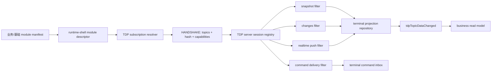

# TDP Topic 按需订阅与投递改造设计

> 日期：2026-04-28  
> 范围：`1-kernel/1.1-base`、`1-kernel/1.2-business`、`0-mock-server/mock-terminal-platform/server`  
> 目标：把 TDP 从“后台按终端投递所有可达 topic，终端业务包自行过滤”升级为“终端声明关心 topic，握手协商，服务端按需投递，终端仍保留防御性过滤”的完整设计。

## 1. 背景与结论

当前 TDP 协议类型中已经预留了 `subscribedTopics` 字段，服务端在线 session 也已经保存了 `subscribedTopics`，但真正的数据路径还没有使用它：

- `tdp-sync-runtime-v2` 的 `HANDSHAKE` 类型有 `subscribedTopics?: string[]`，但当前 `sessionConnectionRuntime` 没有发送。
- `mock-terminal-platform` 的 `wsServer` 会读取 `payload.subscribedTopics ?? []` 到在线 session，但 `FULL_SNAPSHOT`、`CHANGESET`、实时 `PROJECTION_CHANGED / PROJECTION_BATCH` 仍然按终端全量投递。
- 业务主数据包当前通过 `tdpTopicDataChanged` 后再用本包 topic set 过滤，例如 `organizationIamTopicList`、`cateringProductTopicList`、`cateringStoreOperatingTopicList`。

推荐目标架构是：

```text
各 kernel module 在 manifest 声明 TDP topic interest
  -> runtime-shell 汇总当前产品包安装后的有效 topic 订阅
  -> tdp-sync-runtime-v2 在 HANDSHAKE 发送 subscribedTopics + subscriptionHash + capabilities
  -> 服务端按 terminal scope AND topic subscription 过滤 snapshot / changes / realtime push / command
  -> 终端 TDP 层再次防御性过滤
  -> 业务包只处理本包声明过的 topic
```

核心设计结论：

1. **服务端应该按需推送**，不能长期依赖终端业务包过滤所有 topic。
2. **终端仍要过滤**，但它是防御边界，不是主要流量治理机制。
3. **topic interest 应该声明在 kernel module manifest**，不要由 assembly 写死一份散落的配置。
4. **cursor 仍然是最优核心方案**，但必须绑定 `terminalId + subscriptionHash` 语义；订阅集合变化必须 full snapshot / rebase。
5. **不要用 `lastUpdatedAt` 作为同步游标**；可选的 per-topic cursor 可以作为诊断、补偿和未来优化，但不作为第一阶段主协议。
6. **大数据量处理必须和订阅改造同步设计**。订阅变化会更频繁触发 full snapshot，因此必须补齐 snapshot 分片、changes 分页续拉、服务端背压、批量 cursor、终端分批落库与 ACK/APPLIED 时序，否则按需订阅会把原有“大快照单帧传输”的隐患放大。

关键一致性约定：

- **TCP 激活阶段**只做终端身份、激活码授权、TerminalProfile/TerminalTemplate 与 assembly capability 的兼容性校验，不在这里订阅 TDP topic。
- **TDP handshake 阶段**才发送 `subscribedTopics + subscriptionHash + capabilities`，服务端也只在这一阶段建立 session subscription。
- 终端可以在启动 runtime 时汇总当前模块的 `tdpTopicInterests`；“启动时汇总”是本地准备动作，“handshake 时发送”才是协议订阅动作。
- `TerminalAssemblyCapabilityManifestV1` 与 `TdpTopicInterestDeclarationV1` 分离：前者用于激活兼容性，后者用于 TDP topic 订阅。

## 2. 设计目标

### 2.1 功能目标

- 终端启动时自动收集当前安装包关心的 TDP topic。
- TDP `HANDSHAKE` 将订阅 topic 发给服务器。
- 服务器只返回终端订阅范围内的：
  - `FULL_SNAPSHOT`
  - `CHANGESET`
  - `PROJECTION_CHANGED`
  - `PROJECTION_BATCH`
  - `COMMAND_DELIVERED`
- 订阅变更时能可靠重建本地 projection 和业务 read model。
- 大数据量 snapshot / changes 能分页、分片和可重试，不用单条巨型消息承载。
- 老终端、老服务端可以渐进兼容。

### 2.2 安全目标

- `subscribedTopics` 只能缩小数据投递范围，不能扩大终端授权范围。
- 服务端仍然必须先按 `sandboxId + terminalId + scope` 做授权和可达性判断，再做 topic 过滤。
- 服务端不能因为终端声明某 topic 就跨租户、跨门店、跨 terminal 投递。
- 终端收到未订阅 topic 时不写入本地 projection 仓库，并记录协议异常。

### 2.3 健壮性目标

- 断线重连、离线补偿、HTTP changes、全量 snapshot 与实时 push 的 topic 过滤语义一致。
- cursor 不依赖时间戳，不受客户端时钟、服务端多节点时钟漂移影响。
- subscriptionHash 变化后不复用旧 cursor，避免漏掉新订阅 topic 的历史 retained state。
- 支持同一个 terminal 多个在线 session 使用不同订阅集合，服务端按 session 分别过滤。
- cursor ACK 和 `lastAppliedCursor` 只能在本地 projection 已应用并完成必要持久化后推进，避免“服务端认为已应用、终端重启后实际丢数据”的竞态。
- projection 变更广播、scope 优先级解析、topic fingerprint 计算要支持大 topic 集合下的增量处理，避免每条变更触发全量扫描。

### 2.4 非目标

- 不在本设计中重做 TDP projection 的业务建模。
- 不改变后台 authoritative source 与终端 read model 的基本关系。
- 不把业务包改成直接访问后台 API。
- 不把每个 topic 的业务 decode 逻辑下沉到 TDP runtime。

## 3. 当前代码事实

### 3.1 终端侧

`tdp-sync-runtime-v2` 当前协议类型已有字段：

```ts
type HANDSHAKE = {
  sandboxId: string
  terminalId: string
  appVersion: string
  lastCursor?: number
  protocolVersion?: string
  capabilities?: string[]
  subscribedTopics?: string[]
}
```

但当前实际发送 handshake 时只发送：

- `sandboxId`
- `terminalId`
- `appVersion`
- `lastCursor`
- `protocolVersion`
- `runtimeIdentity`

没有发送 `capabilities` 和 `subscribedTopics`。

`runtime-shell-v2` 当前的 `KernelRuntimeModuleV2` 和 `KernelRuntimeModuleDescriptorV2` 也没有 TDP topic interest 声明字段。`preSetup` 可以看到所有 module descriptors，但 descriptor 里只有 module、state、command、actor、error、parameter 等元数据。

业务主数据包当前有明确 topic 列表：

- `organization-iam-master-data`
  - `organizationIamTopicList`
  - 覆盖 `org.*` 与 `iam.*`
- `catering-product-master-data`
  - `cateringProductTopicList`
  - 覆盖商品、菜单、价格、渠道映射等
- `catering-store-operating-master-data`
  - `cateringStoreOperatingTopicList`
  - 覆盖门店配置、可售状态、库存等

业务包现在是在收到 `tdpTopicDataChanged` 后用 `isOrganizationIamTopic`、`isCateringProductTopic`、`isCateringStoreOperatingTopic` 做本地过滤。

### 3.2 服务端侧

服务端已有 `subscribedTopics` session 字段：

```ts
interface OnlineTdpSession {
  subscribedTopics: string[]
  capabilities: string[]
}
```

`wsServer` 在握手时写入：

```ts
subscribedTopics: payload.subscribedTopics ?? []
```

但数据查询和推送未过滤：

- `getTerminalSnapshotEnvelope(sandboxId, terminalId)` 只按 terminal 查询。
- `getTerminalChangesSince(sandboxId, terminalId, cursor, limit)` 只按 terminal 和 cursor 查询。
- `queueProjectionChangeToOnlineTerminal` 对 terminal 的所有在线 session 都 queue。
- `dispatchRemoteControlRelease` 对在线 session 直接发送 `COMMAND_DELIVERED`。

所以当前真实行为是：服务端按终端 scope 找到目标终端后，仍然可能把该终端可达的所有 topic 都投给终端，终端业务包再过滤自己关心的 topic。

## 4. 目标架构



目标分层：

| 层 | 职责 |
| --- | --- |
| 业务包 | 声明自己关心哪些 topic，继续只 decode 本包 topic |
| `runtime-shell-v2` | 承载 module manifest 元数据，并暴露给 runtime |
| `tdp-sync-runtime-v2` | 汇总订阅、计算 hash、发 handshake、本地防御过滤、订阅变更重建 |
| `mock-terminal-platform` TDP server | 记录订阅，按订阅过滤 snapshot / changes / realtime / command |
| 后台主数据发布链路 | 继续写 projection 和 change log，不需要知道具体终端安装了哪些包 |

关键边界：

- **后台发布 projection 时仍然按 scope 生成终端 change log**。这是服务端的终端可达性边界。
- **会话投递时再按 topic subscription 过滤**。这是终端产品形态和包安装差异边界。
- **终端业务包继续过滤**。这是最终防御边界和业务包解码边界。

## 5. 终端侧改造设计

### 5.1 在 module manifest 声明 TDP topic interest

在 `runtime-shell-v2` 扩展公共类型：

```ts
export interface TdpTopicInterestDeclarationV1 {
  topicKey: string
  category?: 'projection' | 'command' | 'system'
  required?: boolean
  reason?: string
}

export interface KernelRuntimeModuleV2 extends AppModule {
  tdpTopicInterests?: readonly TdpTopicInterestDeclarationV1[]
}

export interface KernelRuntimeModuleDescriptorV2 {
  tdpTopicInterests: readonly TdpTopicInterestDeclarationV1[]
}
```

同时扩展：

- `DefineKernelRuntimeModuleManifestV2Input`
- `KernelRuntimeModuleManifestV2`
- `defineKernelRuntimeModuleManifestV2`
- `describeKernelRuntimeModuleV2`

设计原则：

- topic interest 是包契约，不是 assembly 临时配置。
- descriptor 必须包含 topic interest，这样 TDP runtime 可以从当前安装的模块自动汇总。
- `required` 表示该 topic 对模块运行是必需能力；未声明时默认 `false`。服务器如果拒绝 required topic，需要在 handshake response 中回报。
- `category` 只用于终端和服务端可观测性，不作为服务端授权依据。
- `reason` 只用于文档和诊断展示，不参与 subscriptionHash 计算，避免注释性文字变化导致 hash 抖动。

### 5.2 基础 TDP runtime 声明 mandatory topics

`tdp-sync-runtime-v2` 自己必须声明基础 topic：

| topic | category | required | 原因 |
| --- | --- | --- | --- |
| `error.message` | `system` | 是 | runtime-shell error catalog 桥接 |
| `system.parameter` | `system` | 是 | runtime parameter catalog 桥接 |
| `terminal.hot-update.desired` | `system` | 是 | 热更新 desired projection |
| `terminal.group.membership` | `system` | 是 | 终端分组与策略匹配 |
| `tcp.task.release` | `projection` | 视产品需要 | TCP/task release projection |
| `remote.control` | `command` | 视产品能力 | 远程控制命令 |
| `print.command` | `command` | 视产品能力 | 打印命令 |

建议第一阶段把前四个作为 TDP base mandatory topics。后三个不要无条件写死为所有终端 mandatory，而是由对应功能包或产品 shell 声明：

- 没有打印能力的终端不应该收到 `print.command`。
- 没有远程控制能力的轻量终端不应该收到 `remote.control`。
- 如果当前产品事实是所有终端都必须支持远程控制，也应由产品 shell 显式声明，而不是隐藏在服务端全量推送里。

### 5.3 业务包声明自己的 topic list

`organization-iam-master-data`：

```ts
tdpTopicInterests: organizationIamTopicList.map(topic => ({
  topicKey: topic,
  category: 'projection',
  required: true,
  reason: 'organization iam master data read model',
}))
```

`catering-product-master-data`：

```ts
tdpTopicInterests: cateringProductTopicList.map(topic => ({
  topicKey: topic,
  category: 'projection',
  required: true,
  reason: 'catering product master data read model',
}))
```

`catering-store-operating-master-data`：

```ts
tdpTopicInterests: cateringStoreOperatingTopicList.map(topic => ({
  topicKey: topic,
  category: 'projection',
  required: true,
  reason: 'catering store operating read model',
}))
```

产品 shell 或 assembly 如果有产品级 topic，也通过模块声明或产品 shell 模块声明，不要在 TDP runtime 中写死业务 topic。

### 5.4 TDP subscription resolver

在 `tdp-sync-runtime-v2` 增加 resolver：

```ts
export interface ResolvedTdpSubscriptionV1 {
  version: 1
  mode: 'explicit'
  topics: readonly string[]
  hash: string
  sources: readonly {
    moduleName: string
    topicKey: string
    category: 'projection' | 'command' | 'system'
    required: boolean
  }[]
}
```

解析规则：

1. 从 runtime descriptors 读取所有 `tdpTopicInterests`。
2. 加入 `tdp-sync-runtime-v2` base mandatory topics。
3. 去重、排序、校验 topic key。
4. 计算稳定 hash。

hash 输入建议：

```json
{
  "version": 1,
  "mode": "explicit",
  "businessTopics": ["org.store.profile", "..."],
  "baseProfile": "tdp.base.v1"
}
```

hash 计算建议：

- `sha256(JSON.stringify(canonicalSubscription))`
- 输出格式：`sha256:<hex>`
- topics 必须排序，避免模块安装顺序导致 hash 抖动。
- `reason`、module source 顺序、展示字段不参与 hash。
- base mandatory topics 要么通过 `baseProfile` 版本化纳入 hash，要么由服务端强制注入但不参与业务 topic hash；不要让每次基础 topic 小调整都无意触发所有终端 full snapshot。

校验规则：

- topic key 长度建议不超过 128。
- 只允许小写字母、数字、点、短横线、下划线。
- 禁止 `*` 这类 wildcard，除非进入明确的 legacy all 模式。
- 单次订阅数量设置上限，例如 256 或 512，超出视为客户端配置错误。

### 5.5 preSetup 与 install 如何拿到 descriptors

理想方案：`RuntimeModuleContextV2` 和 `RuntimeModulePreSetupContextV2` 都提供 `descriptors`。

当前 `preSetup` 已经有 `descriptors`，`install` 没有。建议对 `runtime-shell-v2` 做小扩展：

```ts
export interface RuntimeModuleContextV2 {
  readonly descriptors: readonly KernelRuntimeModuleDescriptorV2[]
}
```

这样 `tdp-sync-runtime-v2` 在 install 阶段可以直接解析订阅并提供给 connection runtime。

兼容实现方案：

- 如果短期不想扩展 install context，可以让 `createTdpSyncRuntimeModuleV2` 内部创建 `subscriptionRef`。
- `preSetup` 从 `context.descriptors` 解析后写入 `subscriptionRef.current`。
- `installTdpSessionConnectionRuntimeV2` 读取 `subscriptionRef.current`。

但长期更推荐把 descriptors 放入 install context，减少生命周期隐式闭包。

### 5.6 TDP sync state 增加订阅状态

扩展 `TdpSyncState`：

```ts
export interface TdpSyncState {
  lastCursor?: number
  lastAppliedCursor?: number
  activeSubscriptionHash?: string
  activeSubscribedTopics?: readonly string[]
  pendingSubscriptionHash?: string
  lastSubscriptionChangedAt?: number
}
```

持久化：

- `lastCursor`
- `lastAppliedCursor`
- `activeSubscriptionHash`
- `activeSubscribedTopics`

关键语义：

- `lastCursor` 只对 `activeSubscriptionHash` 有效。
- 如果本次启动解析出的 `currentSubscriptionHash !== persisted.activeSubscriptionHash`：
  - handshake 不能发送旧 `lastCursor`，应发送 `lastCursor: 0` 或不发送。
  - handshake 应发送 `subscriptionHashChangedFrom` 供服务端观测。
  - 服务端应返回 `syncMode: 'full'`。
  - 终端应用 `FULL_SNAPSHOT` 后替换本地 projection 仓库，并写入新 hash。

### 5.7 HANDSHAKE 协议扩展

在 `TdpClientMessage.HANDSHAKE.data` 中增加：

```ts
{
  capabilities: [
    'tdp.topic-subscription.v1',
    'tdp.subscription-hash.v1'
  ],
  subscribedTopics: string[],
  subscriptionHash: string,
  subscriptionMode: 'explicit',
  subscriptionVersion: 1,
  subscriptionHashChangedFrom?: string
}
```

保持 `subscribedTopics` 为一维 string list，是为了兼容当前已经预留的协议字段。

建议服务端 `SESSION_READY` 回传：

```ts
{
  subscription?: {
    version: 1
    mode: 'explicit' | 'legacy-all'
    hash: string
    acceptedTopics: string[]
    rejectedTopics: string[]
    requiredMissingTopics: string[]
    fullSnapshotReason?: 'cursor-missing' | 'cursor-expired' | 'subscription-changed'
  }
}
```

如果 `requiredMissingTopics.length > 0`：

- 严格模式：服务端返回 `ERROR` 并关闭 session。
- 兼容模式：服务端 `SESSION_READY` 返回 degraded，并由终端进入 `DEGRADED`。

建议第一阶段使用严格模式，避免终端以缺关键主数据的状态继续运行。

严格模式下的时序必须明确：

- 如果存在 `requiredMissingTopics`，服务端不能继续发送 `FULL_SNAPSHOT`、`CHANGESET` 或分片 snapshot。
- 服务端应发送 `ERROR` 并关闭，或只发送带错误摘要的 `SESSION_READY` 后等待终端关闭，二者择一；不允许一边报告缺 required topic，一边继续投递数据。
- 兼容模式才允许发送 degraded `SESSION_READY`，随后只按 `acceptedTopics` 投递数据。

### 5.8 终端本地防御过滤

即使服务端按需过滤，终端也必须保留两层过滤。

第一层：TDP runtime 过滤。

- `FULL_SNAPSHOT`、`CHANGESET`、`PROJECTION_CHANGED`、`PROJECTION_BATCH` 进入 projection 仓库前，检查 topic 是否属于当前 accepted subscription。
- 未订阅 topic 不写入 projection。
- 记录 protocol diagnostic。
- 建议新增 `NACK` 或 `STATE_REPORT.protocolViolations`，让服务端可观测。

第二层：业务包过滤。

- `organization-iam-master-data` 继续使用 `isOrganizationIamTopic`。
- `catering-product-master-data` 继续使用 `isCateringProductTopic`。
- `catering-store-operating-master-data` 继续使用 `isCateringStoreOperatingTopic`。

这不是重复浪费，而是分层防御：

- TDP 层防止不该落地的数据进入本地仓库。
- 业务层防止 decode 跨包污染。

### 5.9 订阅变化后的本地重建

当 subscriptionHash 变化：

1. TDP handshake 发送 `lastCursor: 0`。
2. 服务端返回 full snapshot。大数据量场景必须优先使用第 7 章定义的 `SNAPSHOT_BEGIN / SNAPSHOT_CHUNK / SNAPSHOT_END` 分片协议；小数据量可兼容旧 `FULL_SNAPSHOT`。
3. 终端先在 pending buffer 中接收新 snapshot，不立即清空旧 projection。
4. `SNAPSHOT_END` 完整性校验通过后，终端用新 snapshot 原子替换本地 retained state。
5. 原子替换时立即清除不在新订阅集合内的旧 topic projection。
6. `topicChangePublisher` 对 snapshot 涉及 topic 重算 fingerprint。
7. 业务包响应 snapshot apply completed / `tdpSnapshotLoaded`，从 TDP projection 仓库 rebuild read model。

当前业务包已经有 `rebuild-*-master-data-from-tdp` 和 `tdpSnapshotLoaded` 后重建的形态，这个方向是正确的。

需要特别注意：

- 缩小订阅集合时，旧 topic 的 projection 必须从本地仓库清除。
- 扩大订阅集合时，不能只靠旧 cursor 拉增量，必须 full snapshot。
- snapshot 替换后，业务 read model 必须 rebuild，不能只等后续单条 topic change。
- snapshot 替换必须是原子的：不能出现“旧 topic A + 新 topic B”的混合状态暴露给 selector 或业务包。
- `ACK` / `STATE_REPORT.lastAppliedCursor` 必须在 snapshot 原子替换、必要持久化、业务重建触发之后再发送；不能在消息刚收到或 reducer 尚未写完时提前确认。

## 6. 服务端改造设计

### 6.1 session registry 扩展

扩展 `OnlineTdpSession`：

```ts
interface OnlineTdpSession {
  subscribedTopics: string[]
  subscriptionHash?: string
  subscriptionMode: 'explicit' | 'legacy-all'
  acceptedTopics: Set<string>
  rejectedTopics: string[]
  supportsTopicSubscription: boolean
}
```

注意：运行时可用 `Set`，持久化与 audit 用 array/json。

### 6.2 数据库扩展

`tdp_sessions` 建议增加：

- `subscription_hash TEXT`
- `subscription_mode TEXT`
- `subscribed_topics_json TEXT`
- `accepted_topics_json TEXT`
- `rejected_topics_json TEXT`

建议新增表：

```sql
CREATE TABLE IF NOT EXISTS tdp_terminal_subscription_offsets (
  sandbox_id TEXT NOT NULL,
  terminal_id TEXT NOT NULL,
  subscription_hash TEXT NOT NULL,
  subscription_mode TEXT NOT NULL,
  subscribed_topics_json TEXT NOT NULL,
  last_delivered_cursor INTEGER,
  last_acked_cursor INTEGER,
  last_applied_cursor INTEGER,
  first_seen_at INTEGER NOT NULL,
  last_seen_at INTEGER NOT NULL,
  PRIMARY KEY (sandbox_id, terminal_id, subscription_hash)
);
```

这个表不是为了替代终端上报的 cursor，而是用于：

- 观测某个订阅版本是否已经完整同步过。
- 服务端诊断终端卡在哪个 subscriptionHash。
- 未来做服务端主动 compensation 或 topic 级追踪。

第一阶段也可以只加 session 字段，不加 offset 表；但从“完整、健壮”角度，建议加。

### 6.2.1 Change Log Retention

`tdp_change_logs` 不能无限增长。topic subscription 会让 `getTerminalChangesSince` 增加 `topic_key IN (...)` 过滤，但如果 change log 表无保留策略，查询成本仍会随运行时间和数据量持续增长，索引只能缓解，不能根治。

推荐策略：

- 按时间保留最近 N 天，例如 7-30 天。
- 同时按 terminal 保留最近 M 个 cursor，例如每个 terminal 至少保留最近 10_000-50_000 条。
- 删除前必须保证 retained snapshot 可重建当前状态，因为过期 cursor 的终端会被强制 full snapshot。
- retention 删除要保留各 terminal 的最小可增量 cursor，用于判断客户端 `lastCursor` 是否已过期。
- 清理任务要按 `sandboxId + terminalId` 分批执行，避免一次性大 delete 阻塞 SQLite。

syncMode 判断应优先基于 retention：

```text
if lastCursor < minRetainedCursorForTerminalSubscription:
  full snapshot
else:
  incremental changes
```

这样比硬编码 `highWatermark - 1000` 更可靠，也和 visible highWatermark 语义兼容。

### 6.3 索引

为过滤查询增加索引：

```sql
CREATE INDEX IF NOT EXISTS idx_tdp_change_logs_terminal_topic_cursor
ON tdp_change_logs (sandbox_id, target_terminal_id, topic_key, cursor);

CREATE INDEX IF NOT EXISTS idx_tdp_change_logs_terminal_cursor_topic
ON tdp_change_logs (sandbox_id, target_terminal_id, cursor, topic_key);

CREATE INDEX IF NOT EXISTS idx_tdp_projections_topic_scope
ON tdp_projections (sandbox_id, topic_key, scope_type, scope_key, item_key);
```

两个 change log 索引各自服务不同查询形态：

- `topic_key IN (...) AND cursor > ?` 时使用 terminal/topic/cursor。
- 按 cursor 顺序补偿、批量分页时使用 terminal/cursor/topic。

### 6.4 handshake 订阅规范化

服务端握手处理流程：

```text
校验 sandboxId / terminalId / token
  -> 识别 capability: tdp.topic-subscription.v1
  -> normalize subscribedTopics
  -> validate topic keys
  -> intersect known/allowed topics
  -> inject server mandatory safe topics if needed
  -> compute server-side hash and compare client hash
  -> 注册 session(subscription)
  -> 计算 visible highWatermark
  -> 判断 full/incremental
  -> SESSION_READY(subscription summary)
  -> FULL_SNAPSHOT or CHANGESET
```

legacy 行为：

- 客户端没有 `tdp.topic-subscription.v1` capability：`subscriptionMode = 'legacy-all'`。
- `legacy-all` 等价于当前行为，服务端不过滤 topic。
- 这样老终端不会因为服务端升级而漏数据。

explicit 行为：

- 客户端声明 capability 且提供 `subscribedTopics`：`subscriptionMode = 'explicit'`。
- 空数组不等价于 all。空数组只代表“除了服务端/终端 mandatory topics 外不订阅业务 topic”。
- 如果客户端声明 capability 但 `subscribedTopics` 缺失或 malformed，返回 `INVALID_SUBSCRIPTION`。

### 6.5 topic 授权边界

订阅 topic 不是授权。服务端投递判断必须是：

```text
isTerminalReachableByScope(sandboxId, terminalId, projection.scope)
AND isTopicSubscribed(session, projection.topicKey)
AND isTopicAllowedForTerminalType(session, projection.topicKey)
```

其中：

- `isTerminalReachableByScope` 是现有 terminal/scope 解析能力。
- `isTopicSubscribed` 来自 handshake。
- `isTopicAllowedForTerminalType` 可以第一阶段先等于 true，后续结合 terminal profile/template/capabilities。

不能把 `subscribedTopics` 当成“终端请求这些 topic 所以都可以给”。

### 6.6 snapshot 过滤

改造函数签名：

```ts
getTerminalSnapshotEnvelope(input: {
  sandboxId: string
  terminalId: string
  subscription: TdpResolvedServerSubscription
}): TdpProjectionEnvelope[]
```

SQL 逻辑：

- legacy-all：保持当前查询。
- explicit：增加 `AND p.topic_key IN (...)`。

返回 `highWatermark` 也要按可见订阅范围计算：

```ts
getHighWatermarkForTerminal(input: {
  sandboxId: string
  terminalId: string
  subscription: TdpResolvedServerSubscription
})
```

visible highWatermark 语义：

- 表示当前订阅集合内，终端可见 change log 的最大 cursor。
- 不要求 cursor 连续。
- 不包含未订阅 topic 的 cursor。

### 6.7 changes 过滤

改造函数签名：

```ts
getTerminalChangesSince(input: {
  sandboxId: string
  terminalId: string
  cursor: number
  limit: number
  subscription: TdpResolvedServerSubscription
})
```

SQL 逻辑：

```sql
SELECT ...
FROM tdp_change_logs
WHERE sandbox_id = ?
  AND target_terminal_id = ?
  AND cursor > ?
  AND topic_key IN (...)
ORDER BY cursor ASC
LIMIT ?
```

`nextCursor` 语义：

- 有 visible changes：`nextCursor = lastVisibleChange.cursor`。
- 无 visible changes：`nextCursor = max(input.cursor, visibleHighWatermark)`。
- 终端不能要求 cursor 连续，cursor 只是服务端生成的 opaque delivery sequence。

`hasMore` 语义：

- 不要简单使用 global highWatermark。
- 应使用 visible subscription 范围内是否还有下一条 change。
- 最稳妥方式是 limit 多查一条，或者查 `EXISTS cursor > nextCursor AND topic IN (...)`。

### 6.8 realtime projection push 过滤

当前队列按 terminal 组织，batch 中只有 change，没有 per-change cursor。这在全量推送时勉强可用，但按 session 过滤后不够健壮。

建议改成按 session 队列：

```ts
interface OnlineTdpSession {
  batchQueue?: Array<{
    cursor: number
    change: TdpProjectionEnvelope
  }>
}
```

实时推送流程：

```text
projection accepted
  -> 写 tdp_change_logs
  -> 找 targetTerminalIds
  -> 找 terminal 在线 sessions
  -> 对每个 session 判断 topic 是否订阅
  -> 只给订阅 session queue
  -> flush 时按该 session 的最后一条 visible cursor 设置 nextCursor
```

伪代码：

```ts
for (const session of listOnlineSessionsByTerminalId(sandboxId, terminalId)) {
  if (!isTopicSubscribed(session, change.topicKey)) {
    continue
  }
  session.batchQueue.push({cursor, change})
  session.lastDeliveredRevision = cursor
}
```

`PROJECTION_CHANGED`：

```ts
data: {
  cursor: queued.cursor,
  change: queued.change,
}
```

`PROJECTION_BATCH`：

```ts
data: {
  changes: queued.map(item => item.change),
  nextCursor: queued[queued.length - 1].cursor,
}
```

这样同一 terminal 的两个 session 即使订阅集合不同，也不会互相污染 cursor。

### 6.9 command delivery 过滤

`COMMAND_DELIVERED` 也必须按 topic subscription 过滤。

当前 `dispatchRemoteControlRelease` 直接发送：

- `remote.control`
- `print.command`
- 其他 payload 中指定的 `topicKey`

目标逻辑：

```text
创建 command outbox
  -> 查在线 sessions
  -> 过滤 subscribed command topic
  -> 只向订阅 session 发送 COMMAND_DELIVERED
  -> outbox / task instance 标记真实投递状态
```

建议状态：

| 状态 | 语义 |
| --- | --- |
| `PENDING` | command 已创建，尚未投递 |
| `DELIVERED` | 至少一个有效 session 已投递 |
| `ACKED` | 终端已 ACK |
| `UNSUBSCRIBED` | 当前终端订阅不包含该 command topic |
| `EXPIRED` | 过期未投递或未 ACK |

如果一个终端类型不支持 `print.command`，服务端不应该把它当作投递失败重试，而应该在任务链路中显示“终端未订阅/不支持该 command topic”。

### 6.10 HTTP snapshot / changes 补偿

当前 HTTP endpoint：

- `GET /api/v1/tdp/terminals/:terminalId/snapshot?sandboxId=...`
- `GET /api/v1/tdp/terminals/:terminalId/changes?sandboxId=...&cursor=...`

目标要求：

- HTTP 补偿必须和当前 TDP subscription 语义一致。
- 不能在 WS 按需过滤后，HTTP fallback 又返回全量。
- 不同场景要分开处理，不能把 session-aware 当成唯一优先方案。

场景一：正常 WS 断线重连。

```text
重新建立 WS
  -> 重新 TDP handshake
  -> 按当前 subscriptionHash 判断 full 或 incremental
```

此时不建议用 HTTP 代替重连，因为 WS handshake 会重新建立 session subscription、capability negotiation 与后续 realtime push 状态。

场景二：WS 仍在线，但握手返回的 `CHANGESET.hasMore = true` 需要补页。

```text
HTTP getChanges(cursor, subscriptionHash, topics)
```

这里优先使用 HTTP changes 分页拉取，避免为了下一页 changes 再发一次 WS handshake。请求必须绑定当前订阅，可以显式携带 `subscriptionHash + topics`，也可以引用当前仍有效的 `sessionId`。

场景三：特殊环境 WS 不可用或调试接口。

```text
HTTP getSnapshot/getChanges with explicit subscriptionHash + topics
```

这种场景不能依赖一个可能不存在或已失效的 WS session，必须显式携带 subscription 参数，或先创建独立的 server-side sync session。

可选 endpoint 形态 A，session-aware endpoint：

```text
GET /api/v1/tdp/sessions/:sessionId/snapshot
GET /api/v1/tdp/sessions/:sessionId/changes?cursor=...
```

服务端从仍有效的 session 读取 subscription，适合“WS 在线、HTTP 只做分页补页”的场景。

可选 endpoint 形态 B，显式 query：

```text
GET /api/v1/tdp/terminals/:terminalId/snapshot?sandboxId=...&subscriptionHash=...&topics=...
GET /api/v1/tdp/terminals/:terminalId/changes?sandboxId=...&cursor=...&subscriptionHash=...&topics=...
```

终端每次 HTTP fallback 都带上当前订阅，适合“无 WS session、调试、特殊网络环境”的场景。

## 7. 大数据量同步、分页与流控设计

> 本章是本次补充的关键设计。topic 按需订阅会减少无关数据，但不会自动解决“大 topic、大 snapshot、大 changeset”的传输与本地处理问题；并且 subscriptionHash 变化会主动触发 full snapshot，因此大数据处理必须作为订阅改造的一等能力。

### 7.1 需要解决的问题

当前实现存在几个结构性风险：

1. `FULL_SNAPSHOT` 是单条 WebSocket 巨型消息，数据量大时会造成传输失败、RN/Hermes 同步 `JSON.parse` 卡顿、Android 低端设备内存压力。
2. snapshot reducer 同步清空并写入全部 projection，JS 线程可能长时间冻结。
3. `CHANGESET` 默认 limit 但握手返回的 `hasMore` 语义不完整，终端也缺少继续拉下一页的闭环。
4. 服务端实时 batch 只是 120ms 合并，不是背压；后台批量导入时可能瞬间把大量 batch 推给终端。
5. 批量 projection 写入时每条变更、每个 terminal 单独查询 next cursor，会产生 N+1 查询。
6. projection record `flushMode: 'immediate'` 在大 snapshot 下会放大本地 I/O。
7. topic fingerprint 当前容易变成“每条变更都全量 stringify + sort”，大 topic 下成本过高。
8. ACK/APPLIED 可能早于本地 state 和持久化完成，导致崩溃恢复后 cursor 已推进但数据未落地。

### 7.2 Full Snapshot 分片协议

新增分片消息，作为新协议默认 full snapshot 形式：

```ts
type TdpServerMessage =
  | {
      type: 'SNAPSHOT_BEGIN'
      data: {
        snapshotId: string
        terminalId: string
        totalChunks: number
        totalItems: number
        highWatermark: number
        subscriptionHash: string
        chunkSize: number
      }
    }
  | {
      type: 'SNAPSHOT_CHUNK'
      data: {
        snapshotId: string
        chunkIndex: number
        items: TdpProjectionEnvelope[]
      }
    }
  | {
      type: 'SNAPSHOT_END'
      data: {
        snapshotId: string
        checksum?: string
      }
    }
```

服务端行为：

- snapshot 查询仍按 `terminal scope AND topic subscription` 过滤。
- 对结果按稳定顺序排序，例如 `topic, scopeType, scopeKey, itemKey, revision`。
- 按条数和估算字节数双阈值切片，建议默认每片 50-100 条，且单片 JSON 目标不超过 128-256KB。
- 发送 `SNAPSHOT_BEGIN` 后按序发送 `SNAPSHOT_CHUNK`，最后发送 `SNAPSHOT_END`。
- 如果 socket 断开，本次 snapshot 作废；终端重连后重新 handshake，服务端重新生成并发送完整分片序列。
- 分片的收益是单片更小、失败后重试完整分片序列比重传单条巨型消息更可靠；它不是天然断点续传。
- 真正的 chunk 断点续传需要终端在重连 handshake 中带 `snapshotId + lastChunkIndex`，并要求服务端缓存同一次 snapshot 的分片结果，复杂度较高，第一阶段不做。

终端行为：

- `SNAPSHOT_BEGIN` 初始化 pending snapshot buffer，不清空现有 projection。
- `SNAPSHOT_CHUNK` 校验 `snapshotId` 和 `chunkIndex`，分批追加到 pending buffer。
- `SNAPSHOT_END` 校验 chunk 数量、条目数和可选 checksum。
- 校验通过后一次性原子替换 `tdpProjection` entries，并清理不在当前 accepted subscription 内的旧 topic。
- 原子替换完成前，selector 继续读取旧 projection，避免 UI 短暂空白或半状态。
- 原子替换完成后再触发业务包 rebuild 和 cursor feedback。

兼容策略：

- 新客户端声明 `tdp.snapshot-chunk.v1` capability 后，服务端优先发送分片消息。
- 老客户端或老服务端仍使用旧 `FULL_SNAPSHOT`。
- 终端本地防御过滤同时作用于旧 `FULL_SNAPSHOT` 与新 `SNAPSHOT_CHUNK`。

### 7.3 Snapshot 原子替换与分批落库

终端 projection 仓库建议引入明确的应用状态：

```ts
interface TdpProjectionState {
  entries: Record<string, TdpProjectionEnvelope>
  pendingSnapshot?: {
    snapshotId: string
    subscriptionHash: string
    totalChunks: number
    totalItems: number
    receivedChunkIndexes: Record<number, true>
    buffer: TdpProjectionEnvelope[]
    highWatermark: number
  }
}
```

应用顺序：

```text
SNAPSHOT_BEGIN
  -> markSnapshotApplying
SNAPSHOT_CHUNK
  -> appendPendingSnapshotChunk
SNAPSHOT_END
  -> validate completeness
  -> replace entries atomically
  -> clear unsubscribed topics
  -> flush or schedule durable persistence
  -> dispatch snapshotApplyCompleted
  -> recompute changed topics / rebuild business read models
  -> ACK + STATE_REPORT
```

如果短期仍要兼容旧 `FULL_SNAPSHOT`，也不能在 reducer 中一次性处理超大数组。过渡方案：

- 对旧 `FULL_SNAPSHOT` 在 actor 层拆成本地 apply batch。
- 应用期间设置 `isApplyingSnapshot`。
- 业务包和 selector 避免在半应用状态读取新旧混合数据。
- 更推荐直接把旧 `FULL_SNAPSHOT` 转入与分片协议相同的 pending snapshot buffer，然后走统一的 `SNAPSHOT_END` 原子替换路径。

持久化策略：

- snapshot 应用期间不应每条 projection `flushMode: 'immediate'`。
- 推荐在 snapshot apply transaction 内批量写入，完成后一次性 flush。
- 如果 state-runtime 暂时不支持事务 flush，至少为 projection entries 使用 debounced/batched flush，并在 ACK 前等待必要的 flush promise 完成。

### 7.4 Changeset 分页与续拉

`CHANGESET` 必须支持分页闭环，而不是只返回一页。

服务端协议：

```ts
type CHANGESET = {
  type: 'CHANGESET'
  data: {
    terminalId: string
    changes: TdpProjectionEnvelope[]
    nextCursor: number
    hasMore: boolean
    highWatermark: number
    pageSize: number
    subscriptionHash: string
  }
}
```

服务端查询规则：

- 按 `sandboxId + terminalId + cursor > lastCursor + topic IN acceptedTopics` 查询。
- `limit + 1` 多查一条判断 `hasMore`。
- `changes = rows.slice(0, limit)`。
- `nextCursor = changes.length ? lastChange.cursor : max(inputCursor, visibleHighWatermark)`。
- `hasMore = rows.length > limit` 或基于 visible subscription 的 `EXISTS`。
- 不能把 `hasMore` 固定为 `false`。

终端续拉规则：

- 处理 `CHANGESET` 后，如果 `hasMore === true`，继续请求下一页。
- 分页拉取优先走现有 `tdp-sync-runtime-v2` HTTP service 扩展后的 `getChanges`，不要通过再次 WS handshake 拉取下一页；重新 handshake 会重置 session 语义。
- HTTP `getChanges` 请求必须携带或绑定当前 `subscriptionHash + topics`，保证和 WS session 的订阅一致。
- 后续如果希望全 WS 化，可以新增非握手类 client message：

```ts
type FETCH_CHANGES = {
  type: 'FETCH_CHANGES'
  data: {
    cursor: number
    limit?: number
    subscriptionHash: string
  }
}
```

续拉闭环：

```text
SESSION_READY incremental
  -> server sends CHANGESET page 1
  -> terminal applies page 1 after persistence
  -> ACK page 1 nextCursor
  -> if hasMore: HTTP getChanges(nextCursor, subscriptionHash, topics)
  -> repeat until hasMore = false
```

`FETCH_CHANGES` 只是可选增强，不是第一阶段必须项。

现有 `httpService.ts` 已经有 `getChanges(sandboxId, terminalId, cursor, limit)` 基础形态，改造时应扩展 query 或请求上下文，携带 `subscriptionHash` 与当前 topic 集合；不应通过再次发送 `HANDSHAKE` 来拉下一页。

### 7.5 Realtime Push 背压与 batch ACK

实时 projection push 需要 session-level queue，这一点在第 6.8 节已定义。大数据量下还需要流控。

建议新增 batch ACK：

```ts
type BATCH_ACK = {
  type: 'BATCH_ACK'
  data: {
    nextCursor: number
    batchId?: string
    processingLagMs?: number
    subscriptionHash: string
  }
}
```

服务端维护：

- 每个 session 的 `inflightBatchCount`。
- 每个 session 的 `pendingVisibleQueue`。
- 每个 session 的可调 batch size / flush interval。

默认策略：

- `inflightBatchCount >= 3` 时暂停继续发送该 session 的 projection batch。
- 收到 `BATCH_ACK` 后再 flush 下一批。
- 如果终端上报 `processingLagMs` 过高，服务端临时降低 batch size 或拉长 flush interval。
- 命令类 topic 可以有更高优先级，但仍不能绕过订阅和授权。

第一阶段可以不实现动态调速，但必须避免“无限连续发送，无任何终端处理反馈”的结构。

### 7.6 服务端批量 cursor 预分配

批量发布 projection 时，不应每条 projection、每个 terminal 都调用一次 `getNextCursorForTerminal`。

推荐在批量写入前按 terminal 分组预分配 cursor：

```ts
const preallocateCursorsForTerminal = (input: {
  sandboxId: string
  terminalId: string
  count: number
}): number[] => {
  const base = getHighWatermarkForTerminalWithoutSubscription(
    input.sandboxId,
    input.terminalId,
  ) + 1
  return Array.from({length: input.count}, (_, index) => base + index)
}
```

注意：

- cursor 仍然是 terminal 级 change log sequence，不因为 topic subscription 改成 per-topic sequence。
- 预分配必须和 change log insert 在同一个事务语义下完成，避免并发写入 cursor 冲突。
- SQLite 单进程场景可以用事务串行化；多节点服务端需要改成数据库 sequence 或独立 cursor allocator。

### 7.7 Topic change 计算与 selector 性能

订阅过滤减少 topic 数量，但不能解决单个 topic 很大的问题。终端应避免每条 projection 都触发全量 topic fingerprint 计算。

推荐改造：

- `PROJECTION_CHANGED` 只重算该 projection 的 topic。
- `PROJECTION_BATCH` 只重算 batch 中出现过的 topic。
- `CHANGESET` 只重算 changes 中出现过的 topic。
- full snapshot / subscription rebase 才重算当前 accepted subscription 内全部 topic。

fingerprint 应基于稳定元数据，而不是 `JSON.stringify(payload)`：

```ts
const toTopicFingerprint = (entries: Record<string, TdpProjectionEnvelope>) =>
  Object.values(entries)
    .map(item => [
      item.itemKey,
      item.scopeType,
      item.scopeId,
      item.revision,
      item.operation,
    ].join(':'))
    .sort()
    .join('|')
```

原因：

- `revision` 在协议上必须代表服务端 projection 内容版本；同一 `topic + scope + itemKey + revision` 的 payload 必须不可变。
- `JSON.stringify(payload)` 对字段插入顺序敏感，可能产生假变更。
- 大 payload stringify 成本高。

因此服务端需要补一条不变量：幂等重放、重试投递或 `IDEMPOTENT_REPLAY` 不能用相同 revision 携带不同 payload。如果发现同 revision payload 不同，应拒绝、生成新 revision，或记录数据一致性错误；否则终端以 revision 做 fingerprint 会漏掉非法内容变化。

scope 优先级 selector 也要 memoize：

- scope chain 只在 TCP binding、terminalId、group membership 变化时重算。
- topic resolved projection 只在该 topic entries 或 scope chain 变化时重算。
- 不要让每个 topic selector 调用都重新构建 scope chain。

### 7.8 Cursor Feedback 顺序

ACK 与 APPLIED 的语义必须拆清楚：

| 回执 | 允许发送时机 |
| --- | --- |
| transport ACK | 消息已收到并通过基础校验，可选 |
| apply ACK | projection 已写入内存 state，topic 变更已计算 |
| applied cursor / state report | projection 已完成必要持久化，业务 rebuild 已触发或完成 |

当前设计中的 `ACK` 更接近 apply ACK，因此必须在数据应用之后发送。

这里需要确认 actor 系统是否保证同一 command 的多个 handler 串行执行。如果当前实现确实串行，竞态概率会降低；但设计上仍应通过显式的 `projectionApplyCompleted` / `snapshotApplyCompleted` 事件保证 ACK 顺序，而不是依赖 actor 调度细节。

推荐事件链：

```text
server message received
  -> validate subscription / hash
  -> apply projection or snapshot pending buffer
  -> atomically commit state
  -> flush required persistence
  -> dispatch topic changes / rebuild business read model
  -> dispatch projectionApplyCompleted(cursor)
  -> cursor feedback actor sends ACK and STATE_REPORT
```

如果未来要区分“收到”和“应用”，可以新增 `RECEIVED_ACK`，但不能用它推进 `lastAppliedCursor`。

### 7.9 HTTP fallback 场景澄清

HTTP fallback 不应默认依赖一个可能已失效的 WS session。

推荐划分：

- 正常断线重连：重新建立 WS，重新 handshake，按当前 subscriptionHash 决定 full 或 incremental。
- WS 仍在线但需要补页：优先用 HTTP `getChanges` 携带当前 `subscriptionHash + topics` 拉取下一页，避免重复握手。
- 特殊环境 WS 不可用：HTTP endpoint 必须显式携带 `subscriptionHash + topics`，或先创建一个 server-side sync session 后再分页。

因此第 6.10 节的 session-aware endpoint 只适合“WS session 仍有效且服务端可查 session subscription”的场景；无 session 补偿必须使用显式 subscription 参数，不能回退到全量 terminal snapshot。

## 8. Cursor 与订阅变化设计

### 8.1 为什么不用 `lastUpdatedAt`

`lastUpdatedAt` 不适合作为核心同步游标：

- 时间戳可能重复，同一毫秒多条变更需要额外 tie-breaker。
- 多节点服务端时钟可能漂移。
- 业务源 `occurredAt`、服务端 `createdAt`、projection `updatedAt` 的语义不同。
- delete、重放、幂等事件、修订覆盖很难只靠时间戳精确表达。
- 客户端时间不能参与服务端增量边界。

所以核心同步游标应继续使用服务端生成的单调 cursor/sequence。

### 8.2 推荐 cursor 模型

主模型：

```text
deliveryCursor = server-generated monotonic cursor per terminal change log
cursor validity = terminalId + subscriptionHash
```

终端本地保存：

```ts
{
  activeSubscriptionHash: string
  lastCursor: number
  lastAppliedCursor: number
}
```

服务端判断：

```text
serverSubscription = normalize(client.subscribedTopics, client.capabilities)
serverHash = hash(serverSubscription)

if client.subscriptionHash exists and client.subscriptionHash != serverHash:
  use serverHash as authoritative
  return ERROR or force FULL with server subscription summary

if client.lastCursor missing:
  full

if client.subscriptionHash != client.persistedSubscriptionHash:
  full

if cursor too old / pruned:
  full

else:
  incremental with topic filter
```

服务端必须以自己规范化后的 subscription 和 hash 为准。客户端传来的 `subscriptionHash` 只用于快速比对和诊断，不作为服务端授权或过滤的权威来源。

syncMode 判断不能继续依赖全局 `highWatermark - 1000` 这样的魔法数字。推荐：

- 优先检查 cursor 是否仍在服务端 change log 保留范围内；过期才 full。
- 如果必须保留阈值，应配置化，例如 `TDP_CURSOR_STALE_THRESHOLD`。
- 阈值计算使用 visible highWatermark，而不是 global highWatermark。

### 8.3 subscriptionHash 变化

订阅变化包括：

- 新增业务包。
- 移除业务包。
- 产品 shell 改变 command topic 能力。
- base runtime 新增 mandatory topic。
- topic key 重命名。

处理策略：

```text
subscriptionHash changed
  -> terminal sends lastCursor = 0
  -> server returns FULL_SNAPSHOT for new subscription
  -> terminal replaces projection repository
  -> business packages rebuild read model
```

不能继续使用旧 cursor，因为旧 cursor 没有覆盖新订阅 topic 的历史 retained state。

### 8.4 每个 topic 一个 cursor 是否需要

不建议第一阶段把“每个 topic 一个 cursor”作为主协议。原因：

- topic 数量多后，handshake 和 state report 会膨胀。
- 服务端分页、ACK、APPLIED、重试语义复杂度明显上升。
- 多 topic 原子投递、跨 topic 因果顺序更难解释。
- 业务包当前需要的是 topic 范围过滤，不是独立 topic 级 replication log。

建议分层：

| 层级 | 是否推荐 | 用途 |
| --- | --- | --- |
| 主 cursor：`terminal + subscriptionHash` | 推荐第一阶段实现 | session delivery、snapshot/changes/reconnect |
| per-topic cursor | 可作为第二阶段辅助能力 | 诊断、单 topic repair、后台运维补偿 |
| `lastUpdatedAt` | 不推荐作为 cursor | 可作为展示字段或业务 freshness 字段 |
| `source_revision` / projection revision | 保留 | 业务新鲜度、幂等、覆盖判断 |

如果未来增加 per-topic cursor，建议使用：

```ts
topicCursors: Record<string, number>
```

其中 number 仍然是服务端生成的 cursor，不是时间戳。

## 9. 协议兼容策略

### 9.1 新客户端连接老服务端

老服务端忽略未知字段：

- `capabilities`
- `subscribedTopics`
- `subscriptionHash`

客户端可能仍收到全量 topic。终端 TDP 层防御过滤可以保护本地仓库。

### 9.2 老客户端连接新服务端

老客户端没有 `tdp.topic-subscription.v1`：

- 服务端进入 `legacy-all`。
- 行为保持当前全量投递。
- `SESSION_READY.subscription.mode = 'legacy-all'` 可用于观测。

### 9.3 新客户端连接新服务端

必须使用 explicit mode：

- 服务端过滤所有 projection 和 command。
- `subscriptionHash` 不匹配或缺失时，服务端以自己规范化后的订阅为准。
- 如果缺 required topic，严格模式拒绝连接。

## 10. 修改清单

### 10.1 终端 `runtime-shell-v2`

文件方向：

- `1-kernel/1.1-base/runtime-shell-v2/src/types/module.ts`
- `1-kernel/1.1-base/runtime-shell-v2/src/supports/moduleDsl.ts`
- `1-kernel/1.1-base/runtime-shell-v2/src/application/moduleDescriptor.ts`
- `1-kernel/1.1-base/runtime-shell-v2/src/application/createKernelRuntimeApp.ts`

改造点：

1. 增加 `TdpTopicInterestDeclarationV1`。
2. `KernelRuntimeModuleV2` 增加 `tdpTopicInterests`。
3. manifest DSL 支持 `tdpTopicInterests`。
4. descriptor 输出 `tdpTopicInterests`。
5. `RuntimeModuleContextV2` 增加 `descriptors`，install 阶段可读取全量 module descriptors。

### 10.2 终端 `tdp-sync-runtime-v2`

文件方向：

- `application/moduleManifest.ts`
- `application/createModule.ts`
- `foundations/sessionConnectionRuntime.ts`
- `types/protocol.ts`
- `types/state.ts`
- `features/slices/tdpSync.ts`
- `foundations/reduceServerMessage.ts`
- 新增 `foundations/topicSubscription.ts`

改造点：

1. 声明 base mandatory topics。
2. 汇总 module descriptors 的 topic interests。
3. 计算 `subscriptionHash`。
4. 持久化 `activeSubscriptionHash` 和 `activeSubscribedTopics`。
5. handshake 发送 `capabilities`、`subscribedTopics`、`subscriptionHash`。
6. hash 变化时不复用旧 cursor。
7. 处理 `SESSION_READY.subscription`。
8. 对未订阅 topic 做 TDP 层防御过滤。
9. 支持 `SNAPSHOT_BEGIN / SNAPSHOT_CHUNK / SNAPSHOT_END` 分片 snapshot。
10. 支持 changeset `hasMore` 续拉。
11. 将 cursor feedback 移到 projection 应用和必要持久化之后。
12. topic change publisher 支持按 changed topics 增量重算，并去掉 payload `JSON.stringify` fingerprint。
13. scope priority selector 增加 memoization。

### 10.3 终端业务包

文件方向：

- `1-kernel/1.2-business/organization-iam-master-data/src/application/moduleManifest.ts`
- `1-kernel/1.2-business/catering-product-master-data/src/application/moduleManifest.ts`
- `1-kernel/1.2-business/catering-store-operating-master-data/src/application/moduleManifest.ts`

改造点：

1. manifest 增加各自 topic interest。
2. 保留现有业务层 topic guard。
3. 保留 snapshot loaded 后 rebuild read model。

### 10.4 产品 shell / assembly

文件方向：

- `2-ui/2.3-integration/catering-shell/src/application/createModule.ts`
- `3-adapter/android/host-runtime-rn84/src/application/createApp.ts`

改造点：

1. 产品 shell 负责安装哪些业务包，就自然带出哪些 topic。
2. 产品 shell 如支持 `remote.control`、`print.command`、`tcp.task.release`，应通过模块声明。
3. assembly 不维护业务 topic 白名单，只负责把模块组装进 runtime。

### 10.5 服务端协议与 session

文件方向：

- `0-mock-server/mock-terminal-platform/server/src/modules/tdp/wsProtocol.ts`
- `0-mock-server/mock-terminal-platform/server/src/modules/tdp/wsSessionRegistry.ts`
- `0-mock-server/mock-terminal-platform/server/src/modules/tdp/wsServer.ts`

改造点：

1. 协议类型增加 `subscriptionHash`、`subscriptionMode`、`subscriptionVersion`。
2. `SESSION_READY` 增加 subscription summary。
3. session 保存 normalized subscription。
4. handshake 校验与 capability negotiation。
5. audit log 记录 `subscriptionHash`、topic count、rejected topics count。
6. 协议类型增加 snapshot chunk、`FETCH_CHANGES`、`BATCH_ACK`。

### 10.6 服务端 TDP service

文件方向：

- `0-mock-server/mock-terminal-platform/server/src/modules/tdp/service.ts`
- `0-mock-server/mock-terminal-platform/server/src/modules/admin/routes.ts`
- `0-mock-server/mock-terminal-platform/server/src/database/schema.ts`
- `0-mock-server/mock-terminal-platform/server/src/database/index.ts`

改造点：

1. `getTerminalSnapshotEnvelope` 支持 subscription filter。
2. `getTerminalChangesSince` 支持 subscription filter。
3. `getHighWatermarkForTerminal` 支持 visible highWatermark。
4. realtime queue 从 terminal-level 改为 session-level visible queue。
5. `COMMAND_DELIVERED` 按 command topic 过滤。
6. command outbox 增加 unsubscribed / pending 状态。
7. HTTP snapshot / changes 走 session-aware 或显式 subscription 参数。
8. 增加数据库字段、索引和迁移。
9. snapshot 查询支持分片发送。
10. changes 查询使用 `limit + 1` 判断 `hasMore`。
11. 批量发布 projection 时按 terminal 预分配 cursor，避免 N+1 查询。
12. syncMode stale 判断改用 visible highWatermark 或 retention 检查，不再依赖全局 `highWatermark - 1000`。
13. 增加 `tdp_change_logs` retention 策略和最小可增量 cursor 判断。

## 11. 验证计划

### 11.1 终端单元测试

覆盖：

- module manifest 可以声明 `tdpTopicInterests`。
- descriptor 输出 topic interests。
- resolver 对 topics 去重、排序、hash 稳定。
- hash 不受模块安装顺序影响。
- malformed topic 被拒绝。
- subscriptionHash 变化时 handshake 不发送旧 cursor。
- `HANDSHAKE` 包含 `capabilities`、`subscribedTopics`、`subscriptionHash`。
- TDP reducer 不落地未订阅 topic。
- `SNAPSHOT_BEGIN / CHUNK / END` 能在 `END` 后原子替换 projection，`END` 前旧数据仍可读。
- snapshot apply 未完成前不发送 applied cursor。
- `CHANGESET.hasMore = true` 时会继续续拉直到 false。
- topic fingerprint 不依赖 `JSON.stringify(payload)` 字段顺序。
- 单条 projection 变更只重算对应 topic，不扫描全部 topic。

### 11.2 业务包测试

覆盖：

- 三个业务包 manifest 的 topic interest 与现有 topic list 完全一致。
- snapshot loaded 后业务 read model rebuild。
- 收到其他包 topic 时仍然不 decode。
- snapshot applying 期间不会读取到新旧混合 projection。

### 11.3 服务端单元测试

覆盖：

- 老客户端无 capability 时进入 `legacy-all`。
- 新客户端 explicit subscription 只返回订阅 topic。
- `FULL_SNAPSHOT` 按 topic 过滤。
- `CHANGESET` 按 topic 过滤。
- cursor 有空洞时仍然正确推进。
- `hasMore` 基于 visible subscription，不被未订阅 topic 干扰。
- changes 使用 `limit + 1` 正确返回 `hasMore`，不再硬编码 false。
- visible highWatermark 使用 `topic_key IN (...)` 的最大 cursor。
- change log retention 后，低于最小保留 cursor 的终端会进入 full snapshot。
- realtime push 同一 terminal 多 session、不同 subscription 时分别投递。
- `COMMAND_DELIVERED` 不发送给未订阅 session。
- required topic 被拒绝时 handshake fail 或 degraded。
- strict required missing 时不发送 snapshot/chunk/changes。
- snapshot chunk 按大小分片，单片不超过配置阈值。
- 批量 projection 发布按 terminal 预分配 cursor。
- backpressure 达到 inflight 阈值时暂停该 session 后续 batch。
- 同一 `topic + scope + itemKey + revision` 不允许携带不同 payload，幂等重放必须保持 revision 内容不可变。

### 11.4 联调测试

建议新增场景：

1. 只安装组织 IAM 包：
   - 后台发布组织、商品、库存 topic。
   - 终端只收到组织 IAM topic 和 base mandatory topic。
2. 安装完整 catering shell：
   - 终端收到组织 IAM、商品、门店运营、base mandatory topic。
3. 订阅从组织 IAM 扩大到完整 catering：
   - subscriptionHash 变化。
   - 服务端返回 full snapshot。
   - 本地 projection 包含新增商品和门店运营 topic。
4. 订阅从完整 catering 缩小到组织 IAM：
   - subscriptionHash 变化。
   - 服务端返回 full snapshot。
   - 本地旧商品/库存 projection 被清除。
5. 老终端兼容：
   - 不发送 capability。
   - 服务端仍按 legacy-all 投递。
6. 大数据 snapshot：
   - 构造至少 1000 条 projection。
   - 服务端以 chunk 发送。
   - 终端在 `SNAPSHOT_END` 后一次性切换到新数据。
   - ACK/APPLIED 在数据落地后发送。
7. 大 changeset：
   - 离线积累超过单页 limit 的变更。
   - 重连后终端连续拉取多页直到 `hasMore = false`。

## 12. 风险与处理

| 风险 | 说明 | 处理 |
| --- | --- | --- |
| 订阅 hash 不稳定 | topics 顺序、重复、大小写导致 hash 抖动 | canonical 排序、去重、校验 |
| 新增 topic 后漏历史数据 | 继续复用旧 cursor 会跳过历史 retained state | hash 变化强制 full snapshot |
| HTTP fallback 绕过过滤 | WS 过滤但 HTTP endpoint 返回全量 | HTTP endpoint session-aware 或显式带 subscription |
| command 语义遗漏 | 只过滤 projection，不过滤 command | command topic 纳入同一 subscription gate |
| 多 session 互相污染 cursor | terminal-level batch queue 共享 lastDeliveredRevision | 改为 session-level queue，queue item 带 cursor |
| 未订阅 topic 仍落本地 | 服务端 bug 或老服务端全量推送 | 终端 TDP 层和业务层双重过滤 |
| topic 订阅被误当授权 | 客户端请求敏感 topic | 服务端先 scope 授权，再 topic 过滤，订阅只能收窄 |
| visible highWatermark 计算错误 | 未订阅 topic 让 hasMore 长期异常 | highWatermark / hasMore 都按 subscription filter 计算 |
| 单条 full snapshot 过大 | WebSocket 大消息、Hermes JSON.parse、低端设备内存压力 | 使用 snapshot chunk 协议，单片限条数和字节数 |
| changeset 漏页 | `hasMore` 错误或终端没有续拉 | 服务端 `limit + 1`，终端通过 HTTP `getChanges` 续拉 |
| ACK 早于落地 | 崩溃后 cursor 已推进但 projection 未持久化 | ACK/APPLIED 在原子替换和必要 flush 后发送 |
| 批量导入压垮终端 | 服务端无背压连续推送 | session-level inflight batch 与 `BATCH_ACK` |
| topic fingerprint 计算过重或抖动 | 全量 stringify/sort、payload 字段顺序变化 | 按 changed topics 增量重算，fingerprint 基于 revision |
| cursor 分配 N+1 | 批量发布时每条变更查询一次 max cursor | 按 terminal 预分配 cursor，并放入事务 |
| change log 无限增长 | `getTerminalChangesSince` 随运行时间变慢 | 增加按时间和 cursor 数量的 retention，过期 cursor 强制 full snapshot |

## 13. 推荐实施顺序

第一阶段：协议和终端声明

1. 扩展 `runtime-shell-v2` manifest / descriptor。
2. 三个业务包声明 topic interest。
3. `tdp-sync-runtime-v2` 增加 resolver、hash、handshake 字段。
4. 终端增加本地防御过滤。
5. 如果需要拆批，可以先让 handshake 带基础 `capabilities` 为 negotiation 铺路；但正式验收必须发送真实 `subscribedTopics` 和 `subscriptionHash`，不能把空订阅作为完成状态。

第二阶段：服务端按需过滤与大数据基础能力

1. handshake normalize subscription。
2. session 保存 accepted subscription。
3. snapshot / changes 加 topic filter，并同步修改 visible highWatermark。
4. 修复 changes `hasMore` 与终端续拉闭环。
5. 增加 snapshot chunk 协议，替代大 `FULL_SNAPSHOT`。
6. realtime push 改 session-level queue。
7. command delivery 加 subscription gate。
8. 批量 projection cursor 预分配，避免 N+1 查询。
9. 增加 change log retention 与 min retained cursor 判断。

第三阶段：订阅变更、落地确认与流控

1. 持久化 `activeSubscriptionHash`。
2. hash 变化强制 full snapshot。
3. snapshot 原子替换、分批持久化、ACK/APPLIED 后置。
4. topic change 增量重算和 selector memoization。
5. HTTP fallback 场景收敛：WS 重连、WS fetch changes、无 WS 显式 subscription HTTP。
6. 增加 `BATCH_ACK` 和 session-level 背压。

第四阶段：兼容、观测和收敛

1. 老客户端 legacy-all 兼容测试。
2. audit log 和 admin UI 展示 subscriptionHash、topic count、rejected topics。
3. 增加服务端 topic 投递统计。
4. 增加 offset 表和诊断接口。
5. 后续再评估 per-topic cursor 作为修复工具。

## 14. 最终验收标准

完成后应满足：

1. 终端启动不需要 assembly 手写 topic 白名单。
2. 当前安装哪些业务包，握手就自动声明对应 topic。
3. 服务端 `FULL_SNAPSHOT` 不再返回未订阅 topic。
4. 服务端 `CHANGESET` 不再返回未订阅 topic。
5. 服务端实时 push 不再向该 session 推未订阅 topic。
6. 服务端 command delivery 不再向不支持 command topic 的终端发送命令。
7. 订阅集合变化时，本地 projection 和业务 read model 会 full rebase。
8. 老终端仍可按当前全量模式工作。
9. 未订阅 topic 即使被错误发送到终端，也不会写入 TDP projection 仓库。
10. cursor 仍是服务端生成的单调序列，不使用 `lastUpdatedAt` 作为同步边界。
11. 大 full snapshot 使用分片协议，不再依赖单条巨型 WebSocket 消息。
12. 超过单页 limit 的 changeset 能通过 HTTP `getChanges` 连续续拉，不漏数据。
13. ACK/APPLIED 只在 projection 应用和必要持久化之后推进。
14. 批量导入场景下服务端有 session-level 背压，不无限制连续推送。
15. topic change 计算不会因单条变更扫描全部 topic 或 stringify 全量 payload。
16. `tdp_change_logs` 有 retention 策略，过期 cursor 会触发 full snapshot 而不是低效增量查询。
