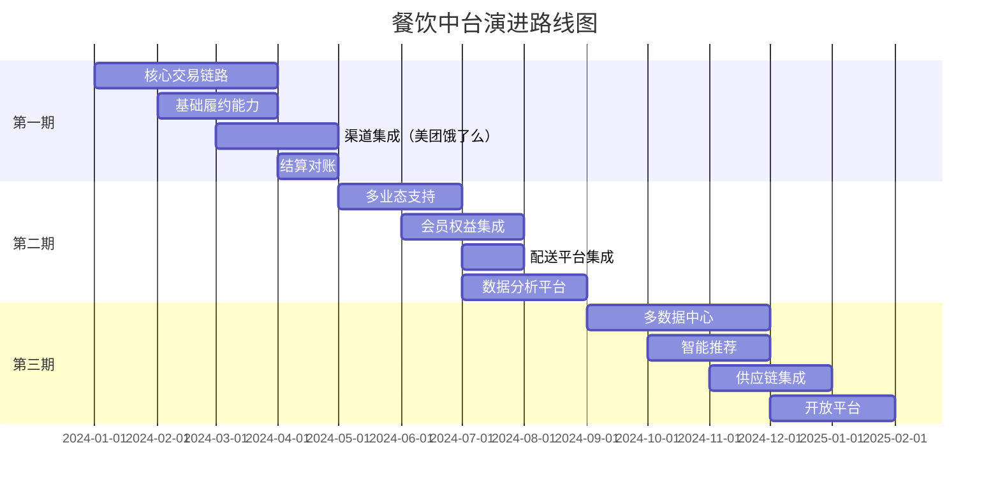

# 12-部署运维与演进路线图

## 1. Kubernetes 部署架构

### 1.1 集群规划

```yaml
# 生产环境集群规划
clusters:
  - name: prod-cluster
    region: cn-north-1
    zones:
      - cn-north-1a
      - cn-north-1b
      - cn-north-1c
    node_pools:
      - name: core-services
        instance_type: c6.4xlarge  # 16核32GB
        min_nodes: 10
        max_nodes: 50
        labels:
          workload: core
      - name: stateful-services
        instance_type: r6.4xlarge  # 16核128GB
        min_nodes: 6
        max_nodes: 20
        labels:
          workload: stateful
      - name: batch-jobs
        instance_type: c6.2xlarge  # 8核16GB
        min_nodes: 3
        max_nodes: 30
        labels:
          workload: batch
```

### 1.2 命名空间规划

```yaml
# 命名空间配置
apiVersion: v1
kind: Namespace
metadata:
  name: restaurant-prod
  labels:
    environment: production
    team: platform
---
apiVersion: v1
kind: Namespace
metadata:
  name: restaurant-staging
  labels:
    environment: staging
    team: platform
---
apiVersion: v1
kind: Namespace
metadata:
  name: restaurant-middleware
  labels:
    environment: production
    team: middleware
```

### 1.3 服务部署配置

**交易服务部署**：
```yaml
apiVersion: apps/v1
kind: Deployment
metadata:
  name: transaction-service
  namespace: restaurant-prod
spec:
  replicas: 5
  strategy:
    type: RollingUpdate
    rollingUpdate:
      maxSurge: 1
      maxUnavailable: 0
  selector:
    matchLabels:
      app: transaction-service
  template:
    metadata:
      labels:
        app: transaction-service
        version: v1.0.0
      annotations:
        prometheus.io/scrape: "true"
        prometheus.io/port: "8080"
        prometheus.io/path: "/actuator/prometheus"
    spec:
      affinity:
        podAntiAffinity:
          preferredDuringSchedulingIgnoredDuringExecution:
            - weight: 100
              podAffinityTerm:
                labelSelector:
                  matchExpressions:
                    - key: app
                      operator: In
                      values:
                        - transaction-service
                topologyKey: kubernetes.io/hostname
      containers:
        - name: transaction-service
          image: registry.example.com/transaction-service:v1.0.0
          imagePullPolicy: IfNotPresent
          ports:
            - name: http
              containerPort: 8080
              protocol: TCP
            - name: grpc
              containerPort: 9090
              protocol: TCP
          env:
            - name: SPRING_PROFILES_ACTIVE
              value: "prod"
            - name: JAVA_OPTS
              value: "-Xms4g -Xmx4g -XX:+UseG1GC -XX:MaxGCPauseMillis=200"
            - name: DB_HOST
              valueFrom:
                secretKeyRef:
                  name: postgres-credentials
                  key: host
            - name: DB_PASSWORD
              valueFrom:
                secretKeyRef:
                  name: postgres-credentials
                  key: password
            - name: REDIS_PASSWORD
              valueFrom:
                secretKeyRef:
                  name: redis-credentials
                  key: password
          resources:
            requests:
              cpu: 2000m
              memory: 4Gi
            limits:
              cpu: 4000m
              memory: 8Gi
          livenessProbe:
            httpGet:
              path: /actuator/health/liveness
              port: 8080
            initialDelaySeconds: 60
            periodSeconds: 10
            timeoutSeconds: 5
            failureThreshold: 3
          readinessProbe:
            httpGet:
              path: /actuator/health/readiness
              port: 8080
            initialDelaySeconds: 30
            periodSeconds: 5
            timeoutSeconds: 3
            failureThreshold: 3
          volumeMounts:
            - name: config
              mountPath: /app/config
            - name: logs
              mountPath: /app/logs
      volumes:
        - name: config
          configMap:
            name: transaction-service-config
        - name: logs
          emptyDir: {}
---
apiVersion: v1
kind: Service
metadata:
  name: transaction-service
  namespace: restaurant-prod
spec:
  type: ClusterIP
  selector:
    app: transaction-service
  ports:
    - name: http
      port: 8080
      targetPort: 8080
    - name: grpc
      port: 9090
      targetPort: 9090
---
apiVersion: autoscaling/v2
kind: HorizontalPodAutoscaler
metadata:
  name: transaction-service-hpa
  namespace: restaurant-prod
spec:
  scaleTargetRef:
    apiVersion: apps/v1
    kind: Deployment
    name: transaction-service
  minReplicas: 5
  maxReplicas: 20
  metrics:
    - type: Resource
      resource:
        name: cpu
        target:
          type: Utilization
          averageUtilization: 70
    - type: Resource
      resource:
        name: memory
        target:
          type: Utilization
          averageUtilization: 80
```

### 1.4 Ingress 配置

```yaml
apiVersion: networking.k8s.io/v1
kind: Ingress
metadata:
  name: restaurant-ingress
  namespace: restaurant-prod
  annotations:
    kubernetes.io/ingress.class: "nginx"
    cert-manager.io/cluster-issuer: "letsencrypt-prod"
    nginx.ingress.kubernetes.io/ssl-redirect: "true"
    nginx.ingress.kubernetes.io/rate-limit: "100"
    nginx.ingress.kubernetes.io/proxy-body-size: "10m"
    nginx.ingress.kubernetes.io/proxy-connect-timeout: "30"
    nginx.ingress.kubernetes.io/proxy-send-timeout: "30"
    nginx.ingress.kubernetes.io/proxy-read-timeout: "30"
spec:
  tls:
    - hosts:
        - api.restaurant.example.com
      secretName: restaurant-tls
  rules:
    - host: api.restaurant.example.com
      http:
        paths:
          - path: /api/v1/orders
            pathType: Prefix
            backend:
              service:
                name: transaction-service
                port:
                  number: 8080
          - path: /api/v1/products
            pathType: Prefix
            backend:
              service:
                name: product-service
                port:
                  number: 8080
          - path: /api/v1/fulfillment
            pathType: Prefix
            backend:
              service:
                name: fulfillment-service
                port:
                  number: 8080
```

---

## 2. CI/CD 流水线

### 2.1 GitLab CI 配置

```yaml
# .gitlab-ci.yml
stages:
  - build
  - test
  - security
  - package
  - deploy-staging
  - deploy-prod

variables:
  MAVEN_OPTS: "-Dmaven.repo.local=.m2/repository"
  DOCKER_REGISTRY: "registry.example.com"
  SONAR_HOST_URL: "https://sonar.example.com"

cache:
  paths:
    - .m2/repository
    - target/

# 构建阶段
build:
  stage: build
  image: maven:3.9-eclipse-temurin-17
  script:
    - mvn clean compile -DskipTests
  artifacts:
    paths:
      - target/
    expire_in: 1 hour

# 单元测试
unit-test:
  stage: test
  image: maven:3.9-eclipse-temurin-17
  script:
    - mvn test
    - mvn jacoco:report
  coverage: '/Total.*?([0-9]{1,3})%/'
  artifacts:
    reports:
      junit: target/surefire-reports/TEST-*.xml
      coverage_report:
        coverage_format: cobertura
        path: target/site/jacoco/jacoco.xml

# 集成测试
integration-test:
  stage: test
  image: maven:3.9-eclipse-temurin-17
  services:
    - postgres:15
    - redis:7
  variables:
    POSTGRES_DB: test_db
    POSTGRES_USER: test_user
    POSTGRES_PASSWORD: test_password
  script:
    - mvn verify -Pintegration-test

# 代码质量检查
sonarqube:
  stage: test
  image: maven:3.9-eclipse-temurin-17
  script:
    - mvn sonar:sonar
      -Dsonar.projectKey=$CI_PROJECT_NAME
      -Dsonar.host.url=$SONAR_HOST_URL
      -Dsonar.login=$SONAR_TOKEN
  only:
    - main
    - develop

# 安全扫描
security-scan:
  stage: security
  image: aquasec/trivy:latest
  script:
    - trivy fs --exit-code 1 --severity HIGH,CRITICAL .
  allow_failure: true

# 依赖检查
dependency-check:
  stage: security
  image: owasp/dependency-check:latest
  script:
    - /usr/share/dependency-check/bin/dependency-check.sh
      --project $CI_PROJECT_NAME
      --scan .
      --format HTML
      --out dependency-check-report
  artifacts:
    paths:
      - dependency-check-report/
    expire_in: 7 days

# 打包镜像
package:
  stage: package
  image: docker:24
  services:
    - docker:24-dind
  before_script:
    - docker login -u $CI_REGISTRY_USER -p $CI_REGISTRY_PASSWORD $DOCKER_REGISTRY
  script:
    - mvn package -DskipTests
    - docker build -t $DOCKER_REGISTRY/$CI_PROJECT_NAME:$CI_COMMIT_SHA .
    - docker tag $DOCKER_REGISTRY/$CI_PROJECT_NAME:$CI_COMMIT_SHA $DOCKER_REGISTRY/$CI_PROJECT_NAME:latest
    - docker push $DOCKER_REGISTRY/$CI_PROJECT_NAME:$CI_COMMIT_SHA
    - docker push $DOCKER_REGISTRY/$CI_PROJECT_NAME:latest
  only:
    - main
    - develop

# 部署到 Staging
deploy-staging:
  stage: deploy-staging
  image: bitnami/kubectl:latest
  script:
    - kubectl config use-context staging-cluster
    - kubectl set image deployment/$CI_PROJECT_NAME
      $CI_PROJECT_NAME=$DOCKER_REGISTRY/$CI_PROJECT_NAME:$CI_COMMIT_SHA
      -n restaurant-staging
    - kubectl rollout status deployment/$CI_PROJECT_NAME -n restaurant-staging
  environment:
    name: staging
    url: https://staging-api.restaurant.example.com
  only:
    - develop

# 部署到生产（手动触发）
deploy-prod:
  stage: deploy-prod
  image: bitnami/kubectl:latest
  script:
    - kubectl config use-context prod-cluster
    - kubectl set image deployment/$CI_PROJECT_NAME
      $CI_PROJECT_NAME=$DOCKER_REGISTRY/$CI_PROJECT_NAME:$CI_COMMIT_SHA
      -n restaurant-prod
    - kubectl rollout status deployment/$CI_PROJECT_NAME -n restaurant-prod
  environment:
    name: production
    url: https://api.restaurant.example.com
  when: manual
  only:
    - main
```

### 2.2 Dockerfile 优化

```dockerfile
# 多阶段构建
FROM maven:3.9-eclipse-temurin-17 AS builder

WORKDIR /app

# 复制 pom.xml 并下载依赖（利用缓存）
COPY pom.xml .
RUN mvn dependency:go-offline

# 复制源码并构建
COPY src ./src
RUN mvn package -DskipTests

# 运行时镜像
FROM eclipse-temurin:17-jre-alpine

# 安装必要工具
RUN apk add --no-cache curl

# 创建应用用户
RUN addgroup -S appgroup && adduser -S appuser -G appgroup

WORKDIR /app

# 复制构建产物
COPY --from=builder /app/target/*.jar app.jar

# 修改所有权
RUN chown -R appuser:appgroup /app

# 切换到非 root 用户
USER appuser

# 健康检查
HEALTHCHECK --interval=30s --timeout=3s --start-period=60s --retries=3 \
  CMD curl -f http://localhost:8080/actuator/health || exit 1

# 暴露端口
EXPOSE 8080 9090

# JVM 参数
ENV JAVA_OPTS="-Xms2g -Xmx2g -XX:+UseG1GC -XX:MaxGCPauseMillis=200 -XX:+HeapDumpOnOutOfMemoryError -XX:HeapDumpPath=/app/logs"

# 启动命令
ENTRYPOINT ["sh", "-c", "java $JAVA_OPTS -jar app.jar"]
```

---

## 3. 灰度发布策略

### 3.1 金丝雀发布

```yaml
# 金丝雀部署配置
apiVersion: flagger.app/v1beta1
kind: Canary
metadata:
  name: transaction-service
  namespace: restaurant-prod
spec:
  targetRef:
    apiVersion: apps/v1
    kind: Deployment
    name: transaction-service
  progressDeadlineSeconds: 600
  service:
    port: 8080
  analysis:
    interval: 1m
    threshold: 5
    maxWeight: 50
    stepWeight: 10
    metrics:
      - name: request-success-rate
        thresholdRange:
          min: 99
        interval: 1m
      - name: request-duration
        thresholdRange:
          max: 500
        interval: 1m
    webhooks:
      - name: load-test
        url: http://flagger-loadtester/
        timeout: 5s
        metadata:
          cmd: "hey -z 1m -q 10 -c 2 http://transaction-service-canary:8080/api/v1/orders"
```

### 3.2 蓝绿部署

```yaml
# 蓝绿部署脚本
apiVersion: v1
kind: Service
metadata:
  name: transaction-service
  namespace: restaurant-prod
spec:
  selector:
    app: transaction-service
    version: blue  # 切换为 green 实现蓝绿切换
  ports:
    - port: 8080
      targetPort: 8080
---
apiVersion: apps/v1
kind: Deployment
metadata:
  name: transaction-service-blue
  namespace: restaurant-prod
spec:
  replicas: 5
  selector:
    matchLabels:
      app: transaction-service
      version: blue
  template:
    metadata:
      labels:
        app: transaction-service
        version: blue
    spec:
      containers:
        - name: transaction-service
          image: registry.example.com/transaction-service:v1.0.0
---
apiVersion: apps/v1
kind: Deployment
metadata:
  name: transaction-service-green
  namespace: restaurant-prod
spec:
  replicas: 5
  selector:
    matchLabels:
      app: transaction-service
      version: green
  template:
    metadata:
      labels:
        app: transaction-service
        version: green
    spec:
      containers:
        - name: transaction-service
          image: registry.example.com/transaction-service:v1.1.0
```

---

## 4. 监控告警

### 4.1 Prometheus 告警规则

```yaml
# prometheus-rules.yaml
apiVersion: monitoring.coreos.com/v1
kind: PrometheusRule
metadata:
  name: restaurant-alerts
  namespace: restaurant-prod
spec:
  groups:
    - name: service-availability
      interval: 30s
      rules:
        - alert: ServiceDown
          expr: up{job="transaction-service"} == 0
          for: 1m
          labels:
            severity: critical
          annotations:
            summary: "服务 {{ $labels.instance }} 不可用"
            description: "{{ $labels.job }} 已经宕机超过 1 分钟"

        - alert: HighErrorRate
          expr: |
            rate(http_server_requests_seconds_count{status=~"5.."}[5m])
            / rate(http_server_requests_seconds_count[5m]) > 0.05
          for: 5m
          labels:
            severity: warning
          annotations:
            summary: "服务 {{ $labels.job }} 错误率过高"
            description: "错误率: {{ $value | humanizePercentage }}"

        - alert: HighResponseTime
          expr: |
            histogram_quantile(0.95,
              rate(http_server_requests_seconds_bucket[5m])
            ) > 1
          for: 5m
          labels:
            severity: warning
          annotations:
            summary: "服务 {{ $labels.job }} 响应时间过长"
            description: "P95 响应时间: {{ $value }}s"

    - name: resource-usage
      interval: 30s
      rules:
        - alert: HighCPUUsage
          expr: |
            rate(container_cpu_usage_seconds_total{namespace="restaurant-prod"}[5m]) > 0.8
          for: 10m
          labels:
            severity: warning
          annotations:
            summary: "容器 {{ $labels.pod }} CPU 使用率过高"
            description: "CPU 使用率: {{ $value | humanizePercentage }}"

        - alert: HighMemoryUsage
          expr: |
            container_memory_usage_bytes{namespace="restaurant-prod"}
            / container_spec_memory_limit_bytes > 0.9
          for: 5m
          labels:
            severity: warning
          annotations:
            summary: "容器 {{ $labels.pod }} 内存使用率过高"
            description: "内存使用率: {{ $value | humanizePercentage }}"

    - name: business-metrics
      interval: 1m
      rules:
        - alert: OrderCreationRateDrop
          expr: |
            rate(order_created_total[5m]) < 10
          for: 10m
          labels:
            severity: warning
          annotations:
            summary: "订单创建速率异常下降"
            description: "当前速率: {{ $value }} orders/s"

        - alert: PaymentFailureRateHigh
          expr: |
            rate(payment_failed_total[5m])
            / rate(payment_total[5m]) > 0.1
          for: 5m
          labels:
            severity: critical
          annotations:
            summary: "支付失败率过高"
            description: "失败率: {{ $value | humanizePercentage }}"

        - alert: FulfillmentDelayHigh
          expr: |
            histogram_quantile(0.95,
              rate(fulfillment_duration_seconds_bucket[10m])
            ) > 1800
          for: 10m
          labels:
            severity: warning
          annotations:
            summary: "履约时长过长"
            description: "P95 履约时长: {{ $value }}s"
```

### 4.2 AlertManager 配置

```yaml
# alertmanager-config.yaml
global:
  resolve_timeout: 5m
  smtp_smarthost: 'smtp.example.com:587'
  smtp_from: 'alerts@example.com'
  smtp_auth_username: 'alerts@example.com'
  smtp_auth_password: 'password'

route:
  group_by: ['alertname', 'cluster', 'service']
  group_wait: 10s
  group_interval: 10s
  repeat_interval: 12h
  receiver: 'default'
  routes:
    - match:
        severity: critical
      receiver: 'critical-alerts'
      continue: true
    - match:
        severity: warning
      receiver: 'warning-alerts'

receivers:
  - name: 'default'
    webhook_configs:
      - url: 'http://alertmanager-webhook:8080/webhook'

  - name: 'critical-alerts'
    email_configs:
      - to: 'oncall@example.com'
        headers:
          Subject: '[CRITICAL] {{ .GroupLabels.alertname }}'
    webhook_configs:
      - url: 'https://qyapi.weixin.qq.com/cgi-bin/webhook/send?key=xxx'
        send_resolved: true

  - name: 'warning-alerts'
    email_configs:
      - to: 'team@example.com'
        headers:
          Subject: '[WARNING] {{ .GroupLabels.alertname }}'

inhibit_rules:
  - source_match:
      severity: 'critical'
    target_match:
      severity: 'warning'
    equal: ['alertname', 'cluster', 'service']
```

---

## 5. 日志收集

### 5.1 Promtail 配置

```yaml
# promtail-config.yaml
server:
  http_listen_port: 9080
  grpc_listen_port: 0

positions:
  filename: /tmp/positions.yaml

clients:
  - url: http://loki:3100/loki/api/v1/push

scrape_configs:
  - job_name: kubernetes-pods
    kubernetes_sd_configs:
      - role: pod
    relabel_configs:
      - source_labels: [__meta_kubernetes_pod_label_app]
        target_label: app
      - source_labels: [__meta_kubernetes_namespace]
        target_label: namespace
      - source_labels: [__meta_kubernetes_pod_name]
        target_label: pod
      - source_labels: [__meta_kubernetes_pod_container_name]
        target_label: container
    pipeline_stages:
      - json:
          expressions:
            timestamp: timestamp
            level: level
            logger: logger
            message: message
            trace_id: traceId
      - labels:
          level:
          logger:
      - timestamp:
          source: timestamp
          format: RFC3339
```

### 5.2 日志查询示例

```promql
# 查询错误日志
{namespace="restaurant-prod", level="ERROR"} |= "OrderNotFoundException"

# 查询特定订单的日志
{namespace="restaurant-prod"} |= "orderId=order_123"

# 统计错误日志数量
sum(rate({namespace="restaurant-prod", level="ERROR"}[5m])) by (app)

# 查询慢查询
{namespace="restaurant-prod"} |= "Slow query" | json | duration > 1000
```

---

## 6. 备份恢复

### 6.1 数据库备份

```bash
#!/bin/bash
# postgres-backup.sh

BACKUP_DIR="/backup/postgres"
DATE=$(date +%Y%m%d_%H%M%S)
BACKUP_FILE="$BACKUP_DIR/backup_$DATE.sql.gz"
RETENTION_DAYS=30

# 全量备份
pg_dump -h postgres-master -U postgres -d restaurant_platform \
  --format=custom \
  --compress=9 \
  --file=$BACKUP_FILE

# 上传到对象存储
aws s3 cp $BACKUP_FILE s3://backup-bucket/postgres/ \
  --storage-class STANDARD_IA

# 清理本地旧备份
find $BACKUP_DIR -name "backup_*.sql.gz" -mtime +$RETENTION_DAYS -delete

# 验证备份
pg_restore --list $BACKUP_FILE > /dev/null
if [ $? -eq 0 ]; then
  echo "备份成功: $BACKUP_FILE"
else
  echo "备份验证失败: $BACKUP_FILE"
  exit 1
fi
```

### 6.2 数据恢复流程

```bash
#!/bin/bash
# postgres-restore.sh

BACKUP_FILE=$1

if [ -z "$BACKUP_FILE" ]; then
  echo "Usage: $0 <backup_file>"
  exit 1
fi

# 从 S3 下载备份
aws s3 cp s3://backup-bucket/postgres/$BACKUP_FILE /tmp/

# 停止应用服务
kubectl scale deployment --all --replicas=0 -n restaurant-prod

# 创建恢复数据库
psql -h postgres-master -U postgres -c "CREATE DATABASE restaurant_platform_restore;"

# 恢复数据
pg_restore -h postgres-master -U postgres \
  --dbname=restaurant_platform_restore \
  --jobs=4 \
  --verbose \
  /tmp/$BACKUP_FILE

# 验证数据
psql -h postgres-master -U postgres -d restaurant_platform_restore -c "SELECT COUNT(*) FROM sale_orders;"

# 切换数据库（需要手动确认）
echo "请手动执行以下命令完成切换："
echo "1. ALTER DATABASE restaurant_platform RENAME TO restaurant_platform_old;"
echo "2. ALTER DATABASE restaurant_platform_restore RENAME TO restaurant_platform;"
echo "3. kubectl scale deployment --all --replicas=5 -n restaurant-prod"
```

### 6.3 配置备份

```yaml
# velero-backup.yaml
apiVersion: velero.io/v1
kind: Schedule
metadata:
  name: restaurant-daily-backup
  namespace: velero
spec:
  schedule: "0 2 * * *"  # 每天凌晨2点
  template:
    includedNamespaces:
      - restaurant-prod
    includedResources:
      - configmaps
      - secrets
      - persistentvolumeclaims
    ttl: 720h  # 保留30天
    storageLocation: default
    volumeSnapshotLocations:
      - default
```

---

## 7. 演进路线图

### 7.1 演进原则

**业务优先**：
- 优先支持核心业务场景（堂食、外卖）
- 快速验证商业模式
- 逐步扩展业态支持

**技术稳健**：
- 先单体后微服务
- 先单机房后多机房
- 先功能完整后性能优化

**风险可控**：
- 灰度发布策略
- 可回滚机制
- 充分测试验证

### 7.2 三阶段规划



---

## 8. 第一期：核心能力建设（3-4个月）

### 8.1 目标与范围

**业务目标**：
- 支持购物中心内餐饮商户接入
- 支持堂食扫码点单、POS点单
- 支持美团、饿了么外卖订单接入
- 支持基础履约流程（接单、制作、完成）
- 支持日结算对账

**技术目标**：
- 完成核心领域服务开发
- 建立 CI/CD 流水线
- 搭建监控告警体系
- 单数据中心部署

**接入规模**：
- 支持 100 家门店
- 日订单量 10 万单
- QPS 峰值 1000

### 8.2 功能清单

**第一期功能矩阵**：

| 领域 | 功能模块 | 优先级 | 工作量 |
|------|---------|--------|--------|
| 交易域 | 订单创建、支付、取消 | P0 | 3周 |
| 交易域 | 订单状态机、事件发布 | P0 | 2周 |
| 商品域 | 商品管理、规格管理 | P0 | 2周 |
| 商品域 | 菜单管理、发布流程 | P0 | 2周 |
| 履约域 | 履约订单、生产计划 | P0 | 3周 |
| 履约域 | 工单分配、状态跟踪 | P0 | 2周 |
| 渠道域 | 美团订单接入 | P0 | 2周 |
| 渠道域 | 饿了么订单接入 | P0 | 2周 |
| 渠道域 | 状态回传 | P0 | 1周 |
| 结算域 | 结算事实生成 | P0 | 2周 |
| 结算域 | 结算周期管理 | P0 | 1周 |
| 结算域 | 对账任务 | P1 | 2周 |
| 租户域 | 租户管理、门店管理 | P0 | 2周 |
| 租户域 | 员工管理、设备管理 | P1 | 2周 |
| 治理域 | 异常记录、审计日志 | P1 | 2周 |
| **终端数据平面** | **TDP L1 服务开发** | **P0** | **3周** |
| **终端数据平面** | **TDP L2 服务开发** | **P0** | **2周** |
| **终端数据平面** | **Projection Adapter 开发** | **P0** | **2周** |
| **终端数据平面** | **终端侧集成（POS/KDS）** | **P0** | **3周** |

### 8.3 技术架构

**第一期架构**：
```yaml
部署架构:
  数据中心: 单数据中心（北京）
  服务部署: Kubernetes 集群
  服务数量: 9 个微服务
  数据库: PostgreSQL 主从（1主2从）
  缓存: Redis Cluster（3主3从）
  消息队列: RocketMQ（2主2从）

服务清单:
  - transaction-service      # 交易服务
  - product-service          # 商品服务
  - fulfillment-service      # 履约服务
  - channel-service          # 渠道服务
  - settlement-service       # 结算服务
  - tenant-service           # 租户服务
  - external-service         # 外部集成服务
  - governance-service       # 治理服务
  - tdp-service             # 终端数据平面服务（L1+L2 Hybrid）

终端数据平面（TDP）:
  部署模式: L1+L2 Hybrid 单节点（第一期简化部署）
  核心能力:
    - 统一 Projection Store 与 Revision 机制
    - WebSocket 实时推送
    - 增量追平与全量对账
    - Topic 治理体系
  支持终端: POS、KDS、PDA、KIOSK、打包台
  详见: 4.终端数据平面服务/ 目录
```

### 8.4 里程碑

**M1（第1个月）**：
- 完成技术架构搭建
- 完成交易域、商品域核心功能
- 完成基础设施部署（数据库、缓存、消息队列）
- 完成 CI/CD 流水线搭建
- **完成 TDP 服务基础框架开发**

**M2（第2个月）**：
- 完成履约域、渠道域核心功能
- 完成美团、饿了么订单接入
- 完成监控告警体系搭建
- **完成 TDP L1/L2 Hybrid 服务开发**
- **完成 Projection Adapter 开发**
- 完成端到端测试

**M3（第3个月）**：
- 完成结算域、租户域功能
- 完成治理域基础功能
- **完成 POS/KDS 终端集成 TDP**
- 完成性能测试与优化

**M4（第4个月）**：
- 完成灰度验证
- 完成生产环境部署
- **完成所有终端类型接入 TDP**
- 正式上线

**M3（第3个月）**：
- 完成结算域、租户域功能
- 完成灰度发布流程
- 完成压力测试（QPS 1000）
- 完成第一批商户接入（10家）

**M4（第4个月）**：
- 完成治理域功能
- 完成运维文档编写
- 完成商户培训
- 正式上线（100家门店）

---

## 9. 第二期：能力扩展（3-4个月）

### 9.1 目标与范围

**业务目标**：
- 支持多业态（快餐、正餐、茶饮、烘焙）
- 支持会员权益核销
- 支持配送平台集成（达达、顺丰同城）
- 支持数据分析与报表
- 支持营销活动

**技术目标**：
- 性能优化（QPS 5000）
- 数据库分片（Citus）
- 缓存优化（两级缓存）
- 链路追踪完善

**接入规模**：
- 支持 1000 家门店
- 日订单量 100 万单
- QPS 峰值 5000

### 9.2 功能清单

**第二期功能矩阵**：

| 领域 | 功能模块 | 优先级 | 工作量 |
|------|---------|--------|--------|
| 交易域 | 多业态订单支持 | P0 | 2周 |
| 交易域 | 优惠券核销 | P0 | 2周 |
| 交易域 | 会员积分 | P1 | 2周 |
| 商品域 | 套餐组合 | P1 | 2周 |
| 商品域 | 时段定价 | P1 | 1周 |
| 履约域 | 配送任务管理 | P0 | 2周 |
| 履约域 | 骑手调度 | P1 | 2周 |
| 渠道域 | 抖音订单接入 | P1 | 2周 |
| 渠道域 | 小红书订单接入 | P2 | 2周 |
| 结算域 | 多维度结算 | P0 | 2周 |
| 结算域 | 自动对账 | P0 | 2周 |
| 外部集成 | 会员系统集成 | P0 | 3周 |
| 外部集成 | 配送平台集成 | P0 | 3周 |
| 外部集成 | ERP 系统集成 | P1 | 2周 |
| 数据分析 | 实时大屏 | P0 | 2周 |
| 数据分析 | 经营报表 | P0 | 3周 |
| 数据分析 | 数据导出 | P1 | 1周 |
| 营销域 | 活动管理 | P1 | 3周 |
| 营销域 | 优惠券发放 | P1 | 2周 |
| **终端数据平面** | **TDP L2 独立节点部署（多商场）** | **P1** | **2周** |

### 9.3 技术架构升级

**第二期架构升级**：
```yaml
性能优化:
  数据库分片: PostgreSQL + Citus（4分片）
  缓存优化: Caffeine L1 + Redis L2
  读写分离: 1主4从
  连接池优化: HikariCP 参数调优

新增服务:
  - marketing-service        # 营销服务
  - analytics-service        # 数据分析服务
  - recommendation-service   # 推荐服务（简单版）

终端数据平面（TDP）升级:
  部署模式: L1 中心节点 + L2 边缘节点（独立部署）
  升级内容:
    - L1 与 L2 分离部署（第一期是 Hybrid）
    - 多商场 L2 节点部署（3-5个商场）
    - L1/L2 联邦同步优化
    - 边缘接入与就近推送

中间件升级:
  - RocketMQ: 4主4从
  - Redis: 6主6从
  - Elasticsearch: 3节点（日志、搜索）
```

### 9.4 里程碑

**M5（第5个月）**：
- 完成多业态支持
- 完成会员系统集成
- 完成配送平台集成
- 完成数据库分片

**M6（第6个月）**：
- 完成数据分析平台
- 完成营销活动功能
- **完成 TDP L1/L2 分离部署**

**M7（第7个月）**：
- **完成多商场 L2 边缘节点部署**
- 完成性能压测与优化
- 完成性能优化（QPS 5000）
- 完成压力测试

**M7（第7个月）**：
- 完成新渠道接入（抖音）
- 完成 ERP 系统集成
- 完成灰度发布
- 接入 500 家门店

**M8（第8个月）**：
- 完成全量上线
- 完成运营培训
- 接入 1000 家门店
- 日订单量达到 100 万单

---

## 10. 第三期：平台化与智能化（4-5个月）

### 10.1 目标与范围

**业务目标**：
- 支持多数据中心部署
- 支持智能推荐
- 支持供应链集成
- 开放平台能力
- 支持 ISV 生态

**技术目标**：
- 多数据中心容灾
- 智能算法引擎
- 开放 API 平台
- 性能优化（QPS 10000）

**接入规模**：
- 支持 10000 家门店
- 日订单量 1000 万单
- QPS 峰值 10000

### 10.2 功能清单

**第三期功能矩阵**：

| 领域 | 功能模块 | 优先级 | 工作量 |
|------|---------|--------|--------|
| 基础设施 | 多数据中心部署 | P0 | 4周 |
| 基础设施 | 跨数据中心同步 | P0 | 3周 |
| 基础设施 | 容灾切换 | P0 | 2周 |
| 智能推荐 | 商品推荐 | P0 | 4周 |
| 智能推荐 | 个性化菜单 | P1 | 3周 |
| 智能推荐 | 智能定价 | P1 | 3周 |
| 供应链 | 采购管理 | P1 | 3周 |
| 供应链 | 库存管理 | P1 | 3周 |
| 供应链 | 供应商管理 | P2 | 2周 |
| 开放平台 | API 网关 | P0 | 3周 |
| 开放平台 | 开发者中心 | P0 | 3周 |
| 开放平台 | ISV 管理 | P0 | 2周 |
| 开放平台 | 应用市场 | P1 | 3周 |
| 数据中台 | 数据仓库 | P0 | 4周 |
| 数据中台 | 实时计算 | P0 | 3周 |
| 数据中台 | 数据服务 | P1 | 2周 |

### 10.3 技术架构升级

**第三期架构升级**：
```yaml
多数据中心:
  数据中心:
    - 北京（主）
    - 上海（备）
  数据同步:
    - 订单数据: 实时同步（RocketMQ）
    - 商品数据: 准实时同步（5分钟）
    - 配置数据: 实时同步
  容灾策略:
    - RTO: 15分钟
    - RPO: 5分钟

智能引擎:
  推荐引擎: TensorFlow Serving
  算法模型:
    - 协同过滤
    - 内容推荐
    - 实时排序
  特征工程: Flink + Redis

开放平台:
  API 网关: Kong / APISIX
  认证授权: OAuth 2.0 + JWT
  限流熔断: Sentinel
  API 文档: Swagger / OpenAPI

数据中台:
  数据仓库: ClickHouse
  实时计算: Flink
  离线计算: Spark
  数据湖: MinIO / S3
```

### 10.4 里程碑

**M9（第9个月）**：
- 完成多数据中心部署
- 完成数据同步方案
- 完成容灾演练
- 完成 API 网关搭建

**M10（第10个月）**：
- 完成智能推荐引擎
- 完成开发者中心
- 完成数据仓库搭建
- 完成性能优化（QPS 10000）

**M11（第11个月）**：
- 完成供应链集成
- 完成应用市场
- 完成实时计算平台
- 接入 5000 家门店

**M12（第12个月）**：
- 完成 ISV 生态建设
- 完成数据服务平台
- 完成全量上线
- 接入 10000 家门店

**M13（第13个月）**：
- 完成容灾切换演练
- 完成运营优化
- 日订单量达到 1000 万单
- 系统稳定性 99.99%

---

## 11. 技术债务管理

### 11.1 技术债务清单

**第一期技术债务**：
```yaml
代码质量:
  - 部分领域模型设计不够完善
  - 单元测试覆盖率不足 80%
  - 代码重复度较高

架构设计:
  - 服务拆分粒度需要优化
  - 事件驱动模式不够统一
  - 缓存策略需要优化

性能优化:
  - 数据库查询未充分优化
  - 缓存命中率需要提升
  - 接口响应时间需要优化
```

**第二期偿还计划**：
```yaml
代码重构:
  - 重构核心领域模型（2周）
  - 提升测试覆盖率到 85%（3周）
  - 消除代码重复（1周）

架构优化:
  - 优化服务拆分（3周）
  - 统一事件驱动模式（2周）
  - 优化缓存策略（2周）

性能调优:
  - 数据库查询优化（2周）
  - 缓存优化（1周）
  - 接口性能优化（2周）
```

### 11.2 持续改进机制

**代码审查**：
- 每个 PR 必须经过 Code Review
- 关键模块需要架构师审查
- 定期进行代码质量扫描（SonarQube）

**技术分享**：
- 每周技术分享会
- 每月架构评审会
- 每季度技术总结

**性能监控**：
- 实时性能监控
- 每周性能报告
- 每月性能优化

---

## 12. 风险管理

### 12.1 风险识别

**技术风险**：

| 风险 | 影响 | 概率 | 应对措施 |
|------|------|------|---------|
| 数据库性能瓶颈 | 高 | 中 | 提前分库分表，读写分离 |
| 消息队列积压 | 高 | 中 | 增加消费者，优化消费逻辑 |
| 缓存雪崩 | 高 | 低 | 多级缓存，缓存预热 |
| 服务雪崩 | 高 | 低 | 熔断降级，限流保护 |
| 数据一致性问题 | 高 | 中 | 分布式事务，补偿机制 |

**业务风险**：

| 风险 | 影响 | 概率 | 应对措施 |
|------|------|------|---------|
| 商户接入速度慢 | 中 | 中 | 简化接入流程，提供培训 |
| 订单量增长超预期 | 高 | 中 | 弹性扩容，性能优化 |
| 渠道对接延期 | 中 | 低 | 提前对接，预留缓冲时间 |
| 结算对账错误 | 高 | 低 | 多重校验，人工复核 |

### 12.2 应急预案

**服务降级预案**：
```yaml
降级策略:
  L1_核心服务:
    - transaction-service: 不降级
    - fulfillment-service: 不降级

  L2_重要服务:
    - product-service: 降级到缓存
    - channel-service: 延迟处理

  L3_辅助服务:
    - analytics-service: 停止服务
    - recommendation-service: 停止服务
    - marketing-service: 停止服务
```

**数据恢复预案**：
```yaml
恢复流程:
  1. 评估数据损失范围
  2. 从备份恢复数据
  3. 重放消息队列
  4. 数据一致性校验
  5. 灰度恢复服务

恢复时间:
  - RTO: 30分钟
  - RPO: 5分钟
```

---

## 13. 本文结论

部署运维与演进路线图提供了完整的生产环境保障和发展路径：

**部署运维**：
- **Kubernetes 部署**：多副本、HPA、亲和性配置
- **CI/CD 流水线**：自动化构建、测试、部署
- **灰度发布**：金丝雀、蓝绿部署策略
- **监控告警**：Prometheus 规则、AlertManager 通知
- **日志收集**：Promtail + Loki 日志聚合
- **备份恢复**：数据库备份、配置备份、恢复流程

**演进路线图**：
- **第一期（3-4个月）**：核心交易链路、基础履约能力、渠道集成，支持 100 家门店
- **第二期（3-4个月）**：多业态支持、会员权益集成、配送平台集成，支持 1000 家门店
- **第三期（4-5个月）**：多数据中心、智能推荐、供应链集成，支持 10000 家门店

**关键成功因素**：
- 业务优先，快速迭代
- 技术稳健，风险可控
- 持续优化，偿还技术债务
- 完善监控，及时响应
