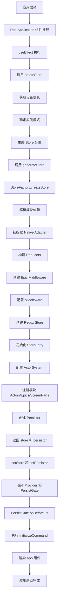
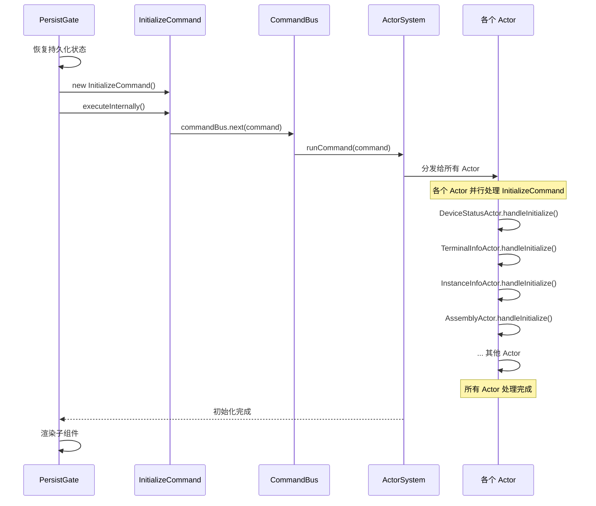
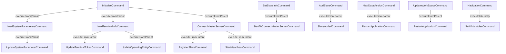
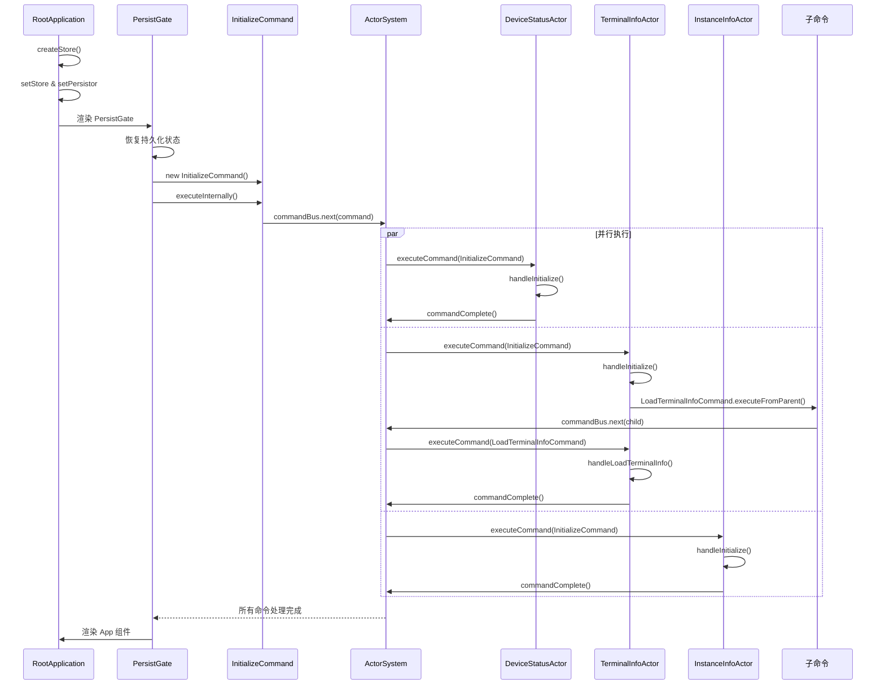
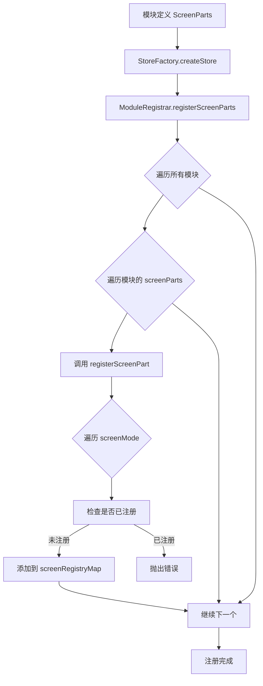
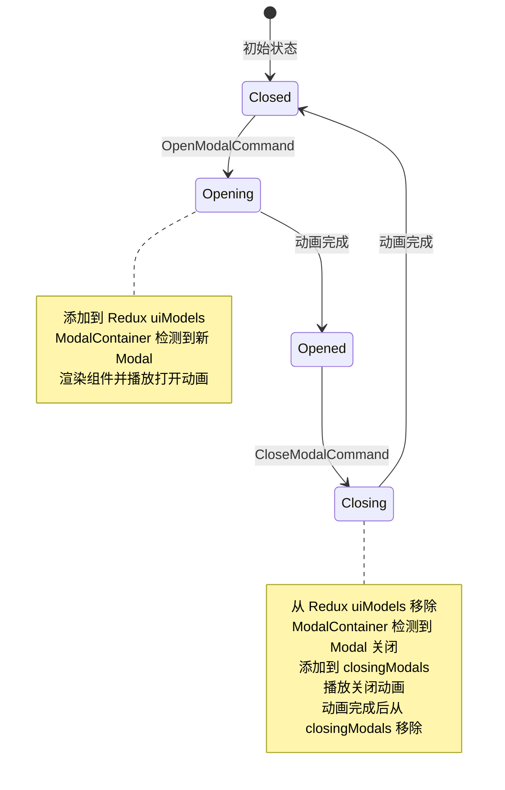
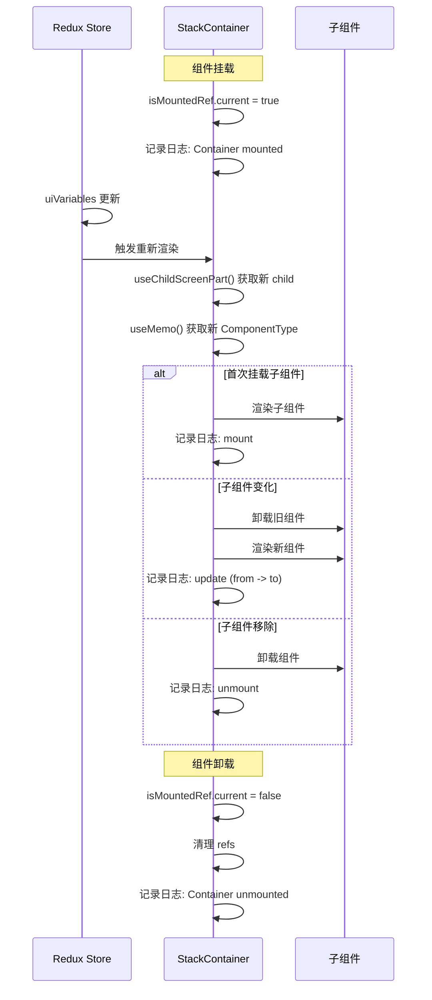
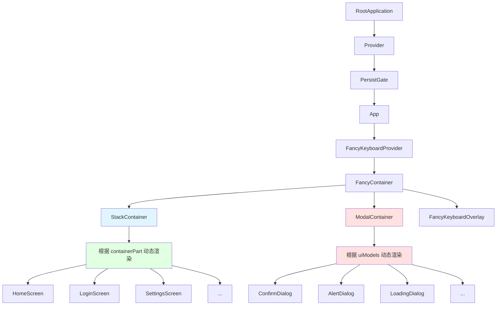

# IMPos2DesktopV1 工程逻辑解读

## 目录

1. [Actor 和 Command 的运行机制与原理](#1-actor-和-command-的运行机制与原理)
2. [Actor 与 Redux 的集成机制与原理](#2-actor-与-redux-的集成机制与原理)
3. [业务端发起带有 request 的 command，监听结果的机制与原理](#3-业务端发起带有-request-的-command监听结果的机制与原理)
4. [结合 IMPos2DesktopV1，command 的执行顺序](#4-结合-impos2desktopv1command-的执行顺序)
5. [结合 IMPos2DesktopV1，可视化组件加载的关系、切换原理](#5-结合-impos2desktopv1可视化组件加载的关系切换原理)

---

## 1. Actor 和 Command 的运行机制与原理

### 1.1 Command 的定义方式

#### defineCommand 工厂函数

`defineCommand` 是一个工厂函数，用于简化命令类的定义，消除重复代码。

```typescript
// 文件: 1-kernel/base/src/core/command.ts

/**
 * 命令定义工厂函数
 * 用于简化命令类的定义,消除重复代码
 */
export function defineCommand<P>(
    name: string,
    executionType: ExecutionType
) {
    class Command extends ICommand<P> {
        commandName = name;
        executionType = executionType;
    }

    CommandRegistry.register(name, Command);
    // 返回类本身和命令名称
    return Command;
}
```

**使用示例：**

```typescript
// 文件: 1-kernel/base/src/features/commands/shared/initialize.ts

/**
 * 初始化命令
 * ExecutionType: SEND_AND_EXECUTE_SEPARATELY
 */
export class InitializeCommand extends defineCommand<void>(
    BaseModuleCommandNames.Initialize,
    ExecutionType.SEND_AND_EXECUTE_SEPARATELY
) {}
```

#### Command 基类结构

```typescript
// 文件: 1-kernel/base/src/core/command.ts

/**
 * 命令基类
 */
export abstract class ICommand<P> {
    abstract readonly commandName: string;
    id = nanoid(8);  // 唯一标识符
    readonly timestamp = Date.now();  // 创建时间戳
    abstract readonly executionType: ExecutionType  // 执行类型
    readonly payload: P;  // 命令载荷
    requestId?: string;  // 请求ID，用于追踪命令来源
    sessionId?: string;  // 会话ID，用于关联多个命令
    executePath: ExecutePath[] = [{id: this.id, type: this.getCommandName()}];  // 执行路径
    slaveInfo?: SlaveInfo;  // 从设备信息

    constructor(payload: P) {
        this.payload = payload;
    }

    getCommandName(): string {
        return this.commandName;
    }

    // 从请求发起命令
    executeFromRequest(requestId: string, sessionId?: string): void {
        this.requestId = requestId;
        this.sessionId = sessionId;
        commandBus.next(this);
    }

    // 内部发起命令
    executeInternally(): void {
        return this.executeFromRequest(INTERNAL, INTERNAL)
    }

    // 从父命令发起子命令
    executeFromParent(parent?: ICommand<any>): void {
        if (parent) {
            this.executePath.push(...parent.executePath);
            parent.executePath.forEach(parentNode => {
                if (parentNode.type === this.getCommandName()) {
                    throw new Error("command in circle: " + this.executePath);
                }
            })
            this.requestId = parent.requestId;
            this.sessionId = parent.sessionId;
        }
        commandBus.next(this);
    }
}
```

### 1.2 Command 的执行类型（ExecutionType）

系统定义了多种执行类型，用于控制命令在主从设备上的执行行为：

```typescript
export enum ExecutionType {
    // 发送并分别执行：主从设备都执行
    SEND_AND_EXECUTE_SEPARATELY = "SEND_AND_EXECUTE_SEPARATELY",

    // 仅发送并在主设备执行：只在主设备执行
    ONLY_SEND_AND_EXECUTE_ON_MASTER = "ONLY_SEND_AND_EXECUTE_ON_MASTER",

    // 仅发送并在从设备执行：只在从设备执行
    ONLY_SEND_AND_EXECUTE_ON_SLAVE = "ONLY_SEND_AND_EXECUTE_ON_SLAVE",

    // 从设备发送，主设备执行：从设备发起，主设备处理
    SLAVE_SEND_MASTER_EXECUTE = "SLAVE_SEND_MASTER_EXECUTE"
}
```

### 1.3 CommandBus 的发布订阅机制

CommandBus 使用 RxJS 的 Subject 实现发布订阅模式：

```typescript
// 文件: 1-kernel/base/src/core/command.ts

// 命令总线：使用 RxJS Subject 实现发布订阅
export const commandBus = new Subject<ICommand<any>>();
```

**工作流程：**

1. **发布命令**：通过 `commandBus.next(command)` 发布命令
2. **订阅命令**：ActorSystem 在初始化时订阅 commandBus
3. **分发执行**：收到命令后，ActorSystem 将命令分发给所有注册的 Actor

```typescript
// 文件: 1-kernel/base/src/core/actor.ts

static getInstance(): ActorSystem {
    if (!ActorSystem.instance) {
        ActorSystem.instance = new ActorSystem();
        // 订阅 commandBus，接收所有命令
        commandBus.subscribe(command => {
            ActorSystem.instance.runCommand(command)
        })
    }
    return ActorSystem.instance;
}
```

### 1.4 Actor 的注册和命令处理机制

#### Actor 注册流程

```typescript
// 文件: 1-kernel/base/src/core/actor.ts

export class ActorSystem {
    private actors: IActor[] = [];

    // 注册 Actor
    register(actor: IActor): void {
        actor.buildMethodMap();  // 构建命令处理器映射
        this.actors.push(actor)
    }
}
```

#### Actor 基类

```typescript
// 文件: 1-kernel/base/src/core/actor.ts

/**
 * Actor 基类
 */
export abstract class IActor {
    // 缓存 methodMap，避免重复构建
    private methodMap?: Map<new (...args: any[]) => ICommand<any>, Function>;

    /**
     * 构建 methodMap：从装饰器中获取命令处理器
     */
    public buildMethodMap() {
        if (this.methodMap) return;

        // 从装饰器中获取处理器
        const decoratorHandlers = getCommandHandlers(this);
        if (decoratorHandlers && decoratorHandlers.size > 0) {
            this.methodMap = decoratorHandlers;
        }
    }

    /**
     * 统一的命令执行逻辑
     */
    public executeCommand(command: ICommand<any>): void {
        const handler = this.findHandler(command);
        if (!handler) {
            return;  // 没有找到处理器，跳过
        }

        const actorName = this.constructor.name;
        const actorSystem = ActorSystem.getInstance();

        // 通知命令开始
        actorSystem.commandStart(actorName, command);

        // 执行处理器
        handler(command).then((result) => {
            // 通知命令完成
            actorSystem.commandComplete(actorName, command, result);
        }).catch((error: any) => {
            // 标准化错误
            const appError = this.normalizeError(error, command);
            // 通知命令错误
            actorSystem.commandError(actorName, command, appError);
        })
    }

    /**
     * 查找命令处理器
     */
    private findHandler(command: ICommand<any>): ((cmd: ICommand<any>) => Promise<Record<string, any>>) | null {
        for (const [clazz, method] of this.methodMap!) {
            if (command.commandName === clazz.name) {
                return method as (cmd: ICommand<any>) => Promise<Record<string, any>>;
            }
        }
        return null;
    }
}
```

### 1.5 @CommandHandler 装饰器的工作原理

#### 装饰器定义

```typescript
// 文件: 1-kernel/base/src/core/decorators.ts

/**
 * 命令处理器装饰器的元数据键
 */
const COMMAND_HANDLERS_KEY = Symbol('commandHandlers');

/**
 * 命令处理器装饰器
 * 用于标记 Actor 中的命令处理方法，自动注册到命令处理器映射中
 */
export function CommandHandler<T extends ICommand<any>>(
    commandClass: new (...args: any[]) => T
) {
    return function (
        target: any,
        propertyKey: string | symbol,
        descriptor?: PropertyDescriptor
    ): void | PropertyDescriptor {
        // 获取或创建命令处理器映射
        if (!target[COMMAND_HANDLERS_KEY]) {
            target[COMMAND_HANDLERS_KEY] = new Map();
        }

        // 注册命令处理器
        const handlers = target[COMMAND_HANDLERS_KEY] as Map<
            new (...args: any[]) => ICommand<any>,
            string | symbol
        >;

        handlers.set(commandClass, propertyKey);

        // 返回 descriptor 以兼容 TypeScript 5.x
        return descriptor;
    };
}
```

#### 获取命令处理器

```typescript
// 文件: 1-kernel/base/src/core/decorators.ts

/**
 * 获取类实例上注册的所有命令处理器
 */
export function getCommandHandlers(
    instance: any
): Map<new (...args: any[]) => ICommand<any>, Function> | null {
    const prototype = Object.getPrototypeOf(instance);
    const handlerMap = prototype[COMMAND_HANDLERS_KEY];

    if (!handlerMap) {
        return null;
    }

    // 将方法名映射转换为实际的方法引用
    const handlers = new Map<new (...args: any[]) => ICommand<any>, Function>();

    for (const [commandClass, methodName] of handlerMap.entries()) {
        const method = instance[methodName];
        if (method && typeof method === 'function') {
            // 绑定 this 上下文
            handlers.set(commandClass, method.bind(instance));
        }
    }

    return handlers;
}
```

#### 使用示例

```typescript
// 文件: 4-assembly/android/IMPos2DesktopV1/src/features/actors/assemblyActor.ts

class AssemblyActor extends IActor {
    @CommandHandler(InitializeCommand)
    private async handleInitialize(command: InitializeCommand) {
        // 处理初始化命令
    }

    @CommandHandler(RestartApplicationCommand)
    private async handleRestartApplication(command: RestartApplicationCommand) {
        await MultiDisplayManager.restartApplication();
    }
}

export const assemblyActor = new AssemblyActor()
```

### 1.6 ActorSystem 的单例模式和命令分发

#### 单例模式

```typescript
// 文件: 1-kernel/base/src/core/actor.ts

export class ActorSystem {
    private static instance: ActorSystem;
    private actors: IActor[] = [];
    private lifecycleListeners: CommandLifecycleListener[] = [];

    static getInstance(): ActorSystem {
        if (!ActorSystem.instance) {
            ActorSystem.instance = new ActorSystem();
            // 订阅命令总线
            commandBus.subscribe(command => {
                ActorSystem.instance.runCommand(command)
            })
        }
        return ActorSystem.instance;
    }
}
```

#### 命令分发逻辑

```typescript
// 文件: 1-kernel/base/src/core/actor.ts

runCommand(command: ICommand<any>): void {
    let commandToExecute = command
    const slaveName = storeEntry.getSlaveName();
    const displayMode = storeEntry.getDisplayMode();

    // 检查执行类型：仅主设备执行
    if (slaveName &&
        commandToExecute.executionType === ExecutionType.ONLY_SEND_AND_EXECUTE_ON_MASTER) {
        this.commandError(
            this.constructor.name,
            commandToExecute,
            new AppError(SystemCommandErrors.COMMAND_FORBIDDEN_ON_SLAVE, command.commandName, command))
        return
    }

    // 检查执行类型：仅从设备执行
    if (!slaveName &&
        commandToExecute.executionType === ExecutionType.ONLY_SEND_AND_EXECUTE_ON_SLAVE) {
        this.commandError(
            this.constructor.name,
            commandToExecute,
            new AppError(SystemCommandErrors.COMMAND_FORBIDDEN_ON_MASTER, command.commandName, command))
        return
    }

    // 从设备发送到主设备执行
    if (slaveName &&
        displayMode &&
        commandToExecute.executionType === ExecutionType.SLAVE_SEND_MASTER_EXECUTE) {
        commandToExecute.slaveInfo = {slaveName, displayMode}
        commandToExecute = new SendToMasterCommand(commandToExecute)
    }

    // 记录日志
    logger.log([moduleName, LOG_TAGS.System, "ActorSystem"], `发出命令->${commandToExecute.commandName}`, commandToExecute)

    // 分发给所有 Actor
    this.actors.forEach(actor => actor.executeCommand(commandToExecute))
}
```

### 1.7 命令生命周期（commandStart, commandComplete, commandError）

#### 生命周期监听器接口

```typescript
// 文件: 1-kernel/base/src/core/command.ts

/**
 * 命令生命周期监听器接口
 */
export interface CommandLifecycleListener {
    onCommandStart?: CommandStartCallback;
    onCommandComplete?: CommandCompleteCallback;
    onCommandError?: CommandErrorCallback;
}
```

#### 生命周期方法

```typescript
// 文件: 1-kernel/base/src/core/actor.ts

/**
 * 命令开始执行时调用
 * 通知所有注册的监听器
 */
commandStart(actorName: string, command: ICommand<any>): void {
    logger.log([moduleName, LOG_TAGS.System, "ActorSystem"],
        `命令开始=>${actorName} ${command.commandName} [RID:${command.requestId}][CID:${command.id}][SID:${command.sessionId}]`)
    this.lifecycleListeners.forEach(listener => {
        if (listener.onCommandStart) {
            try {
                listener.onCommandStart(actorName, command);
            } catch (error) {
                logger.error([moduleName, LOG_TAGS.System, "ActorSystem"], 'commandStart 监听器执行失败:', error);
            }
        }
    });
}

/**
 * 命令执行完成时调用
 * 通知所有注册的监听器
 */
commandComplete(actorName: string, command: ICommand<any>, result?: Record<string, any>): void {
    logger.log([moduleName, LOG_TAGS.System, "ActorSystem"],
        `命令结束=>${actorName} ${command.commandName} [RID:${command.requestId}][CID:${command.id}][SID:${command.sessionId}]`)
    this.lifecycleListeners.forEach(listener => {
        if (listener.onCommandComplete) {
            try {
                listener.onCommandComplete(actorName, command, result);
            } catch (error) {
                logger.error([moduleName, LOG_TAGS.System, "ActorSystem"], 'commandComplete 监听器执行失败:', error);
            }
        }
    });
}

/**
 * 命令执行出错时调用
 * 通知所有注册的监听器
 */
commandError(actorName: string, command: ICommand<any>, appError: AppError): void {
    logger.log([moduleName, LOG_TAGS.System, "ActorSystem"],
        `命令错误=>${actorName} ${command.commandName} [RID:${command.requestId}][CID:${command.id}][SID:${command.sessionId}] Error:${appError.message}`)
    this.lifecycleListeners.forEach(listener => {
        if (listener.onCommandError) {
            try {
                listener.onCommandError(actorName, command, appError);
            } catch (err) {
                logger.error([moduleName, LOG_TAGS.System, "ActorSystem"], 'commandError 监听器执行失败:', err);
            }
        }
    });
}
```

#### 注册生命周期监听器

```typescript
// 文件: 1-kernel/base/src/core/actor.ts

/**
 * 注册命令生命周期监听器
 * @param listener 监听器对象
 * @returns 取消注册的函数
 */
registerLifecycleListener(listener: CommandLifecycleListener): () => void {
    this.lifecycleListeners.push(listener);
    // 返回取消注册的函数
    return () => {
        const index = this.lifecycleListeners.indexOf(listener);
        if (index > -1) {
            this.lifecycleListeners.splice(index, 1);
        }
    };
}
```

### 1.8 命令执行流程图

```mermaid
sequenceDiagram
    participant User as 业务代码
    participant Command as Command实例
    participant Bus as CommandBus
    participant ActorSystem as ActorSystem
    participant Actor as Actor实例
    participant Handler as 命令处理器
    participant Listener as 生命周期监听器

    User->>Command: new XxxCommand(payload)
    User->>Command: executeInternally() / executeFromRequest()
    Command->>Bus: commandBus.next(command)
    Bus->>ActorSystem: runCommand(command)

    ActorSystem->>ActorSystem: 检查执行类型
    ActorSystem->>ActorSystem: 记录日志

    loop 遍历所有Actor
        ActorSystem->>Actor: executeCommand(command)
        Actor->>Actor: findHandler(command)

        alt 找到处理器
            Actor->>Listener: commandStart(actorName, command)
            Actor->>Handler: handler(command)

            alt 执行成功
                Handler-->>Actor: return result
                Actor->>Listener: commandComplete(actorName, command, result)
            else 执行失败
                Handler-->>Actor: throw error
                Actor->>Actor: normalizeError(error)
                Actor->>Listener: commandError(actorName, command, appError)
            end
        else 未找到处理器
            Actor->>Actor: return (跳过)
        end
    end
```

---

## 2. Actor 与 Redux 的集成机制与原理

### 2.1 StoreEntry 单例的作用

StoreEntry 是一个单例类，统一管理所有 store 相关的访问和依赖注入，提供类型安全的状态访问接口。

```typescript
// 文件: 1-kernel/base/src/core/store.ts

/**
 * Store注册表 - 统一管理所有store相关的访问和依赖注入
 */
class StoreEntry {
    private store: EnhancedStore | null = null;
    private syncStateToSlaveFunc: ((key: string, diff: any, meta: any) => Promise<void>) | null = null;

    /**
     * 初始化注册表（只能调用一次）
     */
    initialize(
        store: EnhancedStore,
        syncStateToSlave: (key: string, diff: any, meta: any) => Promise<void>
    ): void {
        if (this.store) {
            throw new Error("StoreEntry already initialized");
        }
        this.store = store;
        this.syncStateToSlaveFunc = syncStateToSlave;
    }

    /**
     * 获取当前状态
     */
    getState<S>(): S {
        if (!this.store) {
            throw new Error("StoreEntry not initialized");
        }
        return this.store.getState() as S;
    }

    /**
     * 类型安全的状态选择器
     */
    selectState<K extends keyof typeof KernelBaseStateNames>(stateKey: K) {
        if (!this.store) {
            throw new Error("StoreEntry not initialized");
        }
        const state = this.store.getState();
        return state[KernelBaseStateNames[stateKey]];
    }

    /**
     * 分发action
     */
    dispatch(action: PayloadAction<any>): void {
        if (!this.store) {
            throw new Error("StoreEntry not initialized");
        }
        this.store.dispatch(action);
    }

    // ... 其他便捷方法
}

// 导出单例
export const storeEntry = new StoreEntry();
```

**StoreEntry 的核心功能：**

1. **单例管理**：确保整个应用只有一个 Store 实例
2. **类型安全**：提供类型安全的状态访问方法
3. **便捷访问**：封装常用的状态访问逻辑（如 getSlaveName、getDisplayMode 等）
4. **状态同步**：管理主从设备间的状态同步函数
5. **依赖注入**：作为 Actor 和 Redux Store 之间的桥梁

### 2.2 dispatchAction 如何关联 Command 和 Redux Action

`dispatchAction` 函数将 Command 的元数据（requestId、sessionId、commandId）附加到 Redux Action 上，实现命令追踪。

```typescript
// 文件: 1-kernel/base/src/core/store.ts

const traceActionFromCommand = (
    action: PayloadAction<any>,
    command?: ICommand<any>
) => {
    const meta: ActionMeta = {
        commandId: command?.id ?? "unknown",
        requestId: command?.requestId ?? "unknown",
        sessionId: command?.sessionId ?? "unknown",
        addedAt: now(),
    };

    return {
        ...action,
        meta,
    };
};

/**
 * 分发 Action 并关联 Command 信息
 */
export const dispatchAction = (action: PayloadAction<any>, command?: ICommand<any>) => {
    storeEntry.dispatch(traceActionFromCommand(action, command));
}

/**
 * 分发简单 Action（不关联 Command）
 */
export const dispatchSimpleAction = (action: PayloadAction<any>) => {
    storeEntry.dispatch(action);
}
```

**使用示例：**

```typescript
// 文件: 1-kernel/base/src/features/actors/instanceInfo.ts

class InstanceInfoActor extends IActor {
    @CommandHandler(UpdateWorkSpaceCommand)
    private async handleUpdateWorkSpaceCommand(command: UpdateWorkSpaceCommand) {
        try {
            await storage.setWorkspace(command.payload)
            // 分发 Action 并关联 Command 信息
            dispatchAction(instanceInfoActions.setWorkspace(command.payload), command)
        } catch (e) {
            throw new AppError(InstanceErrors.STORAGE_PROCESS_ERROR, JSON.stringify(command.payload), command)
        }
    }
}
```

### 2.3 createStateSyncMiddleware 的状态同步机制

`createStateSyncMiddleware` 是一个 Redux 中间件，用于在主设备上自动同步状态变化到从设备。

```typescript
// 文件: 1-kernel/base/src/core/store.ts

export const createStateSyncMiddleware = (): Middleware => {
    // 只保存需要同步的 state 切片，减少内存占用
    let prevSyncStates: Record<string, any> = {};
    let isInitialized = false;

    return ({getState}) => (next) => (action: unknown) => {
        // 执行 Action，获取新状态
        const result = next(action);
        const nextState = getState();

        // 检查是否已初始化依赖
        if (!storeEntry.isInitialized()) {
            return result;
        }

        const instanceInfo = nextState[KernelBaseStateNames.instanceInfo];
        const masterServerStatus = nextState[KernelBaseStateNames.masterServerStatus];

        // 边界检查：确保 instanceInfo 存在
        if (!instanceInfo?.instance) {
            logger.warn([moduleName, LOG_TAGS.Store, 'StateSyncMiddleware'], 'instanceInfo not found in state');
            return result;
        }

        // 只在 MASTER 模式下同步
        if (instanceInfo.instance.instanceMode === InstanceMode.MASTER &&
            masterServerStatus.serverConnectionStatus === ServerConnectionStatus.CONNECTED) {
            const statesToSync = getStatesToSync();

            // 初始化时保存当前状态，避免第一次错误 diff
            if (!isInitialized) {
                statesToSync.forEach(key => {
                    prevSyncStates[key] = nextState[key];
                });
                isInitialized = true;
                return result;
            }

            // 遍历需要同步的 state
            statesToSync.forEach(key => {
                const prevSlice = prevSyncStates[key];
                const nextSlice = nextState[key];

                // 引用比较：只有真正变化时才同步
                if (prevSlice !== nextSlice) {
                    // 计算差异
                    const fullDiff = diff(prevSlice || {}, nextSlice || {});

                    // 过滤掉下划线开头的属性（非业务属性）
                    const filteredDiff = filterUnderscoreProps(fullDiff);

                    // 只有存在差异时才同步
                    if (Object.keys(filteredDiff).length > 0) {
                        logger.debug([moduleName, LOG_TAGS.Store, 'StateSyncMiddleware'], 'Syncing state', {
                            key,
                            diffKeys: Object.keys(filteredDiff)
                        });

                        // 异步同步到 slave
                        storeEntry.syncStateToSlave(key, filteredDiff, null)
                            .then(() => {
                                logger.debug([moduleName, LOG_TAGS.Store, 'StateSyncMiddleware'], 'Sync success', {key});
                            })
                            .catch((err) => {
                                logger.error([moduleName, LOG_TAGS.Store, 'StateSyncMiddleware'], 'Sync failed', {
                                    key,
                                    error: err instanceof Error ? err.message : String(err),
                                    diff: filteredDiff
                                });
                            });
                    }

                    // 更新 prevSyncStates
                    prevSyncStates[key] = nextSlice;
                }
            });
        } else {
            // 非 MASTER 模式，清空 prevSyncStates
            if (isInitialized) {
                prevSyncStates = {};
                isInitialized = false;
            }
        }

        return result;
    };
};
```

**状态同步流程：**

1. **拦截 Action**：中间件拦截所有 Redux Action
2. **检查模式**：只在 MASTER 模式且连接成功时同步
3. **计算差异**：使用 `deep-object-diff` 计算状态变化
4. **过滤属性**：过滤掉下划线开头的非业务属性
5. **异步同步**：通过 `syncStateToSlave` 函数同步到从设备
6. **更新缓存**：更新 prevSyncStates 用于下次比较

### 2.4 Actor 如何通过 storeEntry 访问和修改 Redux 状态

Actor 通过 storeEntry 提供的方法访问和修改 Redux 状态：

```typescript
// 文件: 1-kernel/base/src/features/actors/navigator.ts

class NavigatorActor extends IActor {
    @CommandHandler(SetUiVariablesCommand)
    private async handleSetUiVariables(command: SetUiVariablesCommand) {
        // 1. 通过 storeEntry 获取状态
        const instance = storeEntry.getInstance()

        // 2. 通过 dispatchSimpleAction 分发 Action
        dispatchSimpleAction(uiVariablesActions.updateUiVariable({
            instance: instance,
            uiVariables: command.payload.uiVariables
        }))
    }
}
```

**常用访问模式：**

```typescript
// 1. 获取完整状态
const state = storeEntry.getState<RootState>();

// 2. 类型安全的状态选择
const instanceInfo = storeEntry.selectState('instanceInfo');

// 3. 便捷方法访问
const slaveName = storeEntry.getSlaveName();
const displayMode = storeEntry.getDisplayMode();
const deviceId = storeEntry.getDeviceId();

// 4. 分发 Action
dispatchAction(someAction, command);  // 关联 Command
dispatchSimpleAction(someAction);     // 不关联 Command
```

### 2.5 Redux 中间件如何拦截 Action 并同步到 Slave 设备

#### 中间件配置

```typescript
// 文件: 1-kernel/base/src/store/initializers/MiddlewareConfigurator.ts

export class MiddlewareConfigurator implements IMiddlewareConfigurator {
    configureMiddleware(epicMiddleware: EpicMiddleware<any, any, any>): Middleware[] {
        return [
            createStateSyncMiddleware(),  // 状态同步中间件
            epicMiddleware,               // Epic 中间件
            // ... 其他中间件
        ];
    }
}
```

#### 同步函数实现

```typescript
// 文件: 1-kernel/base/src/features/slices/masterServerStatus.ts

/**
 * 同步状态到从设备
 */
export const syncStateToSlave = async (key: string, diff: any, meta: any) => {
    try {
        const masterSlaves = storeEntry.getMasterSlaves();
        const serverAddresses = storeEntry.getServerAddresses();

        // 遍历所有从设备
        for (const slaveName in masterSlaves) {
            const slave = masterSlaves[slaveName];

            // 跳过未注册的从设备
            if (!slave.deviceId) {
                continue;
            }

            // 发送同步请求到从设备
            await apiClient.post(`/sync/${slave.deviceId}`, {
                key,
                diff,
                meta
            });
        }
    } catch (error) {
        logger.error([moduleName, LOG_TAGS.Store, 'syncStateToSlave'], 'Sync failed', error);
        throw error;
    }
};
```

### 2.6 Actor 与 Redux 集成流程图

```mermaid
sequenceDiagram
    participant Command as Command
    participant Actor as Actor
    participant StoreEntry as StoreEntry
    participant Redux as Redux Store
    participant Middleware as StateSyncMiddleware
    participant Slave as Slave设备

    Command->>Actor: executeCommand()
    Actor->>Actor: 处理业务逻辑

    Actor->>StoreEntry: selectState() / getState()
    StoreEntry->>Redux: store.getState()
    Redux-->>StoreEntry: state
    StoreEntry-->>Actor: state

    Actor->>StoreEntry: dispatchAction(action, command)
    StoreEntry->>StoreEntry: traceActionFromCommand()
    StoreEntry->>Redux: store.dispatch(action)

    Redux->>Middleware: action
    Middleware->>Middleware: 检查是否为 MASTER 模式
    Middleware->>Middleware: 计算状态差异 (diff)
    Middleware->>Middleware: 过滤非业务属性

    alt 有差异需要同步
        Middleware->>StoreEntry: syncStateToSlave(key, diff, meta)
        StoreEntry->>Slave: HTTP POST /sync
        Slave-->>StoreEntry: 同步成功
    end

    Middleware-->>Redux: next(action)
    Redux-->>Actor: 状态更新完成
```

### 2.7 关键设计模式

1. **单例模式**：StoreEntry 确保全局唯一的 Store 访问点
2. **中间件模式**：Redux 中间件拦截 Action 实现状态同步
3. **观察者模式**：CommandBus 使用发布订阅模式
4. **依赖注入**：StoreEntry 作为依赖注入容器
5. **策略模式**：不同的 ExecutionType 对应不同的执行策略

---


## 3. 业务端发起带有 request 的 command，监听结果的机制与原理

### 3.1 Command 的 requestId 和 sessionId 的作用

**requestId**：
- 用于标识命令的来源请求
- 可以追踪一个请求触发的所有命令
- 用于命令结果的回调匹配

**sessionId**：
- 用于关联同一会话中的多个命令
- 可以追踪一个业务流程中的所有命令
- 用于会话级别的命令追踪和调试

```typescript
// 文件: 1-kernel/base/src/core/command.ts

export abstract class ICommand<P> {
    id = nanoid(8);  // 命令唯一ID
    requestId?: string;  // 请求ID
    sessionId?: string;  // 会话ID
    executePath: ExecutePath[] = [{id: this.id, type: this.getCommandName()}];
}
```

### 3.2 executeFromRequest 方法的工作流程

```typescript
// 文件: 1-kernel/base/src/core/command.ts

/**
 * 从请求发起命令
 * @param requestId 请求ID，用于追踪命令来源
 * @param sessionId 会话ID，用于关联多个命令
 */
executeFromRequest(requestId: string, sessionId?: string): void {
    this.requestId = requestId;
    this.sessionId = sessionId;
    commandBus.next(this);  // 发布到命令总线
}

/**
 * 内部发起命令（使用 INTERNAL 标识）
 */
executeInternally(): void {
    return this.executeFromRequest(INTERNAL, INTERNAL)
}

/**
 * 从父命令发起子命令（继承父命令的 requestId 和 sessionId）
 */
executeFromParent(parent?: ICommand<any>): void {
    if (parent) {
        // 继承执行路径
        this.executePath.push(...parent.executePath);

        // 检测循环调用
        parent.executePath.forEach(parentNode => {
            if (parentNode.type === this.getCommandName()) {
                throw new Error("command in circle: " + this.executePath);
            }
        })

        // 继承 requestId 和 sessionId
        this.requestId = parent.requestId;
        this.sessionId = parent.sessionId;
    }
    commandBus.next(this);
}
```

**使用示例：**

```typescript
// 1. 从业务请求发起命令
const command = new InitializeCommand();
command.executeFromRequest("REQ-001", "SESSION-001");

// 2. 内部发起命令
new InitializeCommand().executeInternally();

// 3. 从父命令发起子命令
class ParentActor extends IActor {
    @CommandHandler(ParentCommand)
    private async handleParent(command: ParentCommand) {
        // 子命令会继承父命令的 requestId 和 sessionId
        new ChildCommand(payload).executeFromParent(command);
    }
}
```

### 3.3 CommandLifecycleListener 接口的监听机制

```typescript
// 文件: 1-kernel/base/src/core/command.ts

/**
 * 命令生命周期监听器接口
 */
export interface CommandLifecycleListener {
    onCommandStart?: CommandStartCallback;
    onCommandComplete?: CommandCompleteCallback;
    onCommandError?: CommandErrorCallback;
}

export type CommandStartCallback = (actorName: string, command: ICommand<any>) => void;
export type CommandCompleteCallback = (actorName: string, command: ICommand<any>, result?: Record<string, any>) => void;
export type CommandErrorCallback = (actorName: string, command: ICommand<any>, error: AppError) => void;
```

### 3.4 ActorSystem 如何通知监听器命令的开始、完成和错误

```typescript
// 文件: 1-kernel/base/src/core/actor.ts

export class ActorSystem {
    private lifecycleListeners: CommandLifecycleListener[] = [];

    /**
     * 注册命令生命周期监听器
     * @param listener 监听器对象
     * @returns 取消注册的函数
     */
    registerLifecycleListener(listener: CommandLifecycleListener): () => void {
        this.lifecycleListeners.push(listener);
        // 返回取消注册的函数
        return () => {
            const index = this.lifecycleListeners.indexOf(listener);
            if (index > -1) {
                this.lifecycleListeners.splice(index, 1);
            }
        };
    }

    /**
     * 命令开始执行时调用
     */
    commandStart(actorName: string, command: ICommand<any>): void {
        logger.log([moduleName, LOG_TAGS.System, "ActorSystem"],
            `命令开始=>${actorName} ${command.commandName} [RID:${command.requestId}][CID:${command.id}][SID:${command.sessionId}]`)

        this.lifecycleListeners.forEach(listener => {
            if (listener.onCommandStart) {
                try {
                    listener.onCommandStart(actorName, command);
                } catch (error) {
                    logger.error([moduleName, LOG_TAGS.System, "ActorSystem"], 'commandStart 监听器执行失败:', error);
                }
            }
        });
    }

    /**
     * 命令执行完成时调用
     */
    commandComplete(actorName: string, command: ICommand<any>, result?: Record<string, any>): void {
        logger.log([moduleName, LOG_TAGS.System, "ActorSystem"],
            `命令结束=>${actorName} ${command.commandName} [RID:${command.requestId}][CID:${command.id}][SID:${command.sessionId}]`)

        this.lifecycleListeners.forEach(listener => {
            if (listener.onCommandComplete) {
                try {
                    listener.onCommandComplete(actorName, command, result);
                } catch (error) {
                    logger.error([moduleName, LOG_TAGS.System, "ActorSystem"], 'commandComplete 监听器执行失败:', error);
                }
            }
        });
    }

    /**
     * 命令执行出错时调用
     */
    commandError(actorName: string, command: ICommand<any>, appError: AppError): void {
        logger.log([moduleName, LOG_TAGS.System, "ActorSystem"],
            `命令错误=>${actorName} ${command.commandName} [RID:${command.requestId}][CID:${command.id}][SID:${command.sessionId}] Error:${appError.message}`)

        this.lifecycleListeners.forEach(listener => {
            if (listener.onCommandError) {
                try {
                    listener.onCommandError(actorName, command, appError);
                } catch (err) {
                    logger.error([moduleName, LOG_TAGS.System, "ActorSystem"], 'commandError 监听器执行失败:', err);
                }
            }
        });
    }
}
```

### 3.5 业务端如何注册监听器并获取命令执行结果

#### 方式一：使用 Promise 包装

```typescript
/**
 * 执行命令并等待结果
 */
function executeCommandWithResult<T>(command: ICommand<any>): Promise<T> {
    return new Promise((resolve, reject) => {
        const requestId = nanoid(8);

        // 注册监听器
        const unregister = ActorSystem.getInstance().registerLifecycleListener({
            onCommandComplete: (actorName, cmd, result) => {
                if (cmd.requestId === requestId) {
                    unregister();  // 取消注册
                    resolve(result as T);
                }
            },
            onCommandError: (actorName, cmd, error) => {
                if (cmd.requestId === requestId) {
                    unregister();  // 取消注册
                    reject(error);
                }
            }
        });

        // 发起命令
        command.executeFromRequest(requestId);

        // 设置超时
        setTimeout(() => {
            unregister();
            reject(new Error('Command execution timeout'));
        }, 30000);  // 30秒超时
    });
}

// 使用示例
async function handleBusinessLogic() {
    try {
        const result = await executeCommandWithResult<{success: boolean}>(
            new SomeCommand(payload)
        );
        console.log('命令执行成功:', result);
    } catch (error) {
        console.error('命令执行失败:', error);
    }
}
```

#### 方式二：使用回调函数

```typescript
/**
 * 执行命令并使用回调处理结果
 */
function executeCommandWithCallback(
    command: ICommand<any>,
    onSuccess: (result: any) => void,
    onError: (error: AppError) => void
): () => void {
    const requestId = nanoid(8);

    // 注册监听器
    const unregister = ActorSystem.getInstance().registerLifecycleListener({
        onCommandComplete: (actorName, cmd, result) => {
            if (cmd.requestId === requestId) {
                unregister();
                onSuccess(result);
            }
        },
        onCommandError: (actorName, cmd, error) => {
            if (cmd.requestId === requestId) {
                unregister();
                onError(error);
            }
        }
    });

    // 发起命令
    command.executeFromRequest(requestId);

    // 返回取消函数
    return unregister;
}

// 使用示例
const cancel = executeCommandWithCallback(
    new SomeCommand(payload),
    (result) => {
        console.log('命令执行成功:', result);
    },
    (error) => {
        console.error('命令执行失败:', error);
    }
);

// 如果需要取消监听
// cancel();
```

#### 方式三：使用 RxJS Observable

```typescript
import { Observable } from 'rxjs';

/**
 * 执行命令并返回 Observable
 */
function executeCommandAsObservable<T>(command: ICommand<any>): Observable<T> {
    return new Observable(subscriber => {
        const requestId = nanoid(8);

        // 注册监听器
        const unregister = ActorSystem.getInstance().registerLifecycleListener({
            onCommandStart: (actorName, cmd) => {
                if (cmd.requestId === requestId) {
                    subscriber.next({ type: 'start', actorName } as any);
                }
            },
            onCommandComplete: (actorName, cmd, result) => {
                if (cmd.requestId === requestId) {
                    subscriber.next(result as T);
                    subscriber.complete();
                    unregister();
                }
            },
            onCommandError: (actorName, cmd, error) => {
                if (cmd.requestId === requestId) {
                    subscriber.error(error);
                    unregister();
                }
            }
        });

        // 发起命令
        command.executeFromRequest(requestId);

        // 返回清理函数
        return () => {
            unregister();
        };
    });
}

// 使用示例
executeCommandAsObservable<{success: boolean}>(new SomeCommand(payload))
    .subscribe({
        next: (result) => console.log('命令执行中/完成:', result),
        error: (error) => console.error('命令执行失败:', error),
        complete: () => console.log('命令执行完成')
    });
```

### 3.6 命令监听流程图

```mermaid
sequenceDiagram
    participant Business as 业务代码
    participant Listener as 生命周期监听器
    participant ActorSystem as ActorSystem
    participant Actor as Actor
    participant Handler as 命令处理器

    Business->>ActorSystem: registerLifecycleListener(listener)
    ActorSystem-->>Business: unregister()

    Business->>Business: command.executeFromRequest(requestId)
    Business->>ActorSystem: commandBus.next(command)

    ActorSystem->>Actor: executeCommand(command)
    Actor->>ActorSystem: commandStart(actorName, command)
    ActorSystem->>Listener: onCommandStart(actorName, command)
    Listener-->>Business: 通知命令开始

    Actor->>Handler: handler(command)

    alt 执行成功
        Handler-->>Actor: return result
        Actor->>ActorSystem: commandComplete(actorName, command, result)
        ActorSystem->>Listener: onCommandComplete(actorName, command, result)
        Listener-->>Business: 通知命令完成
        Business->>Business: unregister()
    else 执行失败
        Handler-->>Actor: throw error
        Actor->>ActorSystem: commandError(actorName, command, error)
        ActorSystem->>Listener: onCommandError(actorName, command, error)
        Listener-->>Business: 通知命令错误
        Business->>Business: unregister()
    end
```

### 3.7 最佳实践

1. **及时取消注册**：命令完成或出错后，及时调用 `unregister()` 避免内存泄漏
2. **设置超时**：为命令执行设置合理的超时时间
3. **错误处理**：始终处理 `onCommandError` 回调
4. **使用 requestId 过滤**：在监听器中使用 requestId 过滤，只处理自己发起的命令
5. **避免循环依赖**：使用 `executeFromParent` 时注意避免命令循环调用

---


## 4. 结合 IMPos2DesktopV1，command 的执行顺序

### 4.1 应用启动流程



### 4.2 createStore 的执行过程

```typescript
// 文件: 4-assembly/android/IMPos2DesktopV1/src/utils/createStore.ts

async function createStore(props: AppProps, posAdapter: IPosAdapter) {
    // 1. 获取设备信息
    const deviceInfo = await posAdapter.deviceInfo.getDeviceInfo()
    console.log("获取deviceInfo成功")
    const displays = deviceInfo.displays;

    // 2. 确定实例模式
    const standAlone = props.displayId === 0
    const instanceMode: InstanceMode = standAlone ? InstanceMode.MASTER : InstanceMode.SLAVE
    const displayMode: DisplayMode = standAlone ? DisplayMode.PRIMARY : DisplayMode.SECONDARY;
    const screenMode = displays[0].isMobile ? ScreenMode.MOBILE : ScreenMode.DESKTOP

    // 3. 确定是否启用从设备
    const enableSlaves = standAlone && (displays.length > 1)

    // 4. 构建预初始化状态
    const preInitiatedState = {
        deviceStatus: {
            deviceInfo: deviceInfo,
        },
        instanceInfo: {
            instance: {
                instanceMode: instanceMode,
                displayMode: displayMode,
                screenMode: screenMode,
            },
            workspace: workspace,
            standAlone: standAlone,
            enableSlaves: enableSlaves,
            masterSlaves: enableSlaves ? {
                ['embeddedDisplay']: {
                    name: "embeddedDisplay",
                    addedAt: 0,
                    embedded: true,
                    deviceId: "slave-embeddedDisplay"
                }
            } : {},
            slaveConnectionInfo: (!standAlone) ? {
                slaveName: "embeddedDisplay",
                masterName: "master",
                masterDeviceId: "embeddedDisplay",
                masterServerAddress: [...]
            } : {},
        },
    };

    // 5. 构建 Store 配置
    const storeConfig: ApplicationConfig = {
        standAlone: standAlone,
        workspace: workspace,
        nativeAdapter: posAdapter,
        preInitiatedState: preInitiatedState,
        kernelModules: [assemblyModule],
        reactotronEnhancer: __DEV__ ? reactotron.createEnhancer!() : undefined,
    };

    // 6. 生成 Store
    return await generateStore(storeConfig);
}
```

### 4.3 InitializeCommand 的触发时机和处理流程

#### 触发时机

```typescript
// 文件: 4-assembly/android/IMPos2DesktopV1/src/RootApplication.tsx

return (
    <Provider store={store}>
        <PersistGate
            persistor={persistor}
            onBeforeLift={() => {
                // PersistGate 恢复持久化状态后，触发 InitializeCommand
                new InitializeCommand().executeInternally();
            }}>
            <App onLoadComplete={handleAppLoadComplete}/>
        </PersistGate>
    </Provider>
)
```

#### 处理流程



### 4.4 各个 Actor 处理 InitializeCommand 的顺序

由于 ActorSystem 使用 `forEach` 遍历所有 Actor 并调用 `executeCommand`，所以 Actor 的处理顺序取决于它们的注册顺序。但是，由于命令处理是异步的，实际执行顺序是**并行的**，不保证先后顺序。

#### 注册顺序

```typescript
// 文件: 1-kernel/base/src/store/initializers/ModuleRegistrar.ts

registerModules(modules: KernelModule[]): void {
    const actorSystem = ActorSystem.getInstance();

    modules.forEach(module => {
        if (module.actors) {
            module.actors.forEach(actor => {
                actorSystem.register(actor);  // 按模块顺序注册
            });
        }
    });
}
```

#### 典型的 Actor 注册顺序（基于模块依赖）

1. **Kernel Base Module** 的 Actor：
   - `deviceStatusActor`
   - `terminalInfoActor`
   - `instanceInfoActor`
   - `masterServerStatusActor`
   - `slaveStatusActor`
   - `terminalStatusActor`
   - `systemParametersActor`
   - `unitDataActor`
   - `uiModelsActor`
   - `navigatorActor`

2. **Assembly Module** 的 Actor：
   - `assemblyActor`

3. **其他业务模块** 的 Actor

#### 并行执行示意图

```mermaid
gantt
    title InitializeCommand 并行执行
    dateFormat  X
    axisFormat %L

    section DeviceStatusActor
    handleInitialize :0, 100

    section TerminalInfoActor
    handleInitialize :0, 150

    section InstanceInfoActor
    handleInitialize :0, 80

    section AssemblyActor
    handleInitialize :0, 50

    section NavigatorActor
    handleInitialize :0, 120
```



### 4.5 哪个 command 会调用哪个 command

#### 命令调用关系图



#### 典型的命令调用链

**1. 初始化流程**

```
InitializeCommand (INTERNAL)
  └─> LoadSystemParametersCommand (继承 requestId)
        └─> UpdateSystemParameterCommand (继承 requestId)
  └─> LoadTerminalInfoCommand (继承 requestId)
        └─> UpdateTerminalTokenCommand (继承 requestId)
        └─> UpdateOperatingEntityCommand (继承 requestId)
  └─> ConnectMasterServerCommand (继承 requestId)
        └─> RegisterSlaveCommand (继承 requestId)
        └─> StartHeartbeatCommand (继承 requestId)
```

**2. 从设备连接流程**

```
SetSlaveInfoCommand (从业务发起)
  └─> StartToConnectMasterServerCommand (继承 requestId)
        └─> ConnectToMasterCommand (继承 requestId)
              └─> RegisterSlaveCommand (继承 requestId)
```

**3. 添加从设备流程**

```
AddSlaveCommand (从业务发起)
  └─> SlaveAddedCommand (继承 requestId)
        └─> NotifySlaveAddedCommand (继承 requestId)
```

**4. 导航流程**

```
NavigationCommand (从业务发起)
  └─> SetUiVariablesCommand (INTERNAL)
```

**5. 数据版本更新流程**

```
NextDataVersionCommand (从业务发起)
  └─> RestartApplicationCommand (继承 requestId)
```

### 4.6 命令执行顺序时序图



### 4.7 命令执行的关键特性

1. **异步并行**：所有 Actor 并行处理同一个命令，不保证顺序
2. **继承追踪**：子命令通过 `executeFromParent` 继承父命令的 requestId 和 sessionId
3. **循环检测**：`executeFromParent` 会检测命令循环调用，防止死循环
4. **生命周期通知**：每个命令的开始、完成、错误都会通知所有监听器
5. **错误隔离**：一个 Actor 的错误不会影响其他 Actor 的执行

---


## 5. 结合 IMPos2DesktopV1，可视化组件加载的关系、切换原理

### 5.1 ScreenPart 的注册机制（registerScreenPart）

#### 注册接口

```typescript
// 文件: 1-kernel/base/src/core/screen.ts

/**
 * ScreenPart 注册信息
 */
export interface ScreenPartRegistration {
    partKey: string;                    // 组件唯一标识
    componentType: ComponentType<any>;  // React 组件类型
    containerKey?: string;              // 所属容器的 key
    indexInContainer?: number;          // 在容器中的索引
    screenMode: ScreenMode[];           // 支持的屏幕模式
    readyToEnter?: () => boolean;       // 是否准备就绪
}

/**
 * 注册 ScreenPart
 */
export function registerScreenPart(registration: ScreenPartRegistration) {
    registration.screenMode.forEach(mode => {
        const registry = screenRegistryMap[mode]
        if (registry.has(registration.partKey)) {
            throw new Error(`Screen part with key '${registration.partKey}' is already registered in ${registration.screenMode}`)
        }
        registry.set(registration.partKey, registration)
    })
}
```

#### 注册示例

```typescript
// 注册一个屏幕组件
registerScreenPart({
    partKey: 'HomeScreen',
    componentType: HomeScreen,
    containerKey: 'rootScreenContainer',
    indexInContainer: 0,
    screenMode: [ScreenMode.DESKTOP, ScreenMode.MOBILE],
    readyToEnter: () => {
        // 检查是否有终端 Token
        return storeEntry.hasTerminalToken();
    }
});
```

#### 注册流程



### 5.2 ScreenMode（MOBILE/DESKTOP）的切换原理

#### ScreenMode 定义

```typescript
// 文件: 1-kernel/base/src/types/core/screen.ts

export enum ScreenMode {
    MOBILE = "MOBILE",
    DESKTOP = "DESKTOP"
}
```

#### 注册表结构

```typescript
// 文件: 1-kernel/base/src/core/screen.ts

/**
 * ScreenPart 注册信息存储
 * 按 ScreenMode 分类存储的注册表
 */
const screenRegistryMap: Record<ScreenMode, Map<string, ScreenPartRegistration>> = {
    [ScreenMode.MOBILE]: new Map<string, ScreenPartRegistration>(),
    [ScreenMode.DESKTOP]: new Map<string, ScreenPartRegistration>()
}
```

#### 获取组件类型

```typescript
// 文件: 1-kernel/base/src/core/screen.ts

/**
 * 获取 ScreenPart 的 componentType
 * 根据当前 screenMode 从对应的注册表中获取
 */
export function getScreenPartComponentType(key: string): ComponentType<any> | undefined {
    const screenMode = getScreenMode()  // 从 storeEntry 获取当前 screenMode
    return screenRegistryMap[screenMode].get(key)?.componentType
}

/**
 * 获取当前的 screenMode
 */
function getScreenMode(): ScreenMode {
    return storeEntry.getScreenMode();
}
```

#### 切换原理

1. **初始化时确定**：在 `createStore` 时根据设备信息确定 screenMode
2. **存储在 Redux**：screenMode 存储在 `instanceInfo.instance.screenMode`
3. **动态获取**：组件渲染时通过 `getScreenMode()` 获取当前模式
4. **自动切换**：根据 screenMode 从对应的注册表中获取组件

```mermaid
flowchart TD
    A[设备启动] --> B[获取设备信息]
    B --> C{displays[0].isMobile?}
    C -->|是| D[screenMode = MOBILE]
    C -->|否| E[screenMode = DESKTOP]
    D --> F[存储到 Redux State]
    E --> F
    F --> G[组件渲染]
    G --> H[getScreenMode 从 Redux 获取]
    H --> I[从对应注册表获取组件]
    I --> J[渲染组件]
```

### 5.3 StackContainer 如何根据 containerPart 动态渲染组件

#### StackContainer 组件

```typescript
// 文件: 2-ui/cores/base-2/src/ui/components/StackContainer.tsx

export const StackContainer: React.FC<StackContainerProps> = React.memo(({
    containerPart
}) => {
    // 1. 获取当前子 ScreenPart
    const child = useChildScreenPart(containerPart);

    // 2. 使用 useMemo 缓存组件类型，避免重复查找
    const ComponentType = useMemo(() => {
        if (!child || !child.partKey) {
            logger.warn([moduleName, LOG_TAGS.UI, 'StackContainer'], 'Invalid child', { child });
            return EmptyScreen;
        }

        // 根据 partKey 获取组件类型
        const component = getScreenPartComponentType(child.partKey);

        if (!component) {
            logComponentNotFound(child);
            return EmptyScreen;
        }

        return component;
    }, [child, logComponentNotFound]);

    // 3. 渲染组件
    if (!child) {
        return <EmptyScreen />;
    }

    // 渲染实际组件，传递 props
    return <ComponentType {...child.props} />;
});
```

#### useChildScreenPart Hook

```typescript
// 文件: 1-kernel/base/src/hooks/useChildScreenPart.ts

/**
 * 获取容器的子 ScreenPart
 */
export function useChildScreenPart(containerPart: UIVariable<ScreenPart>): ScreenPart | null {
    // 从 Redux 获取 UI 变量
    const uiVariables = useSelector((state: RootState) => {
        const instance = state.instanceInfo.instance;
        return state.uiVariables[instance.instanceMode]?.[instance.displayMode] || {};
    });

    // 获取容器对应的 ScreenPart
    return uiVariables[containerPart.key] || null;
}
```

#### 动态渲染流程

```mermaid
sequenceDiagram
    participant Nav as NavigationCommand
    participant Actor as NavigatorActor
    participant Redux as Redux Store
    participant Stack as StackContainer
    participant Hook as useChildScreenPart
    participant Registry as ScreenRegistry

    Nav->>Actor: handleNavigation(target)
    Actor->>Redux: dispatch(updateUiVariable)
    Redux->>Redux: 更新 uiVariables

    Note over Stack: React 重新渲染

    Stack->>Hook: useChildScreenPart(containerPart)
    Hook->>Redux: useSelector(uiVariables)
    Redux-->>Hook: uiVariables[containerKey]
    Hook-->>Stack: child (ScreenPart)

    Stack->>Stack: useMemo(() => getScreenPartComponentType(child.partKey))
    Stack->>Registry: getScreenPartComponentType(partKey)
    Registry->>Registry: 根据 screenMode 查找
    Registry-->>Stack: ComponentType

    Stack->>Stack: <ComponentType {...child.props} />
    Stack->>Stack: 渲染新组件
```

### 5.4 ModalContainer 如何管理多个 Modal 的显示和隐藏

#### ModalContainer 组件

```typescript
// 文件: 2-ui/cores/base-2/src/ui/components/ModalContainer.tsx

export const ModalContainer: React.FC = React.memo(() => {
    // 1. 获取当前所有 Modal
    const models = useUiModels();

    // 2. 使用 state 管理正在关闭的 Modal（需要播放关闭动画）
    const [closingModals, setClosingModals] = useState<Map<string, ModalScreen<any>>>(new Map());

    // 3. 使用 useMemo 缓存 Modal 子项列表
    const children = useMemo<ModalChild[]>(() => {
        const validChildren: ModalChild[] = [];

        // 处理当前显示的 Modal
        if (models && models.length > 0) {
            models.forEach((model) => {
                if (!model || !model.partKey) {
                    return;
                }

                const ComponentType = getScreenPartComponentType(model.partKey);

                if (!ComponentType) {
                    return;
                }

                validChildren.push({
                    ComponentType,
                    model,
                    isClosing: false,
                });
            });
        }

        // 处理正在关闭的 Modal（播放关闭动画）
        closingModals.forEach((model, id) => {
            const ComponentType = getScreenPartComponentType(model.partKey);

            if (ComponentType) {
                validChildren.push({
                    ComponentType,
                    model: {
                        ...model,
                        open: false, // 设置 open 为 false，触发关闭动画
                    },
                    isClosing: true,
                });
            }
        });

        return validChildren;
    }, [models, closingModals]);

    // 4. 监听 Modal 列表变化，处理关闭动画
    useEffect(() => {
        const prevModels = prevModelsRef.current;
        const currentModels = models;

        const prevIds = new Set(prevModels.map(m => m.id).filter(Boolean));
        const currentIds = new Set(currentModels.map(m => m.id).filter(Boolean));

        // 检测关闭的 Modal - 不立即删除，而是先播放关闭动画
        prevIds.forEach((id) => {
            if (!currentIds.has(id)) {
                const model = prevModels.find(m => m.id === id);
                if (model) {
                    // 将 Modal 添加到 closingModals，开始播放关闭动画
                    setClosingModals((prev) => {
                        const newMap = new Map(prev);
                        newMap.set(id as string, model);
                        return newMap;
                    });

                    // 在动画时长后，从 closingModals 中移除
                    setTimeout(() => {
                        setClosingModals((prev) => {
                            const newMap = new Map(prev);
                            newMap.delete(id as string);
                            return newMap;
                        });
                    }, CLOSE_ANIMATION_DURATION);
                }
            }
        });

        prevModelsRef.current = currentModels;
    }, [models]);

    // 5. 渲染 Modal 列表
    return (
        <>
            {children.map((child) => {
                const {ComponentType, model} = child;
                const key = model.id || model.partKey;

                // 传递整个 model 对象
                return <ComponentType key={key} {...model} />;
            })}
        </>
    );
});
```

#### useUiModels Hook

```typescript
// 文件: 1-kernel/base/src/hooks/useUiModels.ts

/**
 * 获取当前所有 Modal
 */
export function useUiModels(): ModalScreen<any>[] {
    return useSelector((state: RootState) => {
        const instance = state.instanceInfo.instance;
        return state.uiModels[instance.instanceMode]?.[instance.displayMode] || [];
    });
}
```

#### Modal 管理流程



### 5.5 组件的生命周期管理

#### StackContainer 生命周期

```typescript
// 文件: 2-ui/cores/base-2/src/ui/components/StackContainer.tsx

export const StackContainer: React.FC<StackContainerProps> = React.memo(({
    containerPart
}) => {
    // 使用 ref 追踪上一次的 child
    const prevChildRef = useRef<ScreenPart | null>(null);

    // 使用 ref 追踪组件挂载状态
    const isMountedRef = useRef<boolean>(true);

    // 监听 child 变化
    useEffect(() => {
        if (!isMountedRef.current) return;

        const prevChild = prevChildRef.current;
        const currentChild = child;

        // 首次挂载
        if (!prevChild && currentChild) {
            logChildInfo(currentChild, 'mount');
            currentComponentRef.current = currentChild.partKey;
        }
        // child 发生变化
        else if (prevChild && currentChild && prevChild.partKey !== currentChild.partKey) {
            logger.log([moduleName, LOG_TAGS.UI, 'StackContainer'], 'Child changed', {
                from: prevChild.partKey,
                to: currentChild.partKey
            });

            logChildInfo(currentChild, 'update');
            currentComponentRef.current = currentChild.partKey;
        }
        // child 被移除
        else if (prevChild && !currentChild) {
            logChildInfo(prevChild, 'unmount');
            currentComponentRef.current = null;
        }

        // 更新 ref
        prevChildRef.current = currentChild;
    }, [child, logChildInfo]);

    // 组件挂载时的生命周期
    useEffect(() => {
        isMountedRef.current = true;

        // 组件卸载时的清理函数
        return () => {
            isMountedRef.current = false;

            // 清理 refs
            prevChildRef.current = null;
            currentComponentRef.current = null;
        };
    }, [containerPart]);
});
```

#### 生命周期事件



### 5.6 组件切换的动画和状态管理

#### 导航切换

```typescript
// 文件: 1-kernel/base/src/features/actors/navigator.ts

class NavigatorActor extends IActor {
    @CommandHandler(NavigationCommand)
    private async handleNavigation(command: NavigationCommand) {
        const {target} = command.payload;
        const {partKey, containerKey} = target;

        // 1. 验证 containerKey
        this.validateContainerKey(containerKey, partKey);

        // 2. 验证 ScreenPart 是否准备就绪
        this.validateScreenPartReady(partKey);

        // 3. 更新 UI 变量
        this.updateUiVariable(containerKey, target);
    }

    private updateUiVariable(containerKey: string, target: ScreenPart): void {
        new SetUiVariablesCommand({
            uiVariables: {
                [containerKey]: target
            }
        }).executeInternally();
    }
}
```

#### Modal 打开/关闭

```typescript
// 打开 Modal
new OpenModalCommand({
    partKey: 'ConfirmDialog',
    props: {
        title: '确认',
        message: '是否确认操作？',
        onConfirm: () => { /* ... */ },
        onCancel: () => { /* ... */ }
    }
}).executeInternally();

// 关闭 Modal
new CloseModalCommand({
    id: modalId
}).executeInternally();
```

### 5.7 组件加载关系图



### 5.8 关键设计模式和架构优势

#### 设计模式

1. **注册表模式**：ScreenPart 注册表管理所有组件
2. **策略模式**：根据 ScreenMode 选择不同的组件注册表
3. **观察者模式**：Redux 状态变化触发组件重新渲染
4. **工厂模式**：动态创建和渲染组件
5. **单例模式**：StoreEntry 提供全局状态访问

#### 架构优势

1. **动态渲染**：根据状态动态渲染组件，无需硬编码路由
2. **类型安全**：TypeScript 提供完整的类型检查
3. **模式切换**：支持 MOBILE/DESKTOP 模式无缝切换
4. **生命周期管理**：完整的组件生命周期追踪和日志
5. **错误处理**：组件未找到时渲染 EmptyScreen，避免崩溃
6. **性能优化**：使用 useMemo 和 React.memo 避免不必要的重新渲染
7. **动画支持**：Modal 关闭时播放动画，提升用户体验
8. **解耦设计**：组件注册、状态管理、渲染逻辑完全解耦

---

## 总结

IMPos2DesktopV1 工程采用了先进的架构设计，主要特点包括：

### 核心架构特点

1. **Actor-Command 模式**：
   - 使用 Actor 模式处理命令，实现业务逻辑的解耦
   - 命令总线（CommandBus）实现发布订阅，支持异步并行执行
   - 装饰器模式简化命令处理器的注册

2. **Redux 集成**：
   - StoreEntry 单例统一管理状态访问
   - 中间件实现主从设备状态同步
   - dispatchAction 关联 Command 和 Action，实现完整的追踪链

3. **命令生命周期**：
   - 完整的命令生命周期管理（start、complete、error）
   - 支持多种监听方式（Promise、回调、Observable）
   - requestId 和 sessionId 实现命令追踪

4. **动态组件系统**：
   - ScreenPart 注册表管理所有组件
   - 支持 MOBILE/DESKTOP 模式切换
   - StackContainer 和 ModalContainer 动态渲染组件
   - 完整的组件生命周期管理

### 设计模式应用

- **单例模式**：ActorSystem、StoreEntry
- **工厂模式**：defineCommand、StoreFactory
- **装饰器模式**：@CommandHandler
- **观察者模式**：CommandBus、Redux
- **中间件模式**：Redux Middleware
- **注册表模式**：ScreenPart Registry
- **策略模式**：ExecutionType、ScreenMode

### 架构优势

1. **高度解耦**：业务逻辑、状态管理、UI 渲染完全分离
2. **类型安全**：TypeScript 提供完整的类型检查
3. **可扩展性**：易于添加新的 Actor、Command、ScreenPart
4. **可测试性**：各个模块独立，易于单元测试
5. **可维护性**：清晰的代码结构和完整的日志追踪
6. **性能优化**：异步并行执行、React 性能优化
7. **错误处理**：完善的错误处理和标准化错误对象
8. **主从架构**：支持主从设备协同工作

这套架构设计体现了现代前端工程的最佳实践，为大型企业级应用提供了坚实的基础。

